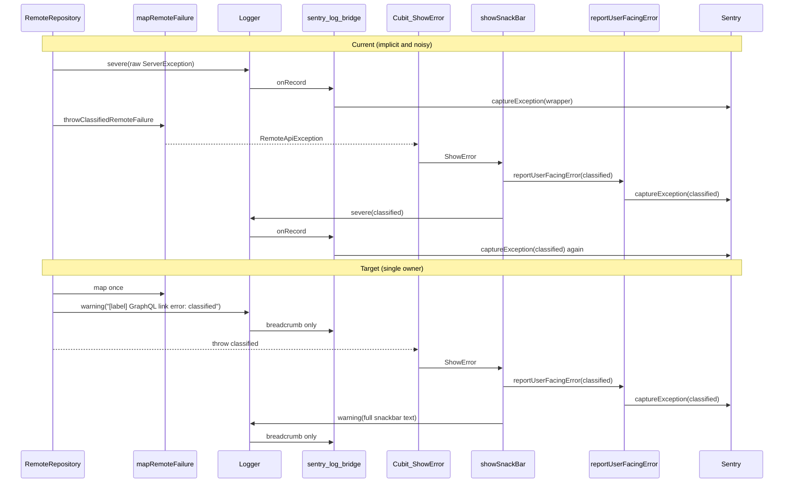

# Clearer Sentry events for remote GraphQL failures

> **For agentic workers:** REQUIRED SUB-SKILL: Use `superpowers:subagent-driven-development` (recommended) or `superpowers:executing-plans` to implement this plan task-by-task. Steps use checkbox (`- [ ]`) syntax for tracking.

**Goal:** Sentry should receive one useful issue for remote GraphQL failures, using the classified domain exception (`RemoteApiException`, etc.) instead of raw Ferry wrappers, without making log severity a hidden Sentry routing API.

**Architecture:** `mapRemoteFailure` remains the GraphQL/Ferry anti-corruption layer. Repositories classify and throw domain failures; UI/error boundaries decide whether a failure is user-facing and should become a Sentry issue. Logger records diagnostic context as breadcrumbs only.

**Tech Stack:** Flutter, Dart, Ferry, `logging`, `sentry_flutter`.

---

## Problem

Today [`remote_repository.dart`](packages/client/lib/data/repository/remote_repository.dart) logs the raw Ferry `linkException` / `graphqlErrors` **before** `mapRemoteFailure` unwraps it:

```dart
log.severe('GraphQL link error', linkError);  // ServerException wrapper
throwClassifiedRemoteFailure(linkError);       // throws RemoteApiException, etc.
```

[`sentry_log_bridge.dart`](packages/client/lib/app/sentry/sentry_log_bridge.dart) sends any SEVERE log with an `error` object to `Sentry.captureException`, and any SEVERE message without an error to `Sentry.captureMessage`. Result: issues like #7584516804 show `ServerException(parsedResponse: null)` while the user snackbar may show the real server text.

A second duplicate can occur when a cubit emits `ShowError` and [`showSnackBar`](packages/client/lib/ui/utils/ui_utils.dart) calls both `reportUserFacingError` and `log.severe(..., error)`, producing another Sentry event for the same failure.

The deeper architecture issue is that `Logger.severe` currently means two different things:

- "This is an important diagnostic log."
- "Create a Sentry issue."

That hidden side effect forces repositories, UI helpers, and screen widgets to know the Sentry bridge contract. It also makes dedupe necessary to paper over unclear ownership. This plan removes that ambiguity.

**Scope note:** Only repos using `requestDataOnlineOrThrow` hit the raw-wrapper SEVERE log today (e.g. InviteGenealogy, Graph, Friends, Favorites, FCM, Complaint, Like). Most other repos use the `dataOrThrow` extension in [`remote_api_service.dart`](packages/client/lib/data/service/remote_api_service.dart), which already throws `mapRemoteFailure(...)` without logging. Both paths should rely on the same explicit user-facing reporting boundary after this change.



## Architecture Decisions

1. **Do not report to Sentry from `RemoteRepository`.** A repository knows that a remote call failed; it does not know whether the failure is user-facing, retried, intentionally ignored, or rendered in an inline load panel. Importing `app/sentry` from `data/repository` would couple the data layer to app-level observability.

2. **Keep `mapRemoteFailure` as the anti-corruption layer.** Ferry and `gql_exec` failures are translated to domain exceptions in [`auth_loss_classifier.dart`](packages/client/lib/data/service/remote_api_client/auth_loss_classifier.dart). Repositories and cubits should propagate the classified exception, not the transport wrapper.

3. **Make issue creation explicit.** `reportUserFacingError` creates exception issues. A separate explicit message reporter handles intentional message-only Sentry issues. `Logger` does not create Sentry issues.

4. **No dedupe helper in the main design.** The previous `identityHashCode` microtask dedupe proposal was a compensating mechanism for two competing capture paths. Once logs are breadcrumbs-only and repositories do not report, the common GraphQL failure chain has one capture point.

5. **Preserve stack traces when the transport wrapper has one.** `RemoteRepository` should throw the classified exception with `Error.throwWithStackTrace(mapped, stackTrace)` when the raw Ferry `ServerException.originalStackTrace` is a `StackTrace`.

## File Structure

- Modify [`docs/adr/0006-client-sentry-observability.md`](docs/adr/0006-client-sentry-observability.md) to record the new contract: explicit reporters create issues; log bridge adds breadcrumbs only.
- Modify [`packages/client/lib/app/sentry/sentry_log_bridge.dart`](packages/client/lib/app/sentry/sentry_log_bridge.dart) so it never calls `Sentry.captureException` or `Sentry.captureMessage`.
- Create [`packages/client/lib/app/sentry/report_sentry_message.dart`](packages/client/lib/app/sentry/report_sentry_message.dart) for intentional message-only issues.
- Modify [`packages/client/lib/ui/widget/screen_load_error_panel.dart`](packages/client/lib/ui/widget/screen_load_error_panel.dart) to use the explicit message reporter instead of relying on `Logger.severe`.
- Modify [`packages/client/lib/data/repository/remote_repository.dart`](packages/client/lib/data/repository/remote_repository.dart) to classify before logging and throwing.
- Modify [`packages/client/lib/ui/utils/ui_utils.dart`](packages/client/lib/ui/utils/ui_utils.dart) so snackbars report explicitly and log warning breadcrumbs only.
- Modify existing `.severe` callers found in the client audit:
  - [`packages/client/lib/data/repository/platform_repository.dart`](packages/client/lib/data/repository/platform_repository.dart)
  - [`packages/client/lib/features/geo/data/repository/geo_repository.dart`](packages/client/lib/features/geo/data/repository/geo_repository.dart)

## Tasks

### Task 1: Update the ADR contract

**Files:**
- Modify: [`docs/adr/0006-client-sentry-observability.md`](docs/adr/0006-client-sentry-observability.md)

- [ ] **Step 1: Replace the log bridge decision**

Change decision item 5 from `Logger.root SEVERE+ -> captureException / captureMessage` to:

```markdown
5. **Explicit issue reporting, breadcrumb log bridge** (non-debug): `reportUserFacingError`
   and explicit Sentry message reporters create Issues. `Logger.root` records
   INFO/WARNING/SEVERE logs as breadcrumbs only; log severity does not create
   Issues. This keeps logging diagnostic and makes Sentry issue ownership
   explicit at user-facing/error-boundary call sites.
```

- [ ] **Step 2: Replace the duplicate-reporting consequence**

Replace the old consequence that says double-reporting is acceptable with:

```markdown
- Sentry Issues are created only by explicit reporters. Logs enrich Issues as
  breadcrumbs, so callers do not need to know hidden `Logger.severe` side
  effects.
```

### Task 2: Make the Sentry log bridge breadcrumb-only

**Files:**
- Modify: [`packages/client/lib/app/sentry/sentry_log_bridge.dart`](packages/client/lib/app/sentry/sentry_log_bridge.dart)
- Modify: [`packages/client/lib/app/sentry/sentry_benign_filter.dart`](packages/client/lib/app/sentry/sentry_benign_filter.dart)
- Modify: [`packages/client/test/app/sentry_benign_filter_test.dart`](packages/client/test/app/sentry_benign_filter_test.dart)

- [ ] **Step 1: Remove issue capture from the bridge**

Refactor `configureSentryLogBridge` so it does not call `Sentry.captureException` or `Sentry.captureMessage`.

Target shape. Note this drops the `isBenignSentryLogRecord` filter that the old issue-capturing bridge used: that filter existed to keep *expected* failures (offline, session loss, …) from creating noisy Issues, which doesn't apply to breadcrumbs — breadcrumbs are cheap, never alert anyone on their own, and a benign event right before a real Issue is exactly the context breadcrumbs exist for. Issue-level benign filtering still lives in `isBenignSentryThrowable`/`beforeSend` (`sentry_init.dart`) and in `reportUserFacingError`/`reportSentryMessage`, so benign errors still won't create Issues — they'll just be visible as breadcrumbs leading up to whatever Issue does get reported.

```dart
/// Routes [Logger.root] records to Sentry breadcrumbs when the SDK is initialized.
void configureSentryLogBridge() {
  Logger.root.onRecord.listen((record) {
    final level = _breadcrumbLevelFor(record.level);
    if (level == null) {
      return;
    }

    final error = record.error;
    unawaited(
      Sentry.addBreadcrumb(
        Breadcrumb(
          message: error == null ? record.message : '${record.message}: $error',
          level: level,
          category: record.loggerName,
        ),
      ),
    );
  });
}

SentryLevel? _breadcrumbLevelFor(Level level) {
  if (level >= Level.SEVERE) {
    return SentryLevel.error;
  }
  if (level == Level.WARNING) {
    return SentryLevel.warning;
  }
  if (level == Level.INFO) {
    return SentryLevel.info;
  }
  return null;
}
```

- [ ] **Step 2: Remove the now-unused log-record filter**

With Step 1, `isBenignSentryLogRecord` (and its private helper `_isBenignSentryMessage`) in `sentry_benign_filter.dart` lose their only production caller — leave them and they're dead code. Delete both from `sentry_benign_filter.dart`, and delete the `group('isBenignSentryLogRecord', ...)` block in `sentry_benign_filter_test.dart`. Keep `isBenignSentryThrowable` and `isBenignSentryExceptionText`: both stay in active use (`reportUserFacingError`, `sentry_init.dart`'s `beforeSend`, and the new `reportSentryMessage` from Task 3).

### Task 3: Add explicit message reporting for intentional message Issues

**Files:**
- Create: [`packages/client/lib/app/sentry/report_sentry_message.dart`](packages/client/lib/app/sentry/report_sentry_message.dart)
- Modify: [`packages/client/lib/ui/widget/screen_load_error_panel.dart`](packages/client/lib/ui/widget/screen_load_error_panel.dart)

- [ ] **Step 1: Add the helper**

Create `report_sentry_message.dart`:

```dart
import 'dart:async';

import 'package:sentry_flutter/sentry_flutter.dart';

import 'sentry_benign_filter.dart';

/// Reports an intentional message-only issue to Sentry.
///
/// Use this for diagnostics that are not represented by a throwable. Most
/// exception paths should use [reportUserFacingError] instead.
void reportSentryMessage(
  String message, {
  SentryLevel level = SentryLevel.error,
}) {
  if (isBenignSentryExceptionText(message)) {
    return;
  }
  unawaited(
    Sentry.captureMessage(
      message,
      level: level,
    ),
  );
}
```

- [ ] **Step 2: Update `logScreenLoadError`**

In `screen_load_error_panel.dart`, import the helper:

```dart
import 'package:tentura/app/sentry/report_sentry_message.dart';
```

Then change the final line in `logScreenLoadError` from:

```dart
GetIt.I<Logger>().severe(buffer.toString());
```

to:

```dart
final message = buffer.toString();
GetIt.I<Logger>().warning(message);
reportSentryMessage(message);
```

This preserves the intentional message-only Sentry issue without relying on the log bridge.

### Task 4: Classify before logging in `RemoteRepository`

**Files:**
- Modify: [`packages/client/lib/data/repository/remote_repository.dart`](packages/client/lib/data/repository/remote_repository.dart)

- [ ] **Step 1: Import Ferry `ServerException` explicitly**

Add:

```dart
import 'package:ferry/ferry.dart' as gql show ServerException;
```

- [ ] **Step 2: Replace raw severe logging with a helper**

Inside `RemoteRepository`, add:

```dart
Never _failFromRemote(
  Object raw, {
  required String kind,
  required String? label,
}) {
  final mapped = mapRemoteFailure(raw);
  if (mapped is! AuthSessionLostException) {
    final effectiveLabel = label == null || label.isEmpty ? 'No label' : label;
    log.warning('[$effectiveLabel] GraphQL $kind: $mapped');
  }

  final stackTrace = _stackTraceFromRaw(raw);
  if (stackTrace != null) {
    Error.throwWithStackTrace(mapped, stackTrace);
  }
  throw mapped;
}

StackTrace? _stackTraceFromRaw(Object raw) {
  if (raw is gql.ServerException) {
    final originalStackTrace = raw.originalStackTrace;
    if (originalStackTrace is StackTrace) {
      return originalStackTrace;
    }
  }
  return null;
}
```

- [ ] **Step 3: Use the helper for both GraphQL failure branches**

Change the `linkException` branch to:

```dart
if (response.linkException != null) {
  _failFromRemote(
    response.linkException!,
    kind: 'link error',
    label: label,
  );
}
```

Change the `graphqlErrors` branch to:

```dart
if (response.graphqlErrors != null) {
  _failFromRemote(
    response.graphqlErrors!,
    kind: 'errors',
    label: label,
  );
}
```

Remove direct `throwClassifiedRemoteFailure(...)` calls from this file. Keep the exported function in [`auth_loss_classifier.dart`](packages/client/lib/data/service/remote_api_client/auth_loss_classifier.dart) for API stability.

**Auth-loss behavior:** unchanged. `AuthSessionLostException` remains benign: no warning breadcrumb from this repository helper and no Sentry report from `reportUserFacingError`.

### Task 5: Keep snackbar reporting explicit and logging diagnostic

**Files:**
- Modify: [`packages/client/lib/ui/utils/ui_utils.dart`](packages/client/lib/ui/utils/ui_utils.dart)

- [ ] **Step 1: Keep the explicit user-facing report**

Keep:

```dart
if (error != null) {
  reportUserFacingError(error, stackTrace: stackTrace);
}
```

- [ ] **Step 2: Downgrade snackbar diagnostic logging**

Change:

```dart
GetIt.I<Logger>().severe(fullText, error, stackTrace);
```

to:

```dart
GetIt.I<Logger>().warning(fullText);
```

The snackbar helper is now the single issue capture point for user-facing exceptions. The log bridge records the snackbar text as a breadcrumb only.

### Task 6: Audit remaining client `.severe` callers

**Files:**
- Modify: [`packages/client/lib/data/repository/platform_repository.dart`](packages/client/lib/data/repository/platform_repository.dart)
- Modify: [`packages/client/lib/features/geo/data/repository/geo_repository.dart`](packages/client/lib/features/geo/data/repository/geo_repository.dart)

- [ ] **Step 1: Find remaining severe logs**

Run:

```bash
cd packages/client && rg -n "\.severe\(" lib test
```

Expected after Tasks 2-5: no production caller should rely on `.severe` to create Sentry issues.

- [ ] **Step 2: Downgrade diagnostic-only repository logs — but check whether the log bridge was the only path to Sentry first**

These two call sites are not equivalent. `platform_repository.dart` rethrows after logging, so the failure still reaches a UI/error boundary (`showSnackBar` → `reportUserFacingError`) under the new contract — a plain downgrade is safe. `geo_repository.dart` **swallows** the error (`getMyCoords` returns `null`, nothing is rethrown) — once the bridge stops auto-reporting SEVERE, `_logger.severe(e)` is the *only* thing standing between this failure and total Sentry invisibility. A blind downgrade silently deletes that signal. Note this catch only runs after `_checkLocationPermission()` already succeeded, so it's a genuine `Geolocator.getCurrentPosition` failure (timeout, provider error), not the common/expected permission-denied path.

In `platform_repository.dart`, change:

```dart
_log.severe(e);
```

to:

```dart
_log.warning('Failed to launch URI: $e');
```

In `geo_repository.dart`, change:

```dart
} catch (e) {
  _logger.severe(e);
}
```

to:

```dart
} catch (e) {
  _logger.warning('Failed to read current location: $e');
  reportUserFacingError(e);
}
```

Add the import:

```dart
import 'package:tentura/app/sentry/report_user_facing_error.dart';
```

This does cross the data→app boundary that Architecture Decision 1 avoids for `RemoteRepository`, but the rationale there doesn't transfer: `RemoteRepository` always has a downstream UI/error boundary to defer to, while this catch is the only place that ever observes the failure, since it swallows rather than rethrows. Reporting explicitly here is consistent with the plan's core rule (issue creation is always an explicit, local decision) rather than an exception to it.

If a future `.severe` caller really needs a Sentry issue, add an explicit reporter call at that call site instead of relying on the log bridge — and check first whether the error is rethrown to an existing boundary or swallowed, the same way this step did.

## Verification

```bash
cd packages/client && flutter test test/app/sentry_benign_filter_test.dart test/data/service/auth_loss_classifier_test.dart
cd packages/client && flutter analyze --no-fatal-warnings --no-fatal-infos \
  lib/app/sentry/ \
  lib/data/repository/remote_repository.dart \
  lib/data/repository/platform_repository.dart \
  lib/features/geo/data/repository/geo_repository.dart \
  lib/ui/utils/ui_utils.dart \
  lib/ui/widget/screen_load_error_panel.dart
cd packages/client && rg -n "\.severe\(" lib test
```

Expected `rg` result: either no matches, or only intentional callers that also use an explicit reporter and document why the log remains severe.

## Out of Scope

- Invite genealogy server root cause (migration / GraphQL resolver).
- Cubit emitting `StateIsSuccess` on load failure (existing graph pattern).
- Refactoring every `dataOrThrow` caller to preserve transport stack traces. Those paths already classify failures; they can share the `Error.throwWithStackTrace` approach later if stack quality is still insufficient.
- Adding a Sentry dedupe registry. It is unnecessary for the common GraphQL failure path once issue ownership is explicit.

## Expected Outcome

For InviteGenealogy and other `requestDataOnlineOrThrow` paths:

- `RemoteRepository` maps Ferry/GraphQL wrappers to domain exceptions before logging.
- Sentry receives one explicit `captureException` from the user-facing boundary, with type/message like `RemoteApiException: <server message>`.
- Logs appear as WARNING/ERROR breadcrumbs, not separate Sentry issues.
- No more `ServerException(parsedResponse: null)` issues from repository log bridge side effects.
