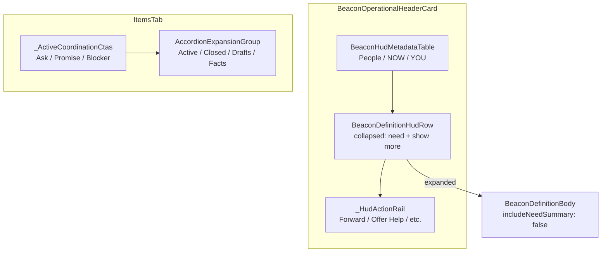

# Beacon Definition HUD + Items Tab Reorganization

**Status:** Implemented in the working tree (uncommitted). Consolidated reference recovered from the full conversation (Jun 2026).

---

## Problem

The beacon detail **Definition** fold lived at the bottom of the **Items** tab accordion. Product intent:

1. Surface **need** at HUD level (with People / NOW / YOU), not buried in a tab fold.
2. Match existing HUD row styling (32px icon column + `bodySmall` text).
3. Keep full definition detail one tap away (expand/collapse).
4. Fix Items-tab empty-state gap after removing Definition.
5. Hide coordination folds from viewers without room admission rights.

---

## Target layout



---

## Design decisions

| Topic | Decision |
|-------|----------|
| Collapsed primary line | Exact `beacon.needSummary` text (no "Need:" prefix); icon conveys designation |
| Empty need | Muted placeholder: `l10n.beaconDefinitionSectionTitle` ("Definition") |
| Typography | `TenturaText.bodySmall`, max 2 lines, ellipsis — same as NOW/YOU rows |
| Show-more `+N` | **N = image count** (`beacon.images.length`); append `Icons.image_outlined` |
| Show-more visibility | When text exceeds 2 lines OR beacon has any expandable definition content |
| Expanded content | Full `BeaconDefinitionBody` minus need line (`includeNeedSummary: false`) |
| Fold back | `l10n.itemShowLess` + `expand_less` icon |
| Lead icon | `Icons.info_outline` (same as old Definition fold); semantics = `beaconDefinitionSectionTitle` |
| Facts fold | **No client room gate** — server filters per-fact visibility in `BeaconFactCardCase.list` (skips `visibility == room && !admitted`) |
| Blocked viewer copy | Reuse `beaconRoomWaitingForApproval` / `beaconRoomNoAdmission` (same as room app-bar tooltip in `beacon_view_app_bar_overflow.dart`) |

---

## Viewer-state matrix (Items tab)

| Viewer | CTA row (top) | Active / Closed / Drafts folds | Facts fold | Tab message |
|--------|---------------|-------------------------------|------------|-------------|
| Author / steward / admitted | Yes (`canCoordinate`) | Yes (`inRoom`) | Public facts only (server) | Items or empty placeholder |
| Committed, awaiting approval | No | Hidden (`inRoom == false`) | Public facts only | `beaconRoomWaitingForApproval` |
| Committed, denied (`notSuitable`) | No | Hidden | Public facts only | `beaconRoomNoAdmission` |
| Uncommitted spectator | No | Hidden | Public facts only | `beaconItemsEmptyPlaceholder` |

### Gates (`items_tab.dart`)

```dart
final canCoordinate = state.canCoordinateInBeaconRoom;
final inRoom = state.canNavigateBeaconRoom || canCoordinate;
final showCoordinationCtas = canCoordinate;
final showActiveFold = inRoom && (canCoordinate || openItems.isNotEmpty);
final showClosedFold = inRoom && closedItems.isNotEmpty;
final showDrafts = inRoom && myDraftCount > 0;
// showFacts unchanged — server already filters factCards
```

### Room admission semantics (`beacon_view_state.dart`)

- `canNavigateBeaconRoom` — author, steward, or help-offered + `hasRoomAdmission`
- `isRoomAdmissionBlocked` — non-author, help offered, no admission yet
- `canCoordinateInBeaconRoom` — may create/edit coordination items (mirrors server `_canUseRoom` + coordination rules)

Server reference: `BeaconRoomCase._canUseRoom` (author | steward | `room_access == admitted`). See `docs/room-coordination-audit.md` criterion 3.

---

## File map (as implemented)

| File | Change |
|------|--------|
| `packages/client/lib/features/beacon_view/ui/widget/beacon_definition_hud_row.dart` | **New** — stateful collapsed/expanded HUD row |
| `packages/client/lib/features/beacon_view/ui/widget/beacon_definition_body.dart` | Added `includeNeedSummary` flag (default `true`) |
| `packages/client/lib/features/beacon_view/ui/widget/beacon_operational_header_card.dart` | Mount `BeaconDefinitionHudRow` after metadata table, before CTA rail |
| `packages/client/lib/features/beacon_view/ui/widget/items_tab.dart` | Remove `_BeaconDefinitionSection`; move `_ActiveCoordinationCtas` to tab top; room gates; blocked-viewer copy |
| `packages/client/lib/features/beacon_view/ui/util/beacon_accordion_sections.dart` | Remove `definition` section id; fallthrough returns `null` |
| `packages/client/test/features/beacon_view/beacon_accordion_sections_test.dart` | Fallthrough test expects `null` |

**Removed:** `_BeaconDefinitionSection` class and Items-tab `AccordionExpansionTile(id: definition, ...)`.

---

## `BeaconDefinitionHudRow` behavior

**Collapsed:**

- `BeaconHudIconRow` with `leadAlign: start`, 32px lead column
- Primary text: need or muted "Definition"
- Show-more row: `itemShowMore` + optional `+{images.length}` + `image_outlined` when `beacon.hasPicture`

**Expanded:**

- Same lead row with full primary text (no line cap)
- Indented `BeaconDefinitionBody(includeNeedSummary: false)` — title, dates, location, done-when, capability tags, media, description
- Show-less affordance with `itemShowLess` + chevron

**Styling constraints:** `context.tt` tokens, `TenturaText.*`, `TenturaRadii.cardDense` for ink wells; no inline `fontSize:`, no raw `EdgeInsets`/`Color` in feature UI.

---

## Accordion cleanup

**Old:** when no active/closed/drafts/facts folds existed, compact accordion defaulted to **Definition** (`BeaconItemsAccordionSection.definition`).

**New:** fallthrough returns `null` — no accordion section forced open. Definition is always in the HUD header.

---

## Verification

```bash
cd packages/client && flutter analyze --no-fatal-warnings --no-fatal-infos
cd packages/client && flutter test test/features/beacon_view/
```

### Manual QA checklist

- [ ] Beacon with need + images: collapsed HUD shows need (2-line cap), show more with `+N` image badge
- [ ] Expand: full definition minus duplicate need line; show less folds back
- [ ] Beacon without need: muted "Definition" placeholder
- [ ] Coordinator: Ask/Promise/Blocker row at top of Items tab (not inside Active fold)
- [ ] Committed-but-unadmitted helper: no coordination folds, "Waiting for approval" message
- [ ] Denied helper: `beaconRoomNoAdmission` message
- [ ] Public facts visible to blocked viewer; room-only facts hidden (server)

---

## Out of scope / follow-ups

- Dedicated richer "awaiting approval" guidance copy (existing terse strings chosen)
- Client-side facts visibility filter (server already handles it)
- Empty-state widget when only public facts exist and no coordination folds (facts fold still renders)
