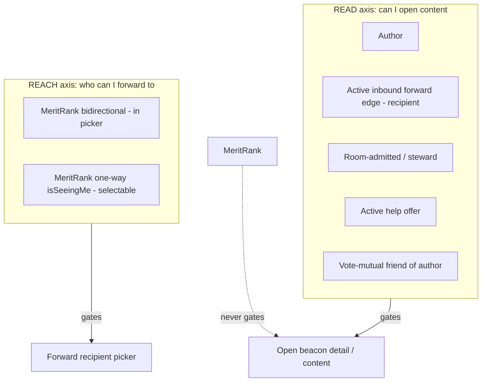

# Beacon visibility — root-cause analysis and alignment plan

## 1. Purpose & relationship to existing docs

This document explains why Tentura's beacon visibility QA traps occur, how they map to fixes, and how client and server surfaces should align to the canonical read predicate. It is a companion to [`beacon-visibility-matrix.md`](../beacon-visibility-matrix.md) (per-relationship reference tables) and does not replace it. Policy authority lives in [ADR 0008](../adr/0008-beacon-visibility-and-invite-sharing.md) and [`CONTEXT.md`](../../CONTEXT.md) § Beacon visibility & sharing.

## 2. Root-cause statement

ADR 0008 established a single source of truth: domain policy [`BeaconVisibility`](../packages/server/lib/domain/beacon_visibility.dart), SQL [`beacon_can_read_content`](../packages/server/lib/data/database/migration/m0098.dart), V2 [`BeaconAccessGuard`](../packages/server/lib/domain/port/beacon_access_guard.dart), and Hasura row filters — kept honest by [`beacon_access_sql_parity_test.dart`](../packages/server/test/data/repository/beacon_access_sql_parity_test.dart). That predicate is sound and must not be weakened.

**Every QA trap shares one defect:** a client surface or one server count re-derives "can this be opened?" from *proxy signals* instead of `beacon_can_read_content`:

- **Show Beacons** on a profile is shown unconditionally (`profile_view_body.dart`) — the list is gated server-side, so one-way friends land on an empty list.
- **Forwarded** cards list `beacon_forward_edge` rows; when the viewer is sender-only, nested `beacon` data is unreadable and the card dead-ends in "Beacon unavailable" (`profile_shared_beacons_fetch.graphql`).
- The **forward picker** uses MeritRank reachability (`rating` bidirectional, `isSeeingMe`) — a *reach* axis users read as *read* access.
- **`coInvolvedBeaconsCount` / `activeForwardsToCount`** in `person_capability_event_repository.dart` build `viewer_involved` without composing the predicate, so the Friends-tab "N shared" badge over-counts.

**The linchpin:** Hasura already exposes read truth as queryable data. In `hasura/metadata.json`, `beacon` defines computed fields `can_read_content` and `can_read_involvement` (lines 190–210); the `user` role may select `can_read_content` (line 242); and `beacon` rows are filtered with `can_read_content: { _eq: true }` (lines 244–248). Other tables (e.g. `beacon_image`, lines 348–353) already filter via `beacon: { can_read_content: { _eq: true } }`. The client can stop guessing and filter on the same predicate.

## 3. The two-axis model

**READ axis** — who can open beacon content: author; active inbound forward edge (recipient); room-admitted participant or steward; active help offerer; vote-mutual friend of the author (all of the author's non-draft, non-deleted beacons). MeritRank is never on this axis.

**REACH axis** — who appears in the forward picker: MeritRank bidirectional (`src_score > 0` AND `dst_score > 0`); per-candidate selectability additionally requires `isSeeingMe` (`rScore > 0` toward the viewer). Choosing someone in the picker means you can *reach* them, not that they can already read the beacon.

**Three states for a forwarded beacon (recipient perspective):**

| State | Meaning |
|-------|---------|
| **I forwarded it** | Outbound `beacon_forward_edge` exists (sender = me) |
| **They can open it** | Recipient has read access via that edge (or another read path) |
| **They did open it** | Recipient has engaged (inbox, involvement, onward forward, etc.) |

Sender-only edges satisfy "I forwarded it" for the sender but not "I can open it" — the trap when UI conflates edge existence with read access.

## 4. Per-trap fix table

| Trap | Proxy signal used today | Canonical signal | Fix (file) | Priority |
|------|-------------------------|------------------|------------|----------|
| 1 — Forwarded card dead-ends after sender lost read access | Edge row always listed; nested `beacon!` null-gated by permissions | `beacon.can_read_content` on the relationship | Add `beacon: { can_read_content: { _eq: true } }` to `ProfileForwardedToUser` where-clause — `profile_shared_beacons_fetch.graphql` | P1 |
| 2 — Show Beacons on one-way friend → empty list | Button always visible | Vote-mutual friendship ⇒ non-empty author browse | `if (profile.isMutualFriend)` around Show Beacons — `profile_view_body.dart` | P3 |
| 3 — MR in picker read as open access | MeritRank bidirectional / `isSeeingMe` | Reach only; read = `beacon_can_read_content` | Copy clarifier `forwardReachExplainer` in forward picker header — `app_en.arb`, `forward_beacon_screen.dart` | P4 |
| 4 — Co-help vs Show Beacons scope confusion | Same picker / profile sections without axis labels | READ vs REACH distinction + profile surface semantics (matrix) | Same P4 copy; matrix doc for Co-help vs Show Beacons | P4 |
| 5 — Friends tab "N shared" over-counts | `viewer_involved` CTE = raw edges/offers without read gate | `beacon_can_read_content(beacon_id, viewer_id)` | Rename to `viewer_involved_raw`, add gated `viewer_involved` — `person_capability_event_repository.dart` | P2 |

**P3 trade-off:** Involved-only readers (forward recipient, help offerer) viewing a non-mutual profile lose the Show Beacons entry point; they still reach those beacons via Inbox and profile Forwarded / Co-help cards.

**P3 update (resolved):** "Show Beacons" (the mutual-friend author-browse-all
button) was replaced outright by a strictly narrower "beacons I'm involved in"
entry point — shown to any viewer, gated purely on "was this beacon ever
forwarded to me" (`beacon(where: {user_id: P, forward_edges: {recipient_id:
viewer}})`, `beacons_involved_with_author.graphql`). This closes the P3 gap by
construction (no mutual-friendship dependency at all) at the cost of no longer
offering mutual friends a full author browse from the profile screen. See
`packages/client/lib/features/profile_view/ui/widget/profile_view_body.dart`
and `packages/client/lib/features/beacon/ui/screen/involved_beacon_screen.dart`.

## 5. Server simplification

The Dart policy + SQL function + parity test remain the single source of truth. Do not duplicate or relax the predicate elsewhere.

**Rule:** any query returning *viewer-openable* beacon involvement must compose `public.beacon_can_read_content(beacon_id, viewer_id)`. Raw edge/offer membership is necessary but not sufficient.

**Concrete fix (P2):** `fetchFriendContextsBatch` in `person_capability_event_repository.dart` — `co_involved` and `forwarded_to_friend` both JOIN `viewer_involved`; gating that CTE fixes `coInvolvedBeaconsCount` and `activeForwardsToCount` together.

**Audit follow-ups** (involvement-shaped SQL that may still bypass the predicate for *viewer* counts — verify before changing):

| Location | Notes |
|----------|-------|
| `person_capability_event_repository.dart` — `friend_involved` | Friend-side involvement; correct without viewer read gate |
| `forward_edge_repository.dart` — path/chain queries | Lineage graph; involvement visibility, not openability counts |
| `lineage_memory_read_repository.dart` | Forward-chain reads for involved users |
| MeritRank / inbox migration SQL (`m0039`, `m0048`, `m0063`–`m0072`) | Historical involvement indexes; not viewer-facing badge counts |
| `inbox_item` joins in repository tests | Inbox rows are separately permissioned; audit if a client badge ever sums inbox without `can_read_content` |

No additional server changes are required for P1/P3/P4.

## 6. Client simplification

Treat **`beacon.can_read_content`** (already on Hasura `beacon` when selected) as per-row openability wherever the UI currently infers from edges, friendship, or MR.

**Near term (this work):**

- Filter GraphQL lists with `beacon: { can_read_content: { _eq: true } }` (P1).
- Gate affordances with domain facts already on entities: `profile.isMutualFriend` for browse-all (P3), populated via `user_fetch_by_id.graphql` → `UserModel` → `Profile`.

**Future refactor (not in scope):**

- Add optional `canReadContent` to [`Beacon`](../packages/client/lib/domain/entity/beacon.dart), mapped from GraphQL in `BeaconModel.toEntity()`.
- Introduce a small `BeaconAccess` view-model (or extension on `Beacon`) for UI: `isOpenable`, `isReachableOnly`, tombstone vs unavailable — UI stays dumb and reads truth as data.

Doc-only alternative for trap 1 (deferred): keep unreadable edges and render a non-tappable tombstone ("You forwarded this; it's no longer available to you") — requires a second gated fetch because `beacon_forward_edge.beacon` is non-null in schema.

## 7. UX/UI enhancements

All styling via `context.tt` + `TenturaText.*`; no raw colors, font sizes, or numeric `EdgeInsets`/`BorderRadius` in feature UI.

| Enhancement | Rationale |
|-------------|-----------|
| **No dead-end buttons** (traps 1–2) | Hide or disable Show Beacons when the list would be empty; exclude unreadable forwarded edges from the list (P1, P3). |
| **Available / no longer available** (trap 1 doc alternative) | If tombstones are added later: muted `TenturaText.bodySmall(tt.textMuted)`, non-tappable card, clear copy — not an error snackbar on tap. |
| **Forward-picker axis copy** (traps 3–4) | One muted line under the header: reach ≠ read until recipient accepts (P4 `forwardReachExplainer`). Existing scope chips (`forwardScopeUnseenShort` / `forwardScopeInvolvedShort`) stay. |
| **Show Beacons empty state** | If mutual friend but zero readable beacons: empty state in beacon list screen (future) — "No beacons you can open from this person yet" with `TenturaText.bodySmall`. |

## 8. Clean-architecture mapping

| Principle | Application |
|-----------|-------------|
| **Dependency rule (inward only)** | `BeaconVisibility` and ports live in domain; SQL in data/migrations; UI never re-implements the predicate. |
| **Entity encapsulates invariants** | Read rules are enterprise invariants — one policy, one SQL function, not duplicated in widgets. |
| **Humble object / dumb UI** | Profile and forward screens render data and gates (`isMutualFriend`, filtered queries, counts from gated SQL); they do not compute friendship × edge × MR cross-products. |
| **Gateway abstraction** | `beacon_can_read_content` and Hasura computed fields are enforcement adapters at the persistence/API boundary; clients consume the boolean rather than re-deriving. |
