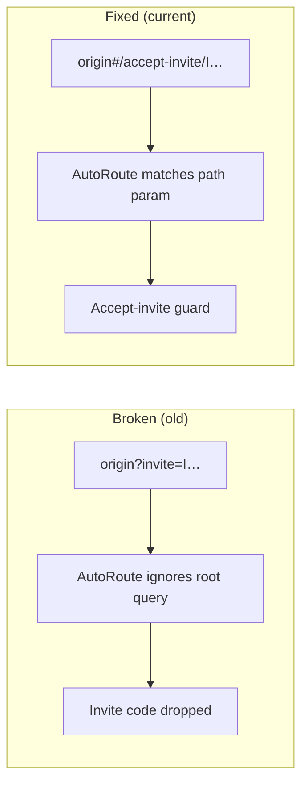
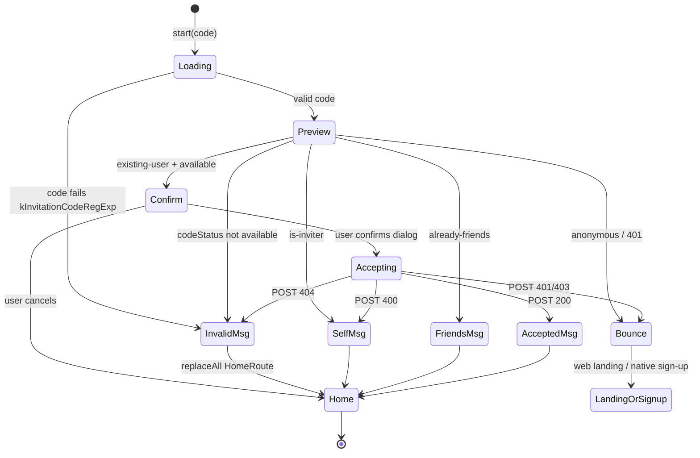
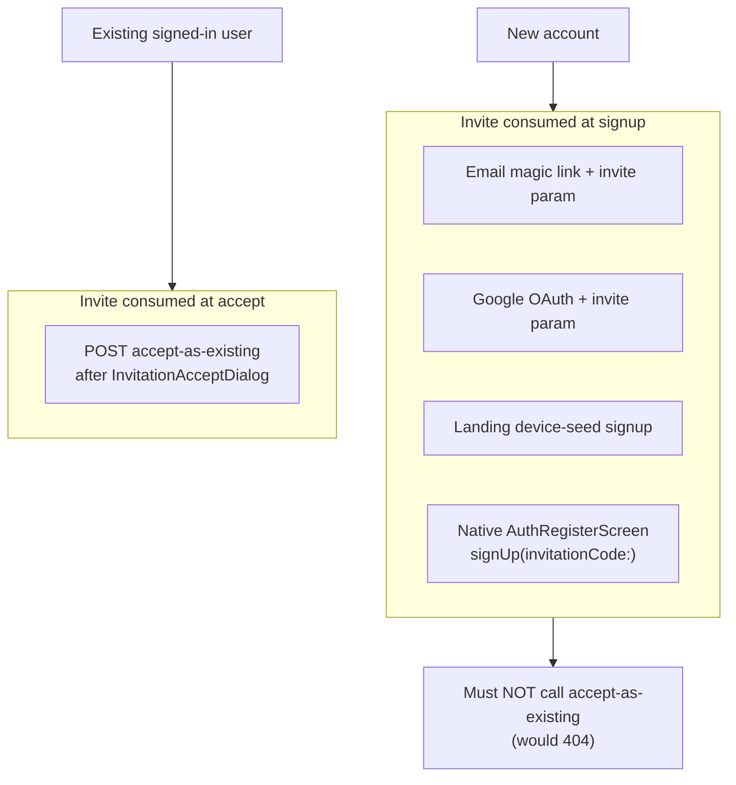

# Invite, signup, and landing flow

> **Status:** Implemented (client + landing). Describes current routing and UX as
> shipped. Phase completion summary and remaining work:
> [`invite-onboarding-auth-plan.md`](invite-onboarding-auth-plan.md) (status table
> at top). Domain terms: [`CONTEXT.md`](../CONTEXT.md) § Public web entry.

## Purpose

Invite links are opened in messengers, captive webviews, and native app links. The
product must:

1. Keep **`/invite/<code>`** as the only share URL (the **basic invite URL**).
2. Carry invite context into Flutter web (hash routes) and native without query-param
   hacks (`?invite=` is ignored by AutoRoute on WASM).
3. **Consume the invite once** — at signup for new users; via `accept-as-existing`
   only for already-authenticated users who confirm.
4. Avoid loops, double befriending, and pointless “open the app” bounces for anonymous
   visitors.

Route **names** (not query params) are the control surface.

## Surfaces and routes

| Surface | Host path | Who sees it |
|---------|-----------|-------------|
| **Landing** | `/invite/<code>`, `/` (signed out) | Static HTML/JS; preview + signup/sign-in entry |
| **WASM (Flutter web)** | `/#/…` when session cookie present at `/`, or any deep hash route | Full product |
| **Native app** | AutoRoute paths (`/accept-invite/…`, `/sign/up/…`, …) | Full product |

### Client routes (WASM hash + native)

| Route | Constant | Audience | Server effect |
|-------|----------|----------|---------------|
| Basic invite URL | *(server/landing only)* `/invite/<code>` | Everyone (share + OG) | Preview only |
| Signup-with-invite | `kPathSignUp` → `/sign/up/<code>` | Unauthenticated native; web bounces to landing | Invite **consumed at account creation** |
| Accept-invite | `kPathAcceptInvite` → `/accept-invite/<code>` | Authenticated user, not yet friends | `POST …/accept-as-existing` after confirm |

**WASM deep links** use hash URLs, e.g. `https://tentura.io/#/accept-invite/Iabc123`.
The server only ever sees `/`; no Caddy change is required for landing → app handoff.

## End-to-end flow (overview)

```mermaid
flowchart TB
  subgraph share["Share & open"]
    shareBtn["Client share action"]
    shareBtn --> basicUrl["Basic invite URL<br/>/invite/I…"]
  end

  basicUrl --> platform{"How link opens"}

  platform -->|"Web browser"| landing["Landing surface<br/>GET preview"]
  platform -->|"Android prod App Link"| nativeDL["Native deepLinkTransformer"]
  platform -->|"iOS / dev / not installed"| landing

  subgraph landingDispatch["Landing (preview callerStatus)"]
    landing --> lp{"callerStatus"}
    lp -->|"anonymous"| stay["Stay on landing<br/>email + Google + recover"]
    lp -->|"existing-user"| hashAccept["CTA → origin#/accept-invite/I…"]
    lp -->|"already-friends"| openProd1["CTA → origin/ product"]
    lp -->|"is-inviter"| openProd2["CTA → origin/ product"]
  end

  subgraph newUser["New user path"]
    stay --> signup["Email / Google on landing<br/>or native /sign/up/I…"]
    signup --> consume["Server consumes invite<br/>email / Google"]
    consume --> friends["Re-preview → already-friends"]
    friends --> openProd3["Open product"]
  end

  subgraph nativeRoute["Native deep link"]
    nativeDL --> nAuth{"JWT in app?"}
    nAuth -->|"No"| signUpRoute["/sign/up/I…<br/>AuthRegisterScreen"]
    nAuth -->|"Yes"| acceptRoute["/accept-invite/I…"]
    signUpRoute --> consume
  end

  hashAccept --> acceptGuard
  acceptRoute --> acceptGuard

  subgraph acceptGuard["Accept-invite guard"]
    acceptGuard --> gAuth{"Authenticated?"}
    gAuth -->|"Yes"| acceptScreen["AcceptInviteScreen"]
    gAuth -->|"No, web"| leaveWeb["goToLanding → /invite/I…<br/>page unloading"]
    gAuth -->|"No, native"| signUpRoute
  end

  subgraph acceptFlow["Accept-invite screen (defense in depth)"]
    acceptScreen --> previewAPI["GET /api/v2/invite/I…/preview"]
    previewAPI --> decide{"codeStatus + callerStatus"}
    decide -->|"invalid / expired / consumed"| msgBad["Message → replaceAll home"]
    decide -->|"is-inviter"| msgSelf["Message → home"]
    decide -->|"already-friends"| msgFriends["Message → home"]
    decide -->|"anonymous stale session"| bounce["Web → landing<br/>Native → /sign/up/I…"]
    decide -->|"existing-user + available"| dialog["InvitationAcceptDialog"]
    dialog -->|"Cancel"| home["replaceAll → HomeRoute"]
    dialog -->|"Confirm"| postAccept["POST …/accept-as-existing"]
    postAccept --> home
  end

  openProd1 --> wasm["WASM / native product"]
  openProd2 --> wasm
  openProd3 --> wasm
  home --> wasm
```

## Landing preview dispatcher

The landing calls `GET /api/v2/invite/<code>/preview` (optional-auth: session cookie
and/or bearer). Response drives UI and CTAs in `packages/landing/main.js`.

| `callerStatus` | `suggestedAction` | Landing behavior | App URL opened |
|----------------|-------------------|------------------|----------------|
| `anonymous` | `accept-as-new` | **Tier 1:** email OTP, Google, and “Recover from seed” (WASM). **Tier 2:** email + browser escape. **No** generic “Open the app” | `/recover?invite=<code>#/recover-seed` for seed recovery; otherwise stay on landing |
| `existing-user` | `accept-as-existing` | “Open Tentura to accept” | `{origin}#/accept-invite/{code}` |
| `already-friends` | `accept-as-new` *(re-preview)* | “Open Tentura” | `{origin}/` (product only) |
| `is-inviter` | `self` | Share hint + open product | `{origin}/` |

**Signed-out `/` (no invite code):** `renderNoInvite()` — invite paste is the primary
path. **“I already have an account”** reveals tier-specific sign-in options and hides
the invite paste form and invite-oriented copy. **“Have an invite link?”** restores
invite mode. When `?signed_in=1`, show flash + **Open Tentura** CTA.

**Google OAuth** on the landing includes `returnTo=/invite/<code>` so after sign-in
the user returns to the invite page, re-previews as `already-friends`, and opens the
product without calling accept-as-existing.

**“I already have an account”** (root `/` only) reveals tier-specific login options
instead of opening WASM with a broken `?invite=` query param. Revealing sign-in hides
the invite paste UI to avoid dual-path ambiguity:

- **Tier 1 (system browser):** email magic link + Google OAuth (when `googleEnabled`) + recover-from-seed.
- **Tier 2 (in-app browser):** email magic link + browser escape; Google and recover stay hidden.

On `/invite/<code>` anonymous pages, email/Google/recover remain visible immediately
for new-user signup (no reveal toggle).

## WASM hash routing

Flutter web does **not** use path URL strategy. Relevant implications:



Landing helpers:

- `appHashUrl(path)` → `{origin}#{path}`
- `openAcceptInviteUrl(code)` → `#/accept-invite/{encoded code}`
- `openProductUrl()` → `{origin}/` only

## Native deep links

`RootRouter.deepLinkTransformer()` normalizes invite entry before navigation:

| Incoming | Authenticated | Transformed path |
|----------|---------------|------------------|
| `/invite/<code>` (App Link) | yes | `/accept-invite/<code>` |
| `/invite/<code>` | no | `/sign/up/<code>` |
| `/shared/view?id=I…` | yes | `/accept-invite/<code>` |
| `/shared/view?id=I…` | no | `/sign/up/<code>` |

Implementation: `packages/client/lib/app/router/invite_deep_link.dart`.

**Platform coverage:**

- **Android prod** (`tentura.io`): verified App Links for all paths including `/invite/…`.
- **Android dev / iOS**: no verified universal link → browser → landing flow.
- **In-app paste/QR**: `ConnectBottomSheet` (separate GraphQL accept path; not this doc’s REST flow).

## Accept-invite guard

Unauthenticated hits to `#/accept-invite/<code>` are resolved in
`packages/client/lib/app/router/accept_invite_guard.dart`:

| Condition | Outcome |
|-----------|---------|
| Authenticated | Allow `AcceptInviteScreen` |
| Web + `goToLanding('/invite/…')` returns `true` | Block navigation (page unloading) |
| Native + `goToLanding` returns `false` | Redirect to `AuthRegisterRoute` (`/sign/up/<code>`) |

`goToLanding` is platform-split: real navigation on web, no-op on native.

## Accept-invite screen state machine

After the guard, `AcceptInviteCubit` always re-fetches preview (defense in depth):



Terminal navigation uses `context.router.replaceAll([const HomeRoute()])` so Back
cannot re-open the accept flow.

## Server API (V2 REST)

| Method | Path | Auth | Role |
|--------|------|------|------|
| `GET` | `/api/v2/invite/<code>/preview` | Optional (cookie or bearer) | Caller-aware preview for landing + accept screen |
| `POST` | `/api/v2/invite/<code>/accept-as-existing` | Bearer JWT required | Befriend issuer + forward beacon; **not** for new signups |

Preview JSON fields used by the client: `codeStatus`, `callerStatus`, `inviter`,
`beacon`, `suggestedAction`.

Accept-as-existing outcomes:

| HTTP | Meaning | Client mapping |
|------|---------|----------------|
| 200 | Success or already friends | OK |
| 400 | Self-invite / bad request | `InvitationSelfOrInvalid` |
| 404 | Missing / consumed / expired | `InvitationNoLongerValid` |
| 401/403 | Stale bearer | `InvitationAuthLost` → bounce |

## Who consumes the invite?



## Corner cases (deliberate)

| Scenario | Behavior |
|----------|----------|
| New web user (email/Google/seed) | Never reaches accept-invite; server consumed invite at signup |
| Double-tap / refresh on `#/accept-invite/…` | Preview + confirm again; first accept wins; later 404 is non-fatal |
| Self-invite | Preview `is-inviter` short-circuit; POST 400 handled defensively |
| Already friends | Preview short-circuit; POST 200 safe if race |
| Malformed code | `kInvitationCodeRegExp` fails client-side; no server call |
| Stale JWT at accept screen | Preview `anonymous` or GET 401 → bounce; no POST |
| Seed recovery + invite | Landing `/recover?invite=I…#/recover-seed` → WASM recover → `#/accept-invite/I…` |
| Notification deep link `/#/shared/view?id=I…` | Transformed like App Link (see table above) |

## Key source files

| Area | Path |
|------|------|
| Route constants | `packages/client/lib/consts.dart` |
| Deep link transforms | `packages/client/lib/app/router/invite_deep_link.dart` |
| Accept guard logic | `packages/client/lib/app/router/accept_invite_guard.dart` |
| Router + guard wiring | `packages/client/lib/app/router/root_router.dart` |
| Preview entity | `packages/client/lib/features/invitation/domain/entity/invite_preview.dart` |
| Repository (preview + accept) | `packages/client/lib/features/invitation/data/repository/invitation_repository.dart` |
| Accept cubit + screen | `packages/client/lib/features/invitation/ui/bloc/accept_invite_cubit.dart`, `…/screen/accept_invite_screen.dart` |
| Landing CTAs | `packages/landing/main.js` |
| Server preview | `packages/server/lib/domain/use_case/invitation_case.dart`, `…/entity/invite_preview_result.dart` |

## Tests

| Suite | Path |
|-------|------|
| Deep link transforms | `packages/client/test/app/invite_deep_link_test.dart` |
| Guard decisions | `packages/client/test/app/accept_invite_guard_test.dart` |
| Preview parsing + status maps | `packages/client/test/features/invitation/invite_preview_test.dart`, `invitation_repository_accept_test.dart` |
| Accept cubit outcomes | `packages/client/test/features/invitation/accept_invite_cubit_test.dart` |
| Landing URL construction | `packages/landing/test/url_dispatch_test.mjs` |

## Manual smoke checklist

- [ ] Signed-out `/` (no cookie): landing with invite entry, email sign-in, no “Open Tentura”
- [ ] Signed-out `/`: paste invite code/link → redirects to `/invite/I…` preview
- [ ] Signed-in desktop web: `/invite/I…` → landing → `#/accept-invite/I…` → confirm → home once
- [ ] Signed-out web: `/invite/I…` → landing signup only → after signup, product (no accept-as-existing)
- [ ] Android prod App Link, authed: preview → confirm → accept; anon → register
- [ ] iOS / dev host: browser landing fallback; in-app paste/QR still works
- [ ] After success: refresh / Back does not repeat befriending

## Related documents

- [`CONTEXT.md`](../CONTEXT.md) — vocabulary (basic invite URL, signup-with-invite route, accept-invite route)
- [`invite-onboarding-auth-plan.md`](invite-onboarding-auth-plan.md) — north star, Caddy order, session model, phased rollout
- [`adr/0002-root-session-routing.md`](adr/0002-root-session-routing.md) — cookie-presence routing at `/`
