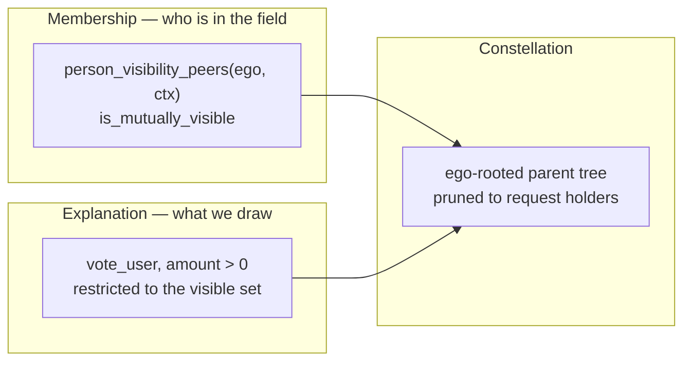

# Constellation — discoverable field, edge semantics, and path explanation

> **Pinning update (2026-09-12):** This record remains normative for
> discoverability, path selection, and the automatic field.
> [`constellation-pinning-plan.md`](constellation-pinning-plan.md) supersedes
> it for viewer-owned anchors, pin-aware request filters, lifecycle/pin
> presentation, and the private `constellation_anchor` realtime exception.
> Its snapshot-only rule still applies to discovery data; it does not prohibit
> a viewer's own anchors from converging between their sessions.

Status: historical architecture record for the automatic field. Its implemented
discoverability and path decisions remain authoritative; the pinning plan owns
the later personal-placement and private-realtime contracts.

Date: 2026-09-07. UX amendment: 2026-09-08, incorporating the product owner's requested ten changes. **Implementation amendment: 2026-09-08** — approved by the plan owner following the adversarial review recorded in [`constellation-review-cursor-gpt.md`](constellation-review-cursor-gpt.md). It carries one override of a prior decision (**O1**, hops-first path key, §5), two corrections (**A2** no `ctx` on the wire, §12/U5; **A3** narrowed positional stability, §5.1), and three new decisions (**N1** symmetric peer set and its residual gap, §5; **N2** the peer cap as a guard rail with three disjoint holder-absence meanings, §5.2; **N3** the provider-neutral render seam, §12/U8). §14.2 gains items 6-8. **Consistency amendment: 2026-09-08 (plan revision 11)** — §5's clauses carry stable `ALG-…` identifiers, `ALG-PARENT` gains the parent-candidate guard the invariant proof depends on, `ALG-EGO` states ego's exclusion explicitly, **B** carries the publication conjunct, and §5.2 holds the one normative absence-semantics table; D11 is narrowed to content-wall parity. Repository baseline inspected for the original architecture: `fd69d499b`, including the then-current working tree. Latest migration in that inspection: `m0159`. The UX amendment is documentation only; it does not claim implementation or refresh that code audit.

User-facing **Request** remains internal **Beacon**. Constellation introduces no parallel entity: it is a new *projection* over existing beacons, existing trust edges, and the existing mutual-visibility relation.

---

## 0. What this document decides

Constellation is a new central navigation surface: an interactive, ego-centred map of the **reachable field of active requests**. Ego sits at the centre, people form the relational rings outward, and each person's active discoverable requests hang off them as satellites.

This document settles the question *"what edges do we draw as the path to each request?"* and the decisions that question depends on. The UX amendment also specifies how the field answers *"what is happening among my trusted connections, and how can I help?"* before requiring graph exploration. It does not specify pixel-level UI or final GraphQL field names.

Surface semantics, restated as the contract the three surfaces must jointly satisfy:

| Surface | Meaning | Push/pull |
|---|---|---|
| **Inbox** | Requests explicitly forwarded to me, plus the update receipts folded in from the retired Updates tab (D17) | Push — someone chose me |
| **Constellation** | Requests I can currently discover in my relational field | Pull — nobody chose me; I am looking |
| **My Work** | Requests I authored **or offered help on** — pending and declined offers included, per the shipped rule in `../Tentura_current_status_quo.md` §7 | Pull on my own responsibility |

The boundary is about *provenance*, not exclusivity: a request can be in my field **and** already held (D16).

Constellation is the answer to the open question recorded in `../Tentura_current_status_quo.md` §14, *"exploration without feed logic"*. Everything below exists to keep it a **map of current opportunities**, not a feed.

---

## 1. The decision underneath the edge decision

If discoverability is defined as *"a request is visible to everyone mutually visible with its author"*, then every discoverable request's author is one hop away **in the visibility relation** and the graph collapses to a star. The path question would be vacuous.

It is not vacuous, because the two relations are different graphs:

- `person_visibility_peers(viewer, ctx)` (m0151) admits a peer under this exact truth table — **not** "explicit trust in either direction":

  ```
  is_mutually_visible :=
        (viewer_explicitly_trusts_subject OR forward_mr > 0)
    AND (subject_explicitly_trusts_viewer OR reverse_mr > 0)
  ```

  Each direction may be satisfied by explicit trust *or* by MeritRank, but **both directions must be satisfied**. MeritRank is a decayed walk, so the MR clauses admit people several hops away in the trust graph.

  **The predicate is not symmetric today, and Constellation makes it symmetric (D14).** `mr_mutual_scores(v_id, ctx)` is ego-outbound, so which MR *rows exist* depends on the argument order — m0151's own header records this: a peer with only peer→viewer MR is omitted. `is_mutually_visible(A, B)` and `is_mutually_visible(B, A)` can therefore disagree today, e.g. explicit `V→A` plus MR `A→V` with no MR `V→A`. That asymmetry would produce requests that look discoverable but cannot be opened, and the reverse.

  The individual MR rows already carry **both** directions (`score_value_of_src` and `score_value_of_dst`), so the fix is cheap: symmetry is about which rows were materialised, not about missing data.
- `vote_user` / `user_trust_edge` is the structural graph where those hops actually live.

Hence the governing principle:

> **Membership is decided in the visibility relation. Explanation is drawn in the explicit-trust graph.**

The path's job is to answer *"why is this near-stranger in my field?"* for exactly those peers who are in it through MeritRank rather than through a tie I declared myself. Where the explicit-trust graph cannot answer that question, we say so instead of inventing a line (§7).



---

## 2. Product decisions

Supplied by the product owner in this round unless marked *derived*.

| # | Decision |
|---|---|
| **D1** | **Two-tier path vocabulary.** **Tier 1** is explicit trust — `vote_user`, `amount > 0` — and is preferred **wherever it reaches within the hop cap** (O1a: a whole search stage runs before tier 2 is consulted at all). **Tier 2** is effective trust (`user_trust_edge`, positive), used **only as a fallback**, for holders tier 1 cannot reach within the cap. Paths are as explicit as they can be, and derived edges appear only where the alternative is no explanation at all. |
| **D1a** | *Derived* — **tier 2 edges render visually distinct but carry no label.** The reader sees a weaker-evidence connection without being told the system inferred it from reviews or forwards. `user_trust_edge` is an aggregate across contexts, so an edge never discloses *which* evidence produced it. |
| **D2** | **Path depth cap is 3 hops** from ego. |
| **D3** | **The unattributable ring is accepted** for v1, now as a **residual**: a mutually visible peer that neither tier reaches within the cap goes to an outer ring with no drawn path. Ring people are **tappable and carry their request satellites** like anyone else — the ring withholds the explanation, not the opportunity. |
| **D4** | **Request discoverability is opt-out**: active requests are discoverable by default to everyone mutually visible with the author; the author may turn discoverability off per request. This is a read-permission rule, not a Constellation-only projection — see D11. |
| **D5** | **Forward edges are never drawn in Constellation.** Constellation shows no provenance of forwarding, because a forwarded request is by definition an Inbox item, not a discovery. The spec clause binding visibility to "relation to the specific beacon/path" is removed (§10). |
| **D6** | *Derived* — **paths may only traverse people who are themselves mutually visible to ego.** A path is never routed through a person ego cannot otherwise see, anonymously or otherwise. This adds zero new exposure class. |
| **D7** | *Derived* — **traversal follows trust direction outward from ego** (`ego → A → B` requires `ego` trusts `A` and `A` trusts `B`). This is the direction MeritRank actually flows. Undirected "you both trust X" bridge paths are a documented later option, not v1. |
| **D8** | *Derived* — **one parent per person**: the drawn structure is a tree, not the full closure. Tie-break is `(tier asc, parent id asc)` — a tier-1 and a tier-2 predecessor can realize the same key, and id alone would let the derived edge win. `depth` is not a tie-break term: under O1 every parent sits exactly one ring in. |
| **D9** | *Derived* — **a person is shown only if they justify themselves**: they hold a discoverable active request, or they are an intermediary on the chosen path to someone who does. Everyone else is pruned. *Naming, because the two are easy to conflate:* the algorithm's `attributed` (§5 step 3) is **reached holders only**; the rendered set is `keep` (step 4) = `attributed` ∪ their ancestors. Prose elsewhere calling an intermediary "attributed" means `keep`; the code field is `isKept`. |
| **D12** | **The migration backfills `is_discoverable = true` for every existing row**, children included. One uniform rule, no legacy tier: every existing active request becomes discoverable across its author's field on rollout day. |
| **D13** | **The full closure among visible peers may cross the wire — both tiers.** Tier 2 is included (U5, §9.1); it is ids-only and weight-free. The disclosure this authorizes is the *existence* of a derived relation between two peers ego can already see, never its evidence or magnitude (D1a). The client receives the closure and prunes locally; drawing stays a tree (§3.1), and *transmission* is the authorized disclosure. §9.1 is amended accordingly.<br>*Originally worded "explicit-trust closure"; widened to both tiers to match U5 and §9.1 — the tier-2 half is the part that discloses system-derived relations, so it is called out here rather than left implicit.* |
| **D14** | **Mutual visibility becomes symmetric**, evaluated in the global context (`ctx = ''`). Shaped so a later switch to per-capability contexts is a parameter change, not a redesign. |
| **D15** | **The field refreshes on open only.** No realtime invalidation for discovery-only viewers. The map is explicitly a snapshot of the moment it was opened. |
| **D16** | **Requests already held are shown and annotated**, not hidden — including ego's own, which hang off the centre. Actions derive from real state, never from a binary "already held" flag. |
| **D17** | **Constellation takes the Updates slot**; Updates folds into Inbox. The bottom bar stays at five destinations. |
| **D11** | **Widening the shared read wall is deliberate.** The `beacon_can_read_content` discoverability clause (§8.3) widens read access on every surface that uses that wall, not only Constellation. This is the intended meaning of D4, confirmed by the product owner, not an accepted side effect. **Discovery grants the same content-wall access used by a forwarded recipient** and permits `offerHelp`, `forward`, invitation, and `fork` subject to their existing operation-specific checks, with no new gate. It does **not** itself grant `can_read_involvement` or discussion admission — a forwarded recipient holds involvement access through m0124's forward-edge branch, a discovery-only viewer does not, and that boundary is preserved (plan UNIT 05). |
| **D10** | *Derived* — **active** means `beacon.status IN (0 open, 7 needsMoreHelp, 8 enoughHelp)`. `enoughHelp` is included but visually de-emphasised, because it still accepts backup offers. Drafts, review-open, closed, cancelled, and deleted never appear. |

---

### 2.1 UX amendment decisions (2026-09-08)

These ten additions are accepted plan scope following the product owner's instruction to incorporate the UX review. They supplement D1–D17; they do not mark any feature as shipped.

| # | Change | Contract |
|---|---|---|
| **UX1** | Readable needs at first glance | Visible request labels communicate the need, timing, and remaining help where known, without a tap (§11.1). |
| **UX2** | Actionable preview | Contribution, effort, location, coverage, and state-appropriate help/backup/forward actions (§11.2). |
| **UX3** | Distinct social meanings | Connection, actual referral, and authorized participation remain separate; proximity never implies endorsement (§9.3, §11.2). |
| **UX4** | Explicit filters | Capability, location/remote, and timing where reliable data exists; stable geometry and no hidden ranking (§5.3). |
| **UX5** | Viewport-aware density | Readable initial labels, grouped overflow, explicit expansion, and path-preserving caps (§5.2–§5.3). |
| **UX6** | Accessible text view | The same bounded field and connection explanations, without infinite scrolling or ranking (§11.3). |
| **UX7** | Discovery entry from My Work | Prominent route, especially in the empty state; My Work remains the default (§11.4). |
| **UX8** | Snapshot freshness and action checks | Show load time and revalidate current permissions and request state before an action (§11.5). |
| **UX9** | Task-based UX acceptance | Users find a suitable contribution, understand the connection, and predict the effect of offering (§12.2). |
| **UX10** | Visibility documentation reconciliation | Align intended permissions and implementation status across this plan, status quo, and `CONTEXT.md` before the read-wall change (§10, U0). |

## 3. Edge vocabulary — options considered

| Vocabulary | Source | What an edge would assert | Verdict |
|---|---|---|---|
| **A. Explicit trust** | `vote_user`, `amount > 0` | "A chose to trust B" — user-authored, ownable, contestable | **Chosen (D1)** |
| **B. Effective trust** | `user_trust_edge` (positive), as returned today by `graph_edges_between` (m0136) | "A's accumulated evidence toward B", including review- and forward-derived bins (`forward` context ×0.20) | **Chosen as tier 2 (D1)** — fallback only. Denser and explains more, at the cost of exposing relations *neither party declared*. Confined to the cases where the alternative is an unexplained node |
| **C. Mutual visibility** | `person_visibility_peers` | "these two can reach each other" | Correct for membership; wrong as a drawn edge — symmetric, non-structural, and third-party pairs are not ego's to know |
| **D. MeritRank walk** | the actual walk contribution | the true causal answer | Rejected on principle: §10 of the status-quo doc makes MR a hidden procedural layer. Drawing the walk is drawing the weights. (Constrained re-entry as an *opaque* path source in §7.2) |
| **E. Forward / provenance** | `beacon_forward_edge` | "A sent this to B" | Rejected by definition (D5). It would also collide visually with the existing Forwards graph mode |
| **F. No edges** | — | rings only, connections on demand | Rejected: discards the feature's thesis |

The contest was **A vs. B**, and it is a privacy trade, not a technical one. Today a user's trust structure is visible to others only when someone deliberately opens *Show connections*; Constellation makes it an **ambient default background surface**. That is defensible for edges a person authored (`vote_user`), and harder to defend for edges the system derived from their reviews and forwards.

The resolution is ordering rather than exclusion (D1): explicit trust wherever it reaches within the hop cap, derived trust **only for holders explicit trust does not reach at all** (O1a, §5). This is a two-stage search precisely so the bound is *the residual*, not the shortest-path layer: a holder explicable by a 3-hop explicit chain is explained that way, never by a shorter derived edge. Ambient disclosure of derived structure stays confined to nodes that would otherwise carry no explanation, and — per R12 — this is also what keeps the outer ring from swallowing the graph.

### 3.1 Path-selection policy — options considered

| Policy | Result | Verdict |
|---|---|---|
| Full closure among visible people | Maximum context | Rejected **as a drawing** — it would turn an ambient map into a social audit tool and reintroduce the legibility failures catalogued as K1/K2 in `graph-navigation-rework-plan.md`. Note this is now a *rendering* decision only: under D13 the closure is transmitted and pruned client-side |
| Union of all shortest paths | Honest ("three ways you are connected") | Rejected — DAG with crossings, unstable under expansion |
| **One deterministic parent per person (tree)** | Every person has exactly one explanation; adding a request never re-routes an existing one | **Chosen (D8)** — and it is what `computeRadialHopLayout` already assumes, since it returns a `parent` map |
| Tree by default + on-demand "show other connections" | Tree plus an escape hatch | Deferred; not in v1 |

---

## 4. Node and edge model

### 4.1 Node kinds

| Node | Meaning | Notes |
|---|---|---|
| **Ego** | The viewer | Centre, fixed |
| **Person (attributed)** | Mutually visible peer reachable within 3 hops over tier-1 or tier-2 trust | Ring = tree depth 1..3 |
| **Person (unattributed)** | Mutually visible peer neither tier reaches within the cap, who holds a discoverable request | Outer ring, dashed stub to ego, no intermediary shown. Tappable; carries satellites (D3) |
| **Request** | An active discoverable request authored by a shown person, **or by ego** (D16) | Satellite of its author; ego's own hang off the centre |

### 4.2 Edge kinds

| Edge | Drawn as | Never |
|---|---|---|
| **Path, tier 1** (declared) | One quiet stroke, no arrowheads, uniform width | Never weight-derived width, never a colour ramp, never negative edges |
| **Path, tier 2** (derived) | Same geometry, visibly lighter or dashed — distinct but **unlabelled** (D1a) | Never annotated with the evidence type; never presented as a ranking of relationship quality |
| **Attachment** (person → their request) | Visually distinct *kind* of line — shorter, different weight and colour role | Must never be confusable with a path stroke; that confusion is exactly what produces "Bob sent me this" |
| **Reachability stub** (ego → unattributed person) | Dashed, low emphasis | Not a claim about any intermediary |

Reciprocity is edge **decoration** (hairline or dot), never geometry — consistent with the trust-graph stance already recorded in `graph-navigation-rework-plan.md` §4-bis.

---

## 5. Algorithm

Inputs, all already authorized data for ego:

1. **V** — symmetric mutual visibility (D14) against ego in the global context, minus `block_hides` in either direction. **One source of truth:** the same symmetric predicate backs both the read wall and the field's peer set; the field must never enumerate peers from the older ego-outbound projection. *Accepted residual gap (N1):* a peer reachable only through **their own** MeritRank walk, with no `vote_user` edge either way, satisfies the symmetric wall but is not enumerable from ego's side without scanning every user. Their request is therefore readable yet absent from the field. **Field membership is a subset of wall-readable, never a superset** — a display gap, never an authorization leak.
2. **B** — **published** requests (`published_at IS NOT NULL` — open-family is not the same as published, §8.3) with status ∈ {0, 7, 8} (D10), whose author is ego or a member of **V**. `is_discoverable` (D4) is required for peer-authored requests; **ego's own requests do not require it** (D16). Block exclusions apply in either direction.
3. **E₁** — tier-1 edges `(src, dst)` from `vote_user WHERE amount > 0`, both endpoints in `{ego} ∪ V` (D6).
4. **E₂** — tier-2 edges from `user_trust_edge` (positive), same endpoint restriction, **ids only, no weights** (§9.1).

Then, as pure client-side domain code. **Each clause carries a stable identifier
(`ALG-…`).** The plan's §0.4 binding table and UNIT 08's test names cite these
identifiers, so a clause cannot be dropped from either document without a
reference dangling — the failure mode that once lost the parent-candidate guard
below when a duplicate statement of this algorithm was removed.

```
1. holders   := { author(b) : b ∈ B }                                  [ALG-HOLDERS]
2. cost(e)   := 0 for e ∈ E₁, 1 for e ∈ E₂            (D1: explicit preferred)
   -- [ALG-DEDUP] If the same ordered pair (src, dst) carries both tiers, the
   -- tier-2 row is discarded before either table is built (see below).

   -- [ALG-STAGE1] STAGE 1 — explicit trust only (O1a). All of E1 costs 0, so
   -- this is a plain hop-minimising BFS over E1, following trust direction (D7).
   depth1(ego) := 0
   T         := { p : reachable from ego over E1 alone within 3 hops }
   depth1(p) := min hops over E1 alone, for p in T
   For p in T:  depth(p) := depth1(p) ; derived(p) := 0
                parent(p) := min by (id asc) among tier-1 predecessors q in
                             {ego} ∪ T with depth1(q) = depth1(p) - 1
                parentTier(p) := 1

   -- [ALG-STAGE2] STAGE 2 — both tiers, ONLY for holders stage 1 could not
   -- reach. A node already in T may be relaxed FROM only at its own depth1,
   -- which is what keeps a single well-defined ring per person.
   d2[ego][0] := 0 ; every other cell d2[·][·] := INFINITY    (explicit init)
   d2[p][h]  := min derived-edge count over walks ego -> p of EXACTLY h edges
                over E1 + E2, where a step out of q in T is permitted only
                when h-1 = depth1(q).  h = 0 … 3 (D2).
   For p not in T reached by stage 2:
                depth(p) := min { h : d2[p][h] < INFINITY }     # HOPS FIRST (O1)
                derived(p) := d2[p][depth(p)]

   -- [ALG-PARENT] stage-2 parent selection. The parent-candidate guard is
   -- load-bearing: the relaxation rule above constrains the TABLE, not this
   -- reconstruction, so without it a T node pinned at a deeper ring could be
   -- selected as the parent of a shallower child (see the invariant below).
   parent(p) := predecessor q of an edge e = (q, p), minimising
                (tier(e), id(q)), subject to:
                  d2[q][depth(p)-1] < INFINITY
                  AND (q ∉ T OR depth1(q) = depth(p)-1)     -- parent-candidate guard
                  AND d2[q][depth(p)-1] + cost(e) = derived(p)   (D8)
   parentTier(p) := tier(e) of the selected edge
   -- q = ego is admitted through d2[ego][0] = 0; ego ∉ T, so the guard passes.

   -- the finiteness restriction is load-bearing: a lex-min over ALL h would let
   -- (1, INFINITY) beat (2, 1) and hand a node unreachable in one hop depth 1.
   -- (A (2, 0) cell cannot occur for p ∉ T: an all-tier-1 walk puts p in T.)
   -- Each cell of either table is a min over a fixed set, so both are
   -- order-independent. NOT a 0-1 BFS deque (see O1).

   -- [ALG-EGO] depth(ego) := 0 by convention. Ego is never assigned a parent
   -- and is absent from every returned map (depth, derived, parent, parentTier)
   -- and from ring — even when ego is a holder (D16) or an edge x -> ego exists
   -- (D7: traversal is outward only). The invariant below is stated against
   -- this convention.
   tree      := the parent map built above (stage 1 for p in T, stage 2 otherwise)
3. attributed := { p ∈ holders : p ∈ tree }        # reached HOLDERS only  [ALG-PRUNE]
4. keep      := attributed ∪ { every ancestor of an attributed holder }   # Steiner pruning (D9)
5. ring      := (holders \ tree) \ {ego}          # residual: neither tier reached (D3)
              -- ego is a holder under D16 but is never a ring node; its own
              -- requests hang off the centre.
6. nodes     := {ego} ∪ keep ∪ ring
              ∪ { b ∈ B : author(b) ∈ ({ego} ∪ keep ∪ ring) }   # ego's satellites included (D16)
7. edges     := parent edges within keep, attachment edges, ego→ring stubs
8. positions := layout in three separate passes (§5.1) — never one call
```

**O1 — hops-first *within* each stage; tier 1 is preferred across stages.**
This overrides the derived-first single-table ordering this document carried
until 2026-09-08. Approved and binding.

Two decisions, and they are separable:

- **O1a — two stages, so D1's disclosure bound survives.** A holder explicable by
  explicit trust alone is **never** explained using a derived edge, however much
  longer the explicit path is. Tier 2 is reached for only after stage 1 has
  failed to reach that holder at all, which is exactly D1's original "derived
  edges appear only where the alternative is no explanation at all". A single
  combined table would have made tier-2 edges ambient at the shortest-path layer;
  that was rejected as too broad a disclosure of relations neither party
  declared.
- **O1b — within a stage, the key is hops-first**: `depth` is the fewest hops,
  and `derived` the fewest tier-2 edges *among paths of that length*. This is
  what makes `depth` well-defined; see the invariant below.

If the same ordered pair `(src, dst)` carries **both** tiers, tier 1 wins and the
tier-2 duplicate is discarded before either table is built — the edge source
already guarantees one row per pair with tier 1 preferred, and the client must
not re-introduce a duplicate carrying a different cost.

**The accepted cost of the stage-2 constraint.** Pinning a `T` node to its
`depth1` can leave a holder unreachable that a wholly unconstrained search would
have found — its only route needed a `T` node drawn at a shorter ring than its
explicit-trust depth. Such a holder falls to the **residual ring**. A path does
exist; we decline to draw it rather than give one person two rings. The ring copy
("reachable through your wider network") stays truthful, and the limitation is
recorded in the shipped feature doc. Do **not** "fix" this by letting a `T` node
float between rings.

*Why hops-first inside a stage.* Derived-first and a well-defined `depth` are not
simultaneously satisfiable. A person's own best label can sit at a different hop
count than the label a descendant is reached through, so a parent edge could span
more than one ring; forcing consistency instead drops reachable holders.
Hops-first removes the conflict outright.

**Invariant: `depth(parent(p)) == depth(p) - 1`, always.** Stage 1 is a plain BFS,
where this is standard. In stage 2, `parent(p) = q` requires `d2[q][depth(p)-1]`
finite **and** the parent-candidate guard `q ∉ T OR depth1(q) = depth(p)-1`
(ALG-PARENT). If `q ∈ T` the guard gives `depth(q) = depth1(q) = depth(p)-1`
directly. The guard is necessary, not decorative: the relaxation rule restricts
which walks may *leave* a `T` node, but it never restricts walks *into* one, so
`d2[q][depth(p)-1]` can be finite for a `T` node whose `depth1(q) ≠ depth(p)-1`,
and the cost equality alone would then admit it. Concretely — tier 1 `ego→a, a→b,
b→q, q→p, r→p`; tier 2 `ego→q, ego→r`; ids `q < r`; everyone visible; `p` a
holder: `depth1(q) = 3`, `p ∉ T`, and `p` is reached at `(depth 2, derived 1)`
through `r` alone (the step `q→p` at `h = 2` is prohibited because `depth1(q) ≠
1`). Yet `d2[q][1] = 1` satisfies `d2[q][1] + cost = derived(p)`, and id order
would select `q` — a depth-3 parent for a depth-2 child. The guard rejects `q`;
the plan pins this fixture as a UNIT 08 test asserting `parent(p) = r`.
If `q ∉ T`, then `q` is reachable in `depth(p)-1` edges so `depth(q) ≤
depth(p)-1`; and `depth(q) < depth(p)-1` would make `p` reachable in
`depth(q)+1 < depth(p)` edges under the same relaxation rules (a step out of a
non-`T` node is never constrained), contradicting the minimality of `depth(p)`.
Both directions hold, so every parent edge spans exactly one ring and §5.1's
sibling-sector model rests on a proved invariant rather than an assumption.

*Why the layered table survives the change.* `depth` alone is a plain BFS, but
`derived(p)` is a **per-layer** minimum that a BFS does not yield. A 0-1 BFS
deque is not a substitute: it orders by the scalar derived count and, within one
value, front-loads tier-1 chains — a DFS on hops — so on `ego→a, a→b, b→x` plus
`ego→c, c→x` it settles `x` at 3 or 2 hops purely by edge iteration order.

### 5.1 Layout composition

Feeding the person tree, the satellites, and the ring stubs into a single radial call does not produce the specified picture. That helper computes **undirected BFS depth** and places every node at `depth × ringGap`, so a stub would make each unattributed person a depth-1 node (inner ring, not outer) and each request a full extra hop (another ring, not a short satellite) — and the requests would additionally distort person sector allocation.

Three passes:

1. **Person tree** — radial rings from the pruned parent tree only. Requests and stubs are excluded from this input.
2. **Unattributed ring** — positions assigned explicitly on an outer radius, deterministically ordered, outside the structural BFS. Stubs are decoration drawn afterwards.
3. **Satellites** — each request positioned relative to its already-placed author, at a fixed short offset, never as a graph hop.

Pass 1 must additionally hold sibling angles fixed against satellite counts (§5 above), which is where the new layout work lives.

Determinism obligations, inherited from the graph rework and enforceable by test:

- the result depends only on the inputs, never on set iteration order;
- the same field state renders identically regardless of the order in which the user expanded things — the layout is recomputed from the current resolved field every time, never patched forward from a previous layout;
- **filtering, grouping or expanding** requests moves no person, ever;
- **adding or removing** a request moves no person **unless it changes its author's holder status** — holders feed the cap policy, so a person's first request can pull them and their ancestor chain into the kept set;
- adding a **person** may re-split its parent's sector among sorted siblings, but never moves anything outside that sector and never moves an ancestor. This is vacuous at depth 1, where the parent is ego and the sector is the whole circle;
- the **residual ring** is evenly spaced by id and sits outside the sector guarantee: adding or removing a ring person re-spaces the other ring people and moves nothing in the tree.

**A3 — this replaces the earlier absolute rule** ("adding a node moves no existing node whose depth and parent did not change"), which is unachievable with equal-angle sector allocation and even ring spacing. The narrowing is approved; all four clauses go in the shipped feature doc's limitations list.

**These are not free.** `computeRadialHopLayout` (`features/graph/domain/layout/radial_hop_positions.dart`) delivers less than its own docstring claims, verified against the implementation:

- **Parent selection differs.** Its BFS assigns `parent` on *first discovery* (`radial_hop_positions.dart:66-75`). Sorted adjacency makes that deterministic, but it is a **different tree** than the `(tier asc, id asc)` predecessor at `d−1` (D8). Counterexample: `ego→a,b; a→z; b→c; z→h; c→h` — FIFO reaches `h` via `z`, though `c` is the smaller same-depth parent. Step 2 above must therefore be computed by Constellation's own domain code, and only its resulting parent edges handed to the layout.
- **Sibling positions are not stable under insertion.** Angles are allocated from **subtree sizes** (`radial_hop_positions.dart:100-120`): each child gets a floor share, and the surplus is split by subtree size. Adding one satellite under `A` changes `A`'s subtree size and therefore rotates `A` *and* its siblings, even though no depth or parent changed. The existing stability test pins the root **and** one descendant
(`radial_hop_positions_test.dart:224-242` asserts both `abc['a'] == ab['a']` and
`abc['b'] == ab['b']`) — but it does so only for a chain extension, not for
sibling insertion, which is the mutation that actually redistributes sectors. Positional stability under request arrival is **new implementation work**, not reuse (§5.1).

### 5.2 Bounds

| Bound | Value | Why |
|---|---|---|
| Path depth | 3 hops (D2) | Bounded discovery is an axiom, not a performance concession |
| **Graph** peers fetched | cap `V` (start at 200) | Edge cost is quadratic in this set |
| Peer **profiles** returned | graph cap + request cap | Request authors outside the graph cap still need a name; nothing may assume profiles ≤ the graph cap |
| Requests per person, initially rendered | 3 + "+N more" opening the person | Anti-clutter; the person panel is the expansion path |
| Requests total, initially rendered | upper cap (start at 150), reduced by viewport label budget | Rendering ceiling, not a target for simultaneous readability (UX5) |

**Caps must not manufacture unattributable peers — and where one unavoidably
does, it must stop asserting.** The client render budget honours this outright:
it truncates path-preservingly, so it never demotes a holder into the ring. The
server graph cap cannot, because the server has not resolved paths; an author
outside the graph set arrives with no edges and lands mechanically in the ring.
The rule is therefore satisfied at a different level: while the graph cap is in
force, **ring nodes lose the claim that no path exists** and degrade to *"path
not shown"* (§11 and the overflow contract below). Manufacturing a ring node is
tolerable; asserting a falsehood about it is not. Truncating `V` can drop an intermediary and thereby demote a holder into the ring, and a later expansion can then re-attribute it — visible churn. Required before U6: a deterministic, score-independent selection order, and truncation that is **path-preserving** (never sever a node from a retained descendant).

**N2 — two different caps, and only one of them selects.** The 200-peer bound in the
table above is a **transport guard rail**; the client additionally carries a smaller
**render budget** (the cap `resolveAndCapConstellation` consumes), which is the only
cap that performs path-preserving selection. They are not the same number and must not
be conflated: without a distinct, smaller client budget the displaced-holder path is
unreachable and the three holder-absence meanings below collapse to two.

**The server-side peer cap bounds transport; it does not select paths.** An
id-ordered prefix cannot preserve paths, because the server has not resolved them.
On overflow the server therefore bounds **the graph, never the content**: it
returns the first `cap` peers by id and the edges among them, while the request
set and its authors' profiles stay drawn from the whole visible peer set. Edges
are the quadratic term and the reason a cap exists; requests are linear and
already separately capped. So what overflow omits is the **path**, not the
request. Two things make that honest rather than a lie about connectivity:

1. the client shows a persistent **"Some connection paths are not shown"** notice
   whenever the flag is set — *paths*, not requests, since the request query is
   unaffected by peer overflow — so an incomplete map never reads as a complete
   one, and every ring node in the field degrades to "path not shown" for as long
   as the flag is set; and
2. that notice points to a **fallback plain list** of the available requests —
   the Text view (§11.3) with connection explanations omitted. Because the peer
   cap does not truncate the request query, this list is a genuine route to the
   content and not merely a different rendering of what the map already showed.
   The request cap remains independent: when *it* fires, some requests were not
   returned at all and the fallback cannot recover those. Both flags may be set
   together, and they need distinct copy.

The cost is accepted deliberately: a truncated intermediary does push its holder
into the residual ring, so some requests lose their *explanation*. The notice and
the fallback list mean the user is told and can still reach them. The
alternatives are both worse: returning nothing gives the most connected users a
dead surface, and truncating requests alongside peers would leave the fallback
list with nothing to recover.

Path-preserving truncation still happens **only** client-side, against the client
render budget, and it resolves on the peer set it was given **before** truncating.
Resolution after truncation re-derives a dropped intermediary's holder into the
ring with no signal at all, which is the failure this rule exists to prevent.

**Absence semantics — the one normative table (N2).** Holder absence has three
disjoint meanings, and the UI must not merge them. Every consumer — plan §0.4,
UNIT 17, UNIT 18 — cites this table instead of restating it.

| State | Membership | Truthful claim | While `peersCapped` is set |
|---|---|---|---|
| **attributed, kept** | `paths.attributed ∩ keptPeerIds` | a permitted path exists and is drawn | unchanged |
| **cap-displaced** | `paths.attributed ∩ droppedHolderIds` — produced by the **client render budget** only | a permitted path exists; the render budget displaced it. Copy says *omitted by a field cap*, never *no path* | unchanged |
| **ring** | `paths.ring` — neither tier reached the holder within `maxHops`, resolved on the full peer set the client was given | *no permitted path within the hop cap* — the honest "we cannot explain this connection" | **overridden:** degrades to *path not shown*. The server truncated the graph, so an absent fetched path is not evidence that none exists; no ring node anywhere in the field may carry the "no path" claim |
| **ring, not kept** | `paths.ring \ keptPeerIds` | still a ring holder — never in `droppedHolderIds`; the client `capped` flag reports the omission separately | same override |
| **graph truncated** (field-level) | `peersCapped` | *Some connection paths are not shown*; the request query is unaffected and the Text view lists the content | — |
| **requests truncated** (field-level) | `requestsCapped` | some requests were not returned; the fallback list cannot recover them | independent of `peersCapped`; both may be set and need distinct copy |
| **hidden by a filter** / **collapsed for space** | presentation only | distinct states and copy; never a claim about paths or membership | — |

`droppedHolderIds` is **attributed-only**: putting a ring holder in both sets would
make two mutually exclusive claims true at once.

Progressive expansion means: the initial render is the pruned tree of §5 step 4; tapping a person reveals **that person's** remaining requests and their own next-hop neighbours. There is no "load more" of the field as a whole, because that is scroll behaviour wearing a map costume.

---

### 5.3 Filters, density, and positional stability (UX4–UX5)

- **Eligibility first:** filters operate only on the already-authorized field. They do not widen visibility, change D14's global trust context, or synthesize private capability/involvement information.
- **Explicit selection:** support capability, location, and timing only where request data supplies reliable values. The mapped location fields (`address_label`, coordinates) establish *presence* of a location, not remote eligibility: a request without them is **unspecified**, never "remote". A remote-specific filter is deferred until an explicit, reliable field exists, and the omission is recorded as a limitation. Define field mappings in U5 before implementation; do not infer effort, availability, or capability from private reviews or prose. Keep unspecified values visible in an identified group by default; excluding them requires an explicit control. If a filter lacks a usable source, omit it with the limitation recorded rather than invent a match.
- **No ranking:** filtering changes which requests are shown, not the order or geometry of people. Within a snapshot retain the unfiltered layout anchors, including when hiding irrelevant branches; clearing filters restores the same positions. A filter must not make a connected person appear unattributed.
- **Readable density:** choose the visible label budget from viewport size, text scale, and non-overlapping accessible hit areas. The per-person limit of three and global limit of 150 are ceilings. Group additional satellites under their author with a labelled expansion control; do not require discovering a second-tap gesture. Use deterministic, score-independent allocation across authors so one prolific author cannot consume the initial label budget. This controls presentation, not membership or importance.
- **Bounded completeness:** grouping never removes the ability to inspect an included author's remaining requests. Preserve intermediary paths under data caps (§5.2), and distinguish requests hidden by a filter, collapsed for space, or omitted by a field cap. An empty filtered result offers Clear filters; it must not imply that nobody in the network needs help.
- **Stable updates:** request arrival, grouping, and filter changes do not move unchanged person anchors. Preserve the selected request and viewport across map/text switches. On a fresh snapshot reconcile by stable ids; if selection is no longer available, explain that state rather than silently selecting another request.

## 6. Reuse map

Most of this exists. New work is narrow.

| Need | Existing | New |
|---|---|---|
| Membership | `person_visibility_peers` (m0151), already the canonical projection used by `forward_candidate_context_sql` | — |
| Tier-2 edges among a known node set | `graph_edges_between` — reads exactly the `user_trust_edge` rows tier 2 wants. **Current definition is m0136** (`node_ids, positive_only, hasura_session`); the m0134 two-argument version was superseded. Returns weights, so it cannot be handed to the client as-is | A weight-free projection over it |
| Tier-1 edges among a known node set | — | A `vote_user`-backed, visibility-filtered, ids-only sibling (D1) |
| Deterministic ego layout | `computeRadialHopLayout` — **partial**: rings and determinism yes, min-id parent selection and insertion-stable sibling angles no | Parent selection in Constellation domain code; three-pass layout composition (§5.1) |
| Path pruning primitives | `prune_directed_paths.dart` (`forwardReachFromPairs`, `verticesThatCanReachFocusPairs`) | Steiner pruning to holders |
| Graph render, legend, modes | `GraphBody`, `GraphLegendMode`, `GraphMode` | A fourth mode: `constellation` |
| Person context panel | `GraphPersonContextCubit` / `graph_person_context_panel.dart` (issue #100) | Request list inside the panel |
| Read authorization | `beacon_can_read_content` (m0136); `person_is_mutually_visible` (m0140) already exists, viewer-first | A discoverability clause (§8) and a **symmetric** wrapper (D14) |

---

## 7. The unattributable ring

### 7.1 v1 behaviour

A peer in **V** who holds a discoverable request and is reached by **neither tier** within 3 hops is shown in an outer ring, attached to ego by a dashed stub, labelled *"reachable through your wider network"*. Ring people are tappable and carry their request satellites (D3): the ring withholds the explanation, not the opportunity. We do **not** fall back to vocabulary D to manufacture a line.

With tier 2 in place (D1) this set should be much smaller than the R12 estimate, which assumed explicit-only paths. It is not empty: MeritRank admits peers whose connection to ego runs through people ego cannot see (D6), and no permitted vocabulary can explain those.

An honest "we are not showing you why" is better social design than a fabricated intermediary, and it is the only treatment that keeps the promise not to expose MeritRank structure.

### 7.2 Documented upgrade path

If the ring turns out to be too large or too unsatisfying in practice, the two exits, in order of preference:

1. **Narrow membership** to explainable peers only. Smaller, more legible — every node then has a drawn path by construction. (The other former exit, "use effective trust", is now taken: it is tier 2.)
2. **`mr_graph(ego, focus, ctx, positive_only, offset, limit)`** — but note that it is **not a path API**. It returns a ranked *focus neighbourhood* within a fixed window (`graph()` in m0108 hard-codes `0, 100`), and m0134's own header plus K3 of the graph-rework plan record that its structural coverage is incomplete. It may return disconnected structure and people outside `V`. Taking this exit requires first establishing a real path contract — completeness, endpoint authorization, permitted intermediaries — and an explicit privacy decision, since stripping numeric fields does not remove score-*derived* selection and ordering. Do not take this exit silently.

---

## 8. Discoverability and opt-out

### 8.1 Rule

An active request is readable by any user mutually visible with its author, unless the author has turned discoverability off for that request.

### 8.2 Schema

Add to `beacon` (Drift table `Beacons`) a nullable-free boolean, working name `is_discoverable`, default `true` (D4), exposed through `beaconCreate` / `beaconUpdate` and the request form.

**The migration backfills `true` for every existing row (D12)**, children included — one uniform rule, no legacy tier. The consequence is exact and should be stated to the team rather than discovered: on rollout day every existing active request, including children promoted out of private discussions, becomes readable across its author's field. Recommended (not required by D12): tell authors once, in-app, at rollout, with the per-request toggle one tap away.

### 8.3 Permission wall

`beacon_can_read_content(p_beacon_id, p_viewer_id)` (m0136) gains a clause after the existing forward/participant/help-offer branches:

```
WHEN b.is_discoverable
     AND b.status IN (0, 7, 8)
     AND b.published_at IS NOT NULL          -- open-family is not the same as published
     AND b.user_id IS NOT NULL               -- m0157 erasure tombstones
     AND public.person_are_mutually_visible(p_viewer_id, b.user_id, '')
     THEN true
```

All four conjuncts are normative. The Dart policy mirror must carry all four, or
the SQL↔Dart parity suite is false by construction: an open-family row with a
NULL `published_at` is denied by SQL and allowed by a three-conjunct mirror.

Under D14 the predicate is **symmetric**, so argument order stops being load-bearing at the call site — but only because the new function makes it so. Symmetry is the OR-closure of the existing viewer-first evaluation:

```
person_are_mutually_visible(a, b, ctx) :=
     person_is_mutually_visible(a, b, ctx)
  OR person_is_mutually_visible(b, a, ctx)
```

The OR (rather than AND) closure is the permissive reading: it repairs the "materialised from the wrong side" case rather than discarding both. **This changes forward-candidate eligibility too**, since `forward_candidate_context_sql` reads the same projection — direct-send eligibility widens by exactly the set that symmetry repairs. That is the consistent outcome and the reason to make the change in one shared function rather than a Constellation-local copy. The widening must reach **every** forward gate, not only the candidate lists: `ForwardCase` authorizes the actual send through `PersonVisibilityRepositoryPort.mutuallyVisiblePeerIds`, which today filters the old ego-outbound `is_mutually_visible` row; if that check stays on the old projection, a repaired pair displays as eligible and then fails at send (plan UNIT 04).

`beacon_can_read_content` is the shared read wall, so this widens read access on *every* surface that uses it — profile shared-request lists, Hasura row permissions, hierarchy parity checks — not only Constellation. **This is deliberate and confirmed (D11):** an active, non-opted-out request is readable by anyone mutually visible with its author, on any surface, and Constellation is simply the first surface that navigates that reachability.

Two obligations follow from making it deliberate rather than incidental:

- Review U3 as an **access-control change** with its own security pass, not as a Constellation feature commit.
- Extend `beacon_access_sql_parity_test`, `inbox_beacon_visibility_hasura_test`, and `user_block_adversarial_pg_test` to assert the *new* wall. Any existing case that breaks is either a genuine regression or an assertion that encoded the old narrower rule — decide which, explicitly, per case. Do not adjust a failing expectation without recording why the old rule no longer holds.

### 8.4 Performance risk

Mutual visibility currently costs a `mr_mutual_scores` call. Evaluating it inside a row-level permission predicate is a real risk. Mitigations, in order:

1. A cheap short-circuit inside the symmetric wrapper: reciprocal `vote_user` first, MeritRank only on miss — and the second (reversed) evaluation only when the first returns false, so symmetry costs nothing on the common path and at most doubles the cold path.
2. If that is not enough, a cached mutual-visibility table. **The MeritRank publish epoch alone is not a sufficient invalidator:** membership depends directly on `vote_user`, and `mr_bump_publish_epoch` (m0144) fires only when an effective-weight change clears epsilon *and* publication succeeds — so explicit-trust membership can change with no epoch bump, leaving a cached positive result granting access after the signal that justified it is gone. Direct-trust changes need their own version counter. Block checks stay **outside** the cache. Expiry, rebuild concurrency, and behaviour when MeritRank is unavailable must be defined before any cache enters the read wall.

Do not ship 8.3 without a measured plan for 8.4 — and measure whole-query plans, including **denied** rows (Hasura evaluates the predicate before dropping them, so the 150-request render cap bounds nothing) and MeritRank-failure behaviour. The blast radius is ordinary request reads, image metadata, help offers, hierarchy predicates, and attention processing — not Constellation alone.

### 8.5 Author-side transparency

Opt-out is meaningless if authors cannot see what they are opting out of. The request surface shows the author a plain statement of current reach (working copy: *"discoverable by people you and your network can both see"*) and the discoverability toggle beside it. A precise live count is optional and should not become a vanity metric.

---

## 9. Invariants

### 9.1 Privacy — never render, never send over the wire

- any MeritRank score, weight, or ordering derived from one;
- `user_trust_edge` weights, including `prev_sent_weight`, and `dst_score` / `src_score` columns;
- negative or neutral trust edges — Constellation is hard-coded `positive_only`;
- any person who is not mutually visible to ego, including as an anonymous intermediary (D6);
- forward edges or provenance-shaped graph affordances (D5). The explicit `Forward` action in a request preview remains available when permitted; it is not a graph edge or a claim that someone referred the request.

**Amended by D13:** trust edges among people who *are* mutually visible to ego may be sent even when they are not drawn — the client receives the closure and prunes locally. What bounds the disclosure is the visible set (D6), not the drawn tree. The rendering rule in §3.1 is unchanged: still a tree, never the closure.

### 9.2 Anti-feed

- Ring is hop distance; angle is a deterministic sort. Neither is score, recency, or popularity.
- Request prominence encodes urgency and deadline only, per the rules in `beacon-schedule-semantics` / the request card "when" line. Never engagement.
- No infinite expansion of the field; no "load more"; **no unread dot or count badge on the Constellation navigation item.** A badge would convert a map into a notification hook, which is the exact failure mode this surface exists to avoid. This matters more under D17: Constellation inherits the slot Updates used to occupy, and Updates *was* a badge surface. The badge moves to Inbox with the receipts; it does not stay behind in the slot.
- No ranking surface, no "top requests", no ordering of people by anything but geometry.

### 9.3 Copy

Language does more work here than geometry. Paths are **epistemic**, never transactive.

| Say | Never say |
|---|---|
| "Visible through Bob" | "From Bob", "via Bob", "Bob shared" |
| "You and Bob's network are connected" | placing a path intermediary's avatar on the request card as implied referral or endorsement |
| "This is a connection, not a referral" | "Bob has not seen or forwarded this" — **we cannot know that.** Bob may well have seen or forwarded it; the drawn edge is one arbitrarily selected explicit-trust connection, not the causal reason the author is in range |

The path asserts **one selected trust connection exists**, tier unlabelled (D1a). It asserts nothing about viewing, forwarding, causation, or MeritRank contribution, and copy must not imply otherwise in either direction.

---

## 10. Spec amendments

**Documentation already edited with the original plan:** `../Tentura_current_status_quo.md` §11 drops the clause binding visibility to "relation to the specific beacon/path" (D5) and states the intended discoverability rule. This is not evidence that the permission change shipped.

**U0 complete (UNIT 01, 2026-09-08):** Live implementation evidence — `beacon_can_read_content` grant branches, `person_visibility_peers` / `person_is_mutually_visible`, Hasura `beacon` row filter, `BeaconAccessGuard.canReadContent` server call-site blast radius, target-vs-current reconciliation in `CONTEXT.md` and this doc's §11 annotation, term collision notes, and architecture-amendment checklist confirmation — is recorded in [`constellation-implementation-journal.md`](constellation-implementation-journal.md) § *UNIT 01 — visibility evidence*. U0 was a documentation/evidence gate, not permission to bypass §14.1.

**Required when Constellation ships** (not pre-emptively edited, because the status-quo doc describes shipped direction):

- §5 surface table gains a **Constellation** row, **loses the Updates row** (D17 — folded into Inbox), and the "no ranked feed" sentence is re-checked against both changes;
- §7 gains the D16 rule that field membership and held-request state are independent;
- §3 "feedless, inbox-driven" is restated as "feedless, inbox- and field-driven";
- §14 drops "exploration without feed logic" from the unresolved list and points here.

---

## 11. Interaction grammar

Constellation is a fourth `GraphMode`, which per `graph-navigation-rework-plan.md` §1.1 is the one seam where the graphs are already honestly separated. Its grammar:

| Gesture | Result |
|---|---|
| Tap request | Actionable preview: author, contribution, timing/location/effort where known, coverage, separate connection explanation, and state-appropriate actions (§11.2) |
| Tap person | Contextual mini-profile plus their active discoverable requests, reusing the issue #100 person panel |
| Tap ego | Re-centre / reset |
| Explicit Expand control on a person; second tap as a shortcut | Progressive expansion: their remaining requests and next-hop neighbours |
| Secondary tap / hover | Per `cross-platform-gesture-affordances` — the client is touch **and** desktop; never long-press alone |

Navigation placement (D17): **Constellation takes the Updates slot**, and Updates folds into Inbox. The bar stays at five destinations in both the compact bar and the expanded rail (`home_screen.dart:206` and `:272`), and Material 3's guidance is respected without a bespoke centre control.

**This is a prerequisite project, not a line item.** Updates is a shipped surface with its own scoped design (issue #80: outbox-extension plus transactional receipts). Folding it into Inbox means deciding how receipts coexist with *Needs me* / *Watching*, what happens to the Updates badge and read-state, and where the archive lands — before Constellation can claim the slot. Sequence it as its own unit with its own product review (U9a in §12); Constellation must not be the vehicle that quietly redesigns Inbox.

---

### 11.1 First-glance needs (UX1)

At initial zoom, readable request labels take priority over decorative graph detail. Use short need text plus existing timing and coverage information, for example *"Borrow a drill · Saturday"* or *"Enough help · backups welcome"*. Specific quantities such as *"One more driver needed"* require author-supplied facts; do not manufacture them from offer counts. Unknown values are omitted or shown as unspecified, never guessed. Coverage text does not introduce a new ranking signal: prominence remains governed by §9.2 and D10. Trust paths remain available as context, without requiring users to inspect people before discovering a need. Use existing design-system tokens and accessible text scaling; grouping follows §5.3.

### 11.2 Request preview and social context (UX2–UX3)

The preview answers, in order: what contribution is needed; when, where/remote, and how much effort if specified; whether more help is needed; how the author connects to the viewer; and what the viewer can do. Keep `Open` available. The primary participation action follows current state (`Offer help`, `Offer as backup`, or the appropriate existing held-request action), with `Forward` as a permitted secondary action. Opening the preview never submits an offer. The offer flow explains the existing commitment and admission semantics; no new watching action or automatic discussion admission is introduced.

Keep three meanings separate:

- **Connection:** the selected permitted path, explicitly an explanation rather than a referral. Tier-2 strokes retain D1a's distinct, unlabelled treatment; a general legend explains the distinction without disclosing evidence or weights.
- **Referral:** show an actual sender/note only through the existing authorized Inbox/request forwarding context. Do not put forwarding provenance into the Constellation graph payload, infer it from a trust path, or claim that an intermediary has never seen/shared the request.
- **Participation:** a factual statement such as *"Ana is helping"* requires current involvement data already authorized for this viewer. Distinguish an offer awaiting response from acknowledged participation. Do not widen involvement or discussion access to populate a preview, and do not treat person visibility alone as involvement authorization. U5 must identify the existing authorized source or omit this optional detail; the wider read-wall parity decision D11 remains unchanged.

### 11.3 Accessible text alternative (UX6)

Provide a labelled Map/Text switch over the same authorized snapshot, filters, and request ids. The text view groups requests by person in deterministic, score-independent order, with the same explicit per-person expansion and bounded field limits. It is not a second discovery query, ranked list, or infinite-scroll surface. Connection explanations, request previews, and actions remain keyboard- and screen-reader-accessible; meaning cannot depend on edge colour, hover, drag, or long press. Preserve selection, filters, and map viewport when switching views. Announce expansion, empty/error states, and focus changes without moving focus unexpectedly.

### 11.4 Entry from My Work (UX7)

Add a visible `Find ways to help` route to Constellation from My Work, especially its empty state. It carries no opportunity count, unread dot, or notification badge. Existing responsibilities remain easy to reach and **My Work remains the default landing destination**. Changing the default or adding personalized recommendations is outside this amendment. D17's navigation slot and U9a's Inbox prerequisite remain unchanged.

### 11.5 Freshness and action-time validation (UX8)

Show a plain `Loaded at …` timestamp for the displayed field snapshot. Reopening reloads the field under D15; switching between Map/Text does not imply a refresh. Discovery-only viewers gain no realtime subscription through this amendment.

Before entering an offer/forward flow, fetch current request state and action eligibility through the existing authorized request path. Submission must still enforce current permissions and lifecycle rules server-side, since state can change after the fetch. If help is now covered, present the backup action for a new choice; if closed or unavailable, explain that state and do not submit the stale action. On validation failure, offer a retry without recording an offer or silently converting it into a backup. "Never silently" is a **server** property, not a client courtesy: the offer mutation carries the kind the user explicitly chose (`expectedOfferKind`), and inside its transaction the server re-reads the request under lock, re-checks authorization and lifecycle, and rejects a kind that no longer matches the current permissible kind (`offerKindChanged`) before writing an offer, commitment, or receipt — the client then preserves the note and asks for a new choice (plan UNIT 16). An omitted kind keeps today's behaviour for existing clients. Preserve a draft note where applicable. Refreshing selected request data does not claim the whole field was refreshed, nor promise revocation of previously disclosed content.

For this check, a new offer's permissible kind follows the locked request status; an existing active offer's permissible kind is its stored kind. The check precedes both creation and active-offer updates.

## 12. Implementation outline

Work units, in dependency order. Each is a separate reviewable change; none is authorized by this document alone.

| # | Unit | Notes |
|---|---|---|
| **U0** | Reconcile visibility documentation and implementation evidence (UX10) | §10; complete before U3. Mark current vs intended permissions in this plan, status quo, and `CONTEXT.md`; retain the authorization-cache gate |
| **U1** | `beacon.is_discoverable` column + migration + `beaconCreate`/`beaconUpdate` wiring | Default `true`, **backfilled `true` for all existing rows** (D12) |
| **U2** | **Symmetric** `person_are_mutually_visible(a, b, ctx)` (D14) wrapping the existing viewer-first m0140 helper, with a reciprocal-`vote_user` short-circuit and reversed evaluation only on miss, plus whole-query benchmarks | Gate for U3. The short-circuit misses exactly the multi-hop MR audience, so it does not bound the worst case. **Changes forward-candidate eligibility** (§8.3), candidate lists **and** the send-time `mutuallyVisiblePeerIds` check together — review with the forwarding owner |
| **U3** | `beacon_can_read_content` discoverability clause | Extend `beacon_access_sql_parity_test`, `inbox_beacon_visibility_hasura_test`, `user_block_adversarial_pg_test`. These carry `@Tags(['pg'])`, so they run under **`dart test -t pg -j 1`** against a migrated database — `-x pg` *excludes* them and would go green without exercising the change |
| **U4** | `vote_user`-backed explicit-edge function over a node set | Sibling of `graph_edges_between`, but ego-authenticated and **visibility-filtered**, not merely block-filtered; ids only, no score columns (§9.1, and see review finding R3) |
| **U5** | V2 GraphQL `constellationField` — **no context argument (A2)**; `ctx` is pinned server-side to `''` per D14, since it is passed straight into the MeritRank projection and an unvalidated caller-supplied value would be a semantically active input against a frozen contract — returning peers, **both edge tiers** (tagged, ids only, weight-free), and requests | Composed projection via a V2 resolver, following `ForwardCandidatesCase` shape. Closure may be sent whole (D13); weights may not (§9.1). Record reliable filter field mappings and authorized preview/involvement sources (§5.3, §11.2) |
| **U6** | Client domain: **two-stage** search (`ALG-STAGE1` tier-1 BFS, then `ALG-STAGE2`'s layered `d2[p][h]` table over both tiers for unreached holders only), hops-first within each stage (O1b), `ALG-PARENT`'s guarded `(tier, id)` predecessor, `ALG-EGO`, depth cap, `ALG-PRUNE` Steiner pruning, residual ring split; filter and cap selection contracts | Pure Dart, no Flutter imports; determinism and path-preserving truncation tests. Resolution runs on the full peer set **before** truncation (N2), in one entry point so the order cannot be inverted. Freeze score-independent selection using U5 field mappings (§5.3) |
| **U7** | Client data: repository + entities | Domain entities only across the port |
| **U8** | `GraphMode.constellation` + legend mode + request node widget + tier-1/tier-2/attachment/stub edge painters + three-pass layout (§5.1) | Design-system tokens only. Tier-2 styling is distinct and **unlabelled** (D1a). **N3 — a provider-neutral render seam is a prerequisite, not a detail:** the reusable graph widgets (node widget, person-context cubit and panel) reach for `GraphCubit` unconditionally and throw under a separate cubit. Lift every touchpoint to parameters/callbacks in this unit, with the existing graph tests green and unchanged, before any reuse |
| **U9a** | **Fold Updates into Inbox** — receipts alongside *Needs me* / *Watching*, badge and read-state migration, archive placement | Prerequisite project with its own product review (§11). Blocks U9 |
| **U9** | Navigation surface + route in freed slot; My Work discovery entry (UX7) | No badge (§9.2); badge goes to Inbox with receipts. Keep My Work as default (§11.4) |
| **U10** | Need labels and actionable request preview + person panel list, held-state annotations and ego's own satellites (D16, UX1–UX3) | §11.1–§11.2. Actions derive real state, never an already-held boolean; U5 records authorized preview data sources |
| **U10a** | Refresh-on-open lifecycle, snapshot timestamp, and action-time state/authorization checks (D15, UX8) — including the **server-side** `expectedOfferKind` / `offerKindChanged` check on the offer mutation | §11.5; no realtime plumbing. Cover races between preview, flow entry, and submission, with a regression that flips coverage after preflight and asserts no writes |
| **U10b** | Explicit filters, viewport-aware grouping/expansion, and stable anchors (UX4–UX5) | §5.3; depends on U5/U6/U8. Validate compact/large layouts and text scaling; no ranking |
| **U10c** | Accessible Map/Text switch over the same field (UX6) | §11.3; shares U10/U10b selection, filters, and actions; keyboard/screen-reader verification |
| **U11** | Author-side discoverability toggle and reach statement | 8.5 |
| **U12** | Docs and UX acceptance: status-quo/`CONTEXT.md` activation updates, feature doc under `docs/features/`, task-based review (UX9–UX10) | §10 and §12.2; only describe behavior as shipped after implementation evidence. Record remaining limitations |

### 12.1 Test obligations

- **Determinism:** identical field state renders identically under shuffled input order and under different expansion orders.
- **Pruning:** every rendered person is a holder or an ancestor of one.
- **Containment:** no rendered node is outside `V`; no non-visible intermediary is ever emitted, in payload or render.
- **Wire hygiene:** the `constellationField` payload contains no score or weight field, in either tier.
- **Tier preference (O1a, across stages):** a holder reachable by explicit trust alone within the hop cap is **never** explained by a tier-2 path, even a shorter one. Within stage 2, where two paths of the same hop count exist, the one with fewer tier-2 edges wins.
- **Symmetry:** `person_are_mutually_visible(a, b) == person_are_mutually_visible(b, a)` over the asymmetric fixtures from §1, and the forward-candidate suite is re-baselined against the widened eligibility.
- **Authorization:** opt-out respected; blocks respected in both directions; status filter exact (D10).
- **Anti-feed:** golden or widget test asserting the navigation item carries no badge.
- **First glance and density:** compact/large viewports and increased text scale retain readable need labels, non-overlapping accessible controls, and explicit overflow expansion; 150 requests is not a required visible density.
- **Filter/layout parity:** Map/Text views expose the same eligible request ids for each filter state; changing filters preserves unchanged person anchors and retains selection when still eligible. Unspecified data and cap/filter/space omissions have distinct states. No score-derived sorting.
- **Social meaning:** explicit/inferred paths, real referrals, pending offers, and acknowledged participation are not conflated. Unauthorized involvement is absent from payloads and previews; discussion content never appears as discovery context.
- **Stale actions:** closure, opt-out, block, and coverage changes between snapshot, flow entry, and submission are handled by current authorization/lifecycle rules. No silent backup submission — the server rejects a mismatched `expectedOfferKind` inside the mutation transaction with no writes (§11.5); snapshot time remains truthful after a selected-request refresh.
- **Navigation/accessibility:** My Work remains default, discovery entry has no badge, and both views support equivalent keyboard/screen-reader tasks without gesture-only expansion.

### 12.2 UX acceptance (UX9)

Use representative fixtures with explicit and inferred connections, a genuine referral, pending and acknowledged helpers, unknown effort/timing, enough-help requests, and a dense field. Include compact and large layouts and the text alternative. Give users the task: *"Find something you could help with, explain your connection to its author, and describe what happens if you offer."*

Record time to the first suitable opportunity, taps before understanding the need, task completion, mistaken endorsement/referral assumptions, and understanding of offer versus discussion admission. Users must be able to identify a concrete contribution without first opening a person, explain that a connection is not an endorsement, and deliberately choose the appropriate next action. Include a stale-request recovery task and keyboard/screen-reader operation. Record observed failures and fixes before UX acceptance; use measured task times to set a benchmark rather than inventing an unsupported speed target. Clicks, browsing duration, and graph exploration alone are not success measures. After rollout, assess whether offers lead to useful coordination under existing authorized outcome data.

---

## 13. Review history

The first adversarial review of this document (2026-09-07, `codex exec` /
`gpt-6-astra`, read-only, against repository `fd69d499b`) raised sixteen
findings, R1–R16. All are closed: the product decisions among them became the
`D…` rows in §2, the factual and algorithmic corrections are applied throughout
the sections above, and the two that survive as live constraints are §8.4 and
the hard gate in §14.1.

The findings themselves, with their original code citations and the reasoning
behind each decision, are in
[`constellation-review-cursor-gpt.md`](constellation-review-cursor-gpt.md),
Part A. They are recorded there rather than here because this document is
normative and they are not: §2 and §14 are the binding statements.

---

## 14. Open questions

All product questions from the first review round are answered — as the `D…` decisions in §2, not as open items (§13 records where they came from). What remains is engineering policy and one hard gate.

### 14.1 Hard gate on U3 — authorization cache

The only R-finding still unanswered. Before the read wall ships, decide: cache freshness and expiry, rebuild concurrency, behaviour when MeritRank is unavailable, and the latency/resource budget the predicate must meet under whole-query plans including denied rows. §8.4 states the constraints; it does not yet state the design. D15 (snapshot-on-open) answers *revocation latency* for the map, but not for the wall, which every other surface shares.

### 14.2 To be written into the units, not re-decided

1. **Deterministic cap and truncation policy** (§5.2, U6) — selection order must be score-independent, and truncation must be path-preserving so a cap never demotes a holder into the ring.
2. **Updates fold scope** (U9a, §11) — receipt placement, badge and read-state migration, archive. Its own product review.
3. **Tier-2 styling** (U8) — distinct and unlabelled (D1a) is decided; the specific token treatment is design work.
4. **UX data mappings and density rules** (U5/U6/U10b) — identify reliable capability/location/timing fields and existing authorized involvement sources before wiring controls; record unavailable fields explicitly (§5.3, §11.2). Freeze deterministic author allocation and viewport/text-scale label budgets against the UX acceptance tasks. These are implementation contracts, not permission to introduce inferred matching or ranking.
5. **Current versus intended visibility documentation** (U0, §10) — verify implementation evidence and reconcile the three documents before U3; update activation status again at U12.
6. **Symmetric peer set as the single source** (U2/U4/U5) — the read wall and the field must enumerate peers through the same symmetric predicate, and the accepted enumeration gap (N1, §5) must be recorded in the shipped limitations list. Never widen it with an unbounded scan.
7. **`ctx` pinned server-side** (U5) — no context argument on the wire (A2); the response echoes the pinned constant so a later switch to per-capability contexts stays a server-side parameter change (§14.3/2).
8. **Provider-neutral render seam** (U8) — enumerate and lift every `GraphCubit` touchpoint in the reused graph widgets before reuse (N3). Scope is the seam only; the graph surfaces' behaviour must not change.

### 14.3 Deliberately deferred

1. **Undirected bridge paths** — "you and B both trust Carol", already shipped as a concept in `features/mutual-friends.md`. The tier-2 fallback (D1) addresses the same problem more cheaply; revisit only if the residual ring stays large.
2. **Per-capability contexts** — D14 fixes `ctx = ''` and is shaped so switching to a plumbing-vs-childcare constellation is a parameter change rather than a redesign.
3. **On-demand "show other connections"** (§3.1) — the closure is already on the client under D13, so this becomes a rendering toggle if it is ever wanted. Not v1.
