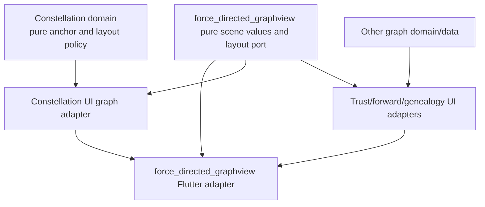

# Force-directed graph scene decoupling plan

**Status:** Reviewed — implementation-ready in the ordered packets below; no implementation or runtime acceptance claimed

**Date:** 2026-09-12

**Repository:** `/home/vader/MY_SRC/tentura`

**Branch at drafting:** `feature/pin_constellation`

**Related plan:** [`constellation-pinning-plan.md`](constellation-pinning-plan.md), especially C6, P06, P07, and P08

## Goal

Refactor Tentura's vendored `force_directed_graphview` fork so graph identity,
topology, layout, transient presentation, camera state, and rendered payloads
have explicit owners and can change independently.

The completed library must support Tentura's current deterministic graph
layouts and node drag behavior without relying on `NodeBase` object equality,
`clear() + mutate()` rebuilds, node-instance searches, camera-reset flags, or
timing-dependent presentation cleanup.

This is a behavior-preserving architecture correction. Persisted
Constellation anchors, authorization, optimistic writes, realtime ordering,
and normalized coordinate rules remain owned by the Constellation feature.

## Why this plan exists

The current library improved the original upstream design by adding a
presentation-position overlay, scene-coordinate conversion, deterministic
paint/hit order, gesture capture, camera gating, same-frame edge updates, and
layout transitions. Those are the correct rendering and interaction
capabilities.

The remaining coupling is identity:

- `GraphLayout` stores `Map<NodeBase, Offset>`.
- `GraphController` stores presentation overrides by `N extends NodeBase`.
- `NodeDetails` equality includes changing presentation data such as labels,
  scores, trust fields, and other subtype state in addition to its logical ID.
- graph reconciliation commonly constructs replacement node objects and then
  calls `GraphController.clear()` followed by `mutate()`;
- layout code must recover stable IDs from object-keyed prior positions;
- drag presentation and camera behavior must survive those object and graph
  replacements through feature-specific sequencing.

This produced the failure class repaired by:

- `44d341877` — preserve camera state across a successful pin rebuild;
- `be1e870f8` — preserve the dragged position across pin reconciliation;
- `5d562788f` — retain the drag presentation until the replacement layout
  lands.

The plan turns those repairs into library invariants. It does not remove
legitimate product rules such as optimistic rollback, server revision
reconciliation, drag-vs-camera gesture arbitration, or deterministic
Constellation placement.

## Scope

### In scope

- stable node and edge identities independent of render payload equality;
- immutable, ID-keyed topology and layout values;
- an explicit layout request/result boundary that contains no `NodeBase`,
  `EdgeBase`, widget, or domain entity;
- transient presentation overrides keyed by node ID;
- generation-safe streaming and one-shot layout publication;
- atomic handoff from a drag/provisional position to the accepted layout;
- topology updates that preserve camera and unaffected positions by default;
- one resolved-position source for nodes, labels, edges, hit testing, focus,
  and drag;
- compatibility adapters for existing trust, forwards, genealogy, and
  Constellation callers during migration;
- removal of the compatibility layer after all callers migrate;
- architecture and behavioral tests that prevent the coupling returning.

### Out of scope

- moving Constellation anchor persistence into the graph package;
- storing normalized `[-10, +10]` anchor coordinates in library scene state;
- changing server schema, GraphQL, authorization, or realtime protocols;
- replacing deterministic Constellation placement with a force simulation;
- adopting `flutter_force_directed_graph` or `flutter_graph_view`;
- building a general graph database or cross-application graph framework;
- splitting the pure scene types into a separately published package during
  this refactor;
- changing user-visible interactions or visual design;
- editing generated Dart, GraphQL, localization, or DI files.

## Authority and constraints

1. Live code and `AGENTS.md` override stale prose.
2. Constellation domain remains pure and must not import
   `force_directed_graphview` or Flutter types.
3. `packages/force_directed_graphview` must never import `package:tentura`.
4. The root `pubspec_overrides.yaml` continues resolving the vendored fork.
5. Existing unrelated tracked and untracked worktree changes must remain
   untouched. In particular, the current modification to
   `packages/force_directed_graphview/analysis_options.yaml` predates this plan
   and must not be staged or committed incidentally.
6. Implementation uses fresh sequential Composer 2.5 workers. Do not run
   Flutter, browser, analyzer, PostgreSQL, or integration suites in parallel.
7. After every worker exits, inspect and clean only task-owned dangling
   `cursor-agent`, Chrome/Chromedriver, Flutter, Dart test, analyzer, and build
   processes. Preserve editor/browser infrastructure and user-started local
   services.
8. Commit each coherent, verified migration step locally. Do not push or
   deploy until this plan and the parent Constellation plan are fully proven
   locally.

## Architectural decisions

The review contract in **R1–R9** below is normative where an illustrative
signature or packet summary omits lifecycle details. Collection-owning values
use validating factories and private constructors, not public `const`
constructors retaining caller-owned collections.


### A1 — Stable IDs are the only scene identity

Use non-empty `String` identifiers because every Tentura graph surface already
has a stable string graph key, including genealogy keys that are not account
IDs.

```dart
typedef GraphNodeId = String;
typedef GraphEdgeId = String;
```

`GraphNodeId` is opaque. The graph package must not parse prefixes or infer
person, Beacon, account, or authorization semantics.

Node payload `==` and `hashCode` must never determine topology membership,
layout lookup, presentation lookup, paint order, selection, or drag ownership.

Edges have required stable IDs because Tentura may render more than one
semantic edge between the same endpoints. `(sourceId, destinationId)` is not a
valid universal edge identity.

### A2 — Topology and render payloads are separate from layout input

The scene topology owns node IDs, edge IDs, endpoints, and opaque payloads
needed by builders or painters. Layout algorithms receive small immutable
layout specifications instead of feature entities or render objects.

Target values:

```dart
final class GraphSceneNode<N> {
  const GraphSceneNode({
    required this.id,
    required this.payload,
    required this.size,
    this.simulationFixed = false,
  });

  final GraphNodeId id;
  final N payload;
  final SceneSize size;
  final bool simulationFixed;
}

final class GraphSceneEdge<E> {
  const GraphSceneEdge({
    required this.id,
    required this.sourceId,
    required this.destinationId,
    required this.payload,
  });

  final GraphEdgeId id;
  final GraphNodeId sourceId;
  final GraphNodeId destinationId;
  final E payload;
}

final class GraphTopology<N, E> {
  // Validating factory copies entries and rejects duplicates before mapping.
  factory GraphTopology.fromEntries({
    required Iterable<GraphSceneNode<N>> nodes,
    required Iterable<GraphSceneEdge<E>> edges,
  });

  final Map<GraphNodeId, GraphSceneNode<N>> nodesById;
  final Map<GraphEdgeId, GraphSceneEdge<E>> edgesById;
}
```

Construction rejects empty or duplicate IDs and edges whose endpoints do not
exist. Maps are defensively copied and exposed as unmodifiable values.

`SceneSize` and the other scene primitives are pure Dart value types. Flutter
conversion belongs to the Flutter adapter.

### A3 — Layout is an ID-keyed request/result port

The final layout API contains no `NodeBase`, `EdgeBase`, `Offset`, widget,
controller, or Tentura entity:

```dart
final class GraphLayoutNode {
  const GraphLayoutNode({
    required this.id,
    required this.size,
    this.simulationFixed = false,
  });

  final GraphNodeId id;
  final SceneSize size;
  final bool simulationFixed;
}

final class GraphLayoutEdge {
  const GraphLayoutEdge({
    required this.id,
    required this.sourceId,
    required this.destinationId,
  });

  final GraphEdgeId id;
  final GraphNodeId sourceId;
  final GraphNodeId destinationId;
}

final class GraphLayoutRequest {
  const GraphLayoutRequest({
    required this.ticket,
    required this.canvasSize,
    required this.nodesById,
    required this.edgesById,
    required this.previous,
  });

  final GraphLayoutTicket ticket;
  final SceneSize canvasSize;
  final Map<GraphNodeId, GraphLayoutNode> nodesById;
  final Map<GraphEdgeId, GraphLayoutEdge> edgesById;
  final SceneLayout? previous;
}

abstract interface class SceneLayoutAlgorithm {
  Stream<GraphLayoutFrame> layout(GraphLayoutRequest request);
}
```

`simulationFixed` replaces `NodeBase.pinned` inside layout input. It is an
algorithm hint and never a persisted Constellation anchor.

The client owns its layout implementations. The graph library owns the port
because `GraphSceneController` consumes it. Tentura adapters map domain layout
results to scene values at the UI boundary.

### A4 — Layout tickets and frames make asynchronous publication explicit

```dart
final class GraphLayoutTicket {
  GraphLayoutTicket._(this._owner, this.topologyRevision, this.generation);

  final Object _owner; // Included in value equality/hash; controller-minted.
  final int topologyRevision;
  final int generation;
}

final class GraphLayoutFrame {
  const GraphLayoutFrame({
    required this.ticket,
    required this.sequence,
    required this.positions,
    required this.isTerminal,
  });

  final GraphLayoutTicket ticket;
  final int sequence;
  final Map<GraphNodeId, ScenePoint> positions;
  final bool isTerminal;
}
```

Frozen rules:

1. Every requested layout gets a monotonically increasing controller-local
   generation.
2. A frame is accepted only when its complete ticket equals the active ticket.
3. Frame sequence increases strictly within a ticket; duplicates and backward
   frames are ignored.
4. Every accepted frame contains exactly the active topology node IDs. A
   partial frame is rejected rather than briefly hiding nodes.
5. A stream must emit exactly one terminal frame. Completion without a
   terminal frame is a layout failure and preserves the last accepted layout.
6. Error, cancellation, replacement, and controller disposal invalidate the
   ticket and cannot notify after disposal.
7. Layout transition animation applies only between accepted complete frames.
   It never becomes the algorithm's mutable working state.

### A5 — Layout and presentation are separate immutable snapshots

```dart
final class SceneLayout {
  const SceneLayout({
    required this.ticket,
    required this.revision,
    required this.positions,
  });

  final GraphLayoutTicket ticket;
  final int revision;
  final Map<GraphNodeId, ScenePoint> positions;
}

final class ScenePresentation {
  const ScenePresentation({
    this.overrides = const {},
    this.paintOrder = const [],
    this.holds = const {},
  });

  final Map<GraphNodeId, ScenePoint> overrides;
  final List<GraphNodeId> paintOrder;
  final Map<GraphNodeId, ({GraphPresentationToken token, GraphLayoutTicket ticket})> holds;
}
```

For a node in the active topology:

```text
resolvedPosition(id) = presentation.overrides[id] ?? transition.positions[id]
    ?? layout.positions[id] ?? snapshot.seedPositions[id]
```

An override held for ticket `T` is cleared atomically only after the terminal
frame for `T` has been accepted. The controller installs the accepted layout
before removing the override and sends one notification, so no intermediate
frame can flash the old position.

A failed or superseded held ticket does not silently discard the override.
The feature must explicitly choose rollback, replacement ticket, or
cancellation. This prevents a transport or layout failure from masquerading as
a successful placement.

### A6 — The scene controller owns session state, not domain truth

Rename only if it improves clarity after compatibility migration; the target
role is `GraphSceneController<N, E>`.

It owns:

- current immutable topology;
- active layout ticket and subscription;
- last accepted layout;
- immutable presentation state;
- layout transition ticker/state;
- controller-local revision counters;
- lifecycle and notification safety.

It does not own:

- persisted anchors or normalized coordinates;
- server revisions or authorization;
- optimistic command outcomes;
- selection semantics;
- feature filtering or composition;
- application-global state.

There must be one controller per mounted graph screen/session. Immutable
topology values may be reused, but camera, drag, layout subscriptions, and
presentation state are never shared implicitly between views or accounts.

### A7 — Camera operations are explicit and independent

Applying topology or accepting layout never resets, recenters, fits, or moves
the camera.

The Flutter adapter exposes explicit operations:

```dart
void resetCamera();
void fitCamera({required Iterable<GraphNodeId> ids});
void focusCamera(GraphNodeId id);
void setCameraInteractionGated(bool gated);
```

Initial centering is a one-time mount policy, not a side effect of
`GraphController.clear()`. Remove `clear(recenter: ...)` after callers migrate.

### A8 — Rendering and hit testing use one resolver

Nodes, labels, edges, hit testing, focus, lazy visibility, drag start, and drag
updates resolve coordinates through the same controller snapshot.

Within one paint/hit-test pass, capture a single immutable scene snapshot so
all consumers observe the same layout/presentation revision. An edge must not
read its source before an update and its destination after the update.

Painting and hit testing use `List<GraphNodeId>` ordering. Later IDs paint and
hit-test on top. The active drag/provisional ID may be appended by
presentation policy without mutating topology or domain layout.

### A9 — Constellation normalized coordinates stay in its domain

`ConstellationPoint`, `ConstellationAnchorPosition`, coordinate-space version,
anchor maps, deterministic placement, prior-layout hints, and conversion to or
from normalized `[-10, +10]` coordinates remain under
`packages/client/lib/features/constellation/domain`.

The UI adapter maps a completed Constellation layout to `ScenePoint` values.
Neither `SceneLayout` nor `SceneLayoutAlgorithm` knows anchor persistence or
server revisions.

### A10 — Compatibility is temporary and measurable

During migration, preserve the existing public types behind adapters:

- `NodeBase` and `EdgeBase` remain accepted render payloads;
- old `GraphLayoutAlgorithm.layout/relayout` implementations are wrapped by a
  `LegacyGraphLayoutAlgorithmAdapter`;
- old `getPosition(NodeBase)` and presentation methods delegate through an
  explicit `nodeIdOf` resolver;
- old node-valued paint order maps to ID order once at the boundary.

No new production caller may use a legacy API after packet M02. Mark legacy
members deprecated only after all adapters exist. Remove them in M07; do not
leave a permanent dual architecture.

## Target dependency direction



Forbidden directions:

- Constellation domain → graph package or Flutter;
- graph package → Tentura;
- layout algorithm → rendered payload type;
- controller → Constellation persistence/use cases;
- widget/render object → mutable algorithm working state.

## Ordered implementation packets

### M00 — Baseline and behavior inventory

**Purpose:** freeze current behavior before changing representation.

**Files:**

- `docs/plans/force-directed-graphview-scene-decoupling-plan.md`
- `docs/plans/constellation-pinning-implementation-journal.md`
- `packages/force_directed_graphview/test/controller_test.dart`
- `packages/force_directed_graphview/test/node_drag_gesture_test.dart`
- new `packages/force_directed_graphview/test/scene_contract_test.dart`
- `packages/client/test/features/constellation/constellation_anchor_interaction_test.dart`

**Work:**

1. Record current public graph API and all production callers.
2. Add failing characterization tests for replacement payload with the same ID,
   camera preservation, atomic drop-to-layout handoff, duplicate IDs,
   multi-edges, stale streaming frames, and two independent controllers.
3. Record exact tests covering trust, forwards, genealogy, and Constellation.
4. Do not change production behavior in this packet.

**Acceptance:** the new tests demonstrate the object/equality coupling or are
marked expected-failing through a test mechanism that cannot enter the final
branch. Before committing M00, convert them to a separate documented baseline
command or commit only already-green characterization tests; the committed
test suite must remain green.

**Commit:** `test(graph): characterize scene identity and lifecycle`

### M01 — Add pure scene value types

**Files:**

- new `packages/force_directed_graphview/lib/src/scene/graph_ids.dart`
- new `packages/force_directed_graphview/lib/src/scene/scene_geometry.dart`
- new `packages/force_directed_graphview/lib/src/scene/graph_topology.dart`
- new `packages/force_directed_graphview/lib/src/scene/scene_layout.dart`
- new `packages/force_directed_graphview/lib/src/scene/scene_presentation.dart`
- new `packages/force_directed_graphview/lib/src/scene/scene_snapshot.dart`
- `packages/force_directed_graphview/lib/force_directed_graphview.dart`
- new/extended package unit tests

**Work:** implement A1, A2, and immutable defensive-copy contracts from A5.
Use `meta` annotations only; these files must not import Flutter.

**Acceptance:** tests cover equality, immutability, validation, missing
endpoints, duplicate node/edge IDs, parallel edges, opaque genealogy-like IDs,
and resolved-position precedence.

**Commit:** `feat(graph): add stable scene identity values`

### M02 — Add the ID-keyed layout port and legacy adapter

**Files:**

- new `packages/force_directed_graphview/lib/src/layout_algorithm/graph_layout_request.dart`
- new `packages/force_directed_graphview/lib/src/layout_algorithm/scene_layout_algorithm.dart`
- existing `packages/force_directed_graphview/lib/src/layout_algorithm/graph_layout_algorithm.dart`
  remains unchanged as the legacy interface until M07
- new `packages/force_directed_graphview/lib/src/layout_algorithm/legacy_graph_layout_algorithm_adapter.dart`
- `packages/force_directed_graphview/lib/src/model/graph_layout.dart`
- `packages/force_directed_graphview/lib/src/layout_algorithm/fruchterman_reingold_algorithm.dart`
- package exports and tests

**Work:**

1. Implement A3 and A4.
2. Introduce `SceneLayoutAlgorithm` additively. Keep the old
   `GraphLayoutAlgorithm` signature unchanged and make it usable by the new
   controller only through the named legacy adapter.
3. Map `NodeBase.pinned` to `simulationFixed` in the legacy adapter; native callers supply that scene hint explicitly, never as persisted anchor state.
4. Ensure streaming algorithms mark one terminal frame.
5. Reject stale, partial, duplicate-sequence, and post-terminal frames.

**Acceptance:** legacy Fruchterman–Reingold output matches the baseline within
its existing deterministic/tolerance contract; one-shot and streaming fake
algorithms prove ticket cancellation and terminal-frame rules.

**Commit:** `feat(graph): introduce id-keyed layout requests`

### M03 — Introduce `GraphSceneController` in parallel

**Files:**

- new `packages/force_directed_graphview/lib/src/scene_controller.dart`
- `packages/force_directed_graphview/lib/src/controller.dart`
- `packages/force_directed_graphview/lib/src/graph_view.dart`
- `packages/force_directed_graphview/lib/src/configuration.dart`
- controller tests

**Work:**

1. Implement A5–A7 with ID-keyed topology, layout, and presentation state.
2. Add the token-based `applyTopology`, `beginPresentation`,
   `updatePresentation`, `cancelPresentation`, `requestLayout`, `cancelLayout`,
   and `resolvePosition` surface frozen by R2. Bare-ID presentation methods are
   legacy wrappers only. `requestLayout(releaseOnTerminal: ...)` registers
   holds before subscribing, so synchronous layout streams are safe.
3. Add a required stable ID resolver to the legacy `GraphController` adapter.
4. Keep old controller methods delegating to the new controller.
5. Make camera changes explicit; topology updates preserve camera.

**Acceptance:** prove payload replacement under one ID retains position,
topology removal removes the position/override safely, accepted terminal layout
clears a matching held override in one notification, failed/superseded layout
does not, and two controllers have isolated camera/layout/presentation state.

**Commits:**

1. `feat(graph): add id-keyed scene controller`
2. `refactor(graph): adapt legacy controller to scene state`

### M04 — Move rendering, ordering, focus, and gestures to scene snapshots

**Files:**

- `packages/force_directed_graphview/lib/src/widget/nodes_view.dart`
- `packages/force_directed_graphview/lib/src/widget/labels_view.dart`
- `packages/force_directed_graphview/lib/src/widget/edges_view.dart`
- `packages/force_directed_graphview/lib/src/widget/node_drag_gesture.dart`
- `packages/force_directed_graphview/lib/src/widget/graph_layout_view.dart`
- `packages/force_directed_graphview/lib/src/graph_view.dart`
- package widget tests

**Work:** implement A8. Preserve existing optional/default-off drag behavior and
the C7/D18 pointer-ownership rules. Replace node-valued paint order and
instance-keyed hit testing with IDs. Drag callbacks carry ID and scene point;
legacy callbacks adapt back to payloads.

**Acceptance:**

- nodes, labels, incident edges, and hit testing see one scene revision;
- one dragged node moves without a layout request;
- unrelated node and edge coordinates remain unchanged;
- topmost overlap follows ID paint order;
- scale-before-capture, additional pointer after capture, remaining pointer,
  cancel, dispose, and camera re-arm tests remain green;
- no notification during build and no callback after disposal.

**Commit:** `refactor(graph): render and drag from stable scene snapshots`

### M05 — Migrate Tentura layout algorithms and graph adapters

**Files:**

- `packages/client/lib/features/graph/ui/utils/tentura_layout_algorithms.dart`
- `packages/client/lib/features/graph/domain/entity/node_details.dart`
- `packages/client/lib/features/graph/domain/entity/edge_details.dart`
- `packages/client/lib/features/graph/ui/widget/graph_body.dart`
- `packages/client/lib/features/graph/ui/bloc/graph_cubit.dart`
- relevant graph layout and widget tests

**Work:**

1. Implement native ID-keyed adapters for radial-hop, layered DAG, and the
   trust/forward graph modes.
2. Define stable node IDs and stable edge IDs at the UI adapter boundary.
3. Remove layout dependence on `NodeDetails ==`, `hashCode`, and
   `positionHint` identity.
4. Preserve FR simulation-fixed behavior where it is still used.
5. Stop using `clear()` for payload-only changes.

**Acceptance:** the same topology produces the same ID-keyed positions under
payload replacement; trust, forwards, and genealogy retain their current
layout, focus, edge, expand, and camera behavior.

**Commits:** one focused commit per algorithm/graph mode; do not combine all
three production surfaces into one late commit.

### M06 — Migrate Constellation topology and placement handoff

**Files:**

- `packages/client/lib/features/constellation/domain/constellation_layout.dart`
- `packages/client/lib/features/constellation/ui/bloc/constellation_cubit.dart`
- `packages/client/lib/features/constellation/ui/widget/constellation_body.dart`
- `packages/client/lib/features/graph/ui/utils/tentura_layout_algorithms.dart`
- Constellation layout, cubit, interaction, and widget tests

**Work:**

1. Keep `computeConstellationPlacedLayout` and normalized anchor conversion in
   the Constellation domain.
2. Map its ID-keyed pure result into a terminal `GraphLayoutFrame` in the UI adapter; only the controller creates accepted `SceneLayout` revisions.
3. Replace `_rebuildGraph()` and `clear() + mutate()` with an ID-keyed topology
   application that preserves camera and unchanged positions.
4. Replace node-instance searches during drag with direct ID operations.
5. When a confirmed/optimistic projection requests layout ticket `T`, hold the
   dragged presentation position for `T`; accept terminal layout and clear the
   hold atomically.
6. On mutation/layout failure, explicitly restore the newest confirmed
   projection or attach the hold to its recovery ticket. Never clear by timing.
7. Continue deferring presentation of a remote update for the actively dragged
   target while applying other confirmed updates.

**Acceptance:**

- label/score/payload refresh during drag does not lose capture or position;
- successful new pin and move have no drop flash;
- camera does not move on topology or anchor reconciliation;
- failed write restores newest confirmed position once;
- remote move/delete during local drag follows D26/C7;
- stale layout and stale server results cannot clear a newer override;
- unpinned Request placement beside its author and all P06 deterministic
  placement tests remain green;
- no global layout request occurs per pointer move.

**Commits:**

1. `refactor(client): adapt constellation layout to graph scene`
2. `refactor(client): reconcile constellation topology by stable id`
3. `refactor(client): hand off drag presentation by layout ticket`

### M07 — Remove the legacy architecture

**Files:**

- `packages/force_directed_graphview/lib/src/model/graph_layout.dart`
- `packages/force_directed_graphview/lib/src/model/node.dart`
- `packages/force_directed_graphview/lib/src/model/edge.dart`
- `packages/force_directed_graphview/lib/src/controller.dart`
- `packages/force_directed_graphview/lib/src/configuration.dart`
- `packages/force_directed_graphview/lib/force_directed_graphview.dart`
- all remaining callers and tests found by exact symbol search

**Work:**

1. Remove `Map<NodeBase, Offset>` layout storage.
2. Remove node-instance presentation APIs and node-valued paint order.
3. Remove the legacy algorithm/controller adapters.
4. Remove `clear(recenter: ...)` and implicit camera reset.
5. Retain `NodeBase`/`EdgeBase` only if they still provide useful render
   payload structure; otherwise replace them with ordinary payload generics.
6. Search the complete repository for every removed symbol and fail the packet
   if any production caller remains.

**Acceptance:** no dual architecture remains. Layout and presentation maps are
ID-keyed throughout production code. Package and client tests are green.

**Commit:** `refactor(graph): remove object-keyed layout compatibility`

### M08 — Architecture enforcement and documentation

**Files:**

- package README/changelog as applicable
- `docs/plans/constellation-pinning-plan.md` cross-reference only
- `docs/plans/constellation-pinning-implementation-journal.md`
- `packages/tentura_lints/lib/src/rules/` only if an enforceable narrow rule is
  justified
- `packages/tentura_lints/lib/main.dart` and plugin diagnostics only when adding
  a lint
- lint rule tests/baseline only when required

**Work:**

1. Document scene/domain boundary, ticket lifecycle, and compatibility removal.
2. Add an architecture check that Constellation domain does not import Flutter
   or `force_directed_graphview` if existing rules do not already cover it.
3. Prefer a repository script/static architecture test over a new analyzer lint
   when a simple import/symbol check is sufficient.
4. Record every accepted commit and verification result in the Constellation
   implementation journal.

**Acceptance:** documentation describes the final implementation rather than
the migration scaffolding; architecture checks fail on a deliberate boundary
violation and pass after removal.

**Commit:** `docs(graph): record stable scene architecture`

## Verification matrix

Run focused checks after each packet. Run broad checks once after M08 unless a
failure or later change invalidates earlier evidence.

### Package-focused checks

```bash
cd packages/force_directed_graphview && flutter test
cd packages/force_directed_graphview && dart analyze --format machine
```

The analyzer run is bounded and serialized. Inspect analyzer process and file
descriptor state if it stops making progress. Do not claim analyzer green if
only generated paths were excluded or output was truncated.

### Client-focused checks

Use exact test paths established in M00, including:

```bash
cd packages/client && flutter test test/features/graph
cd packages/client && flutter test test/features/constellation/constellation_p06_composition_layout_test.dart
cd packages/client && flutter test test/features/constellation/constellation_anchor_interaction_test.dart
./scripts/check-custom-lints.sh packages/client
bash scripts/check-user-facing-terminology.sh
```

### Final local acceptance

Run serially, never concurrently:

1. `cd packages/force_directed_graphview && flutter test`
2. `cd packages/client && flutter test`
3. `cd packages/tentura_lints && dart test` if lint code changed.
4. `./scripts/check-custom-lints.sh packages/client`
5. `./scripts/check-custom-lints.sh packages/server` only if shared lint or
   server-visible architecture checks changed.
6. `bash scripts/check-user-facing-terminology.sh`
7. `./scripts/run_client_integration_web_local.sh integration_test/constellation_pinning_test.dart`
8. One Constellation multi-client run with actor echo disabled, using the exact
   runner flags frozen by the parent plan.

The refactor does not require PostgreSQL changes. Reuse the already accepted
fresh disposable PostgreSQL evidence only if no client/server contract changed
and the parent plan still permits it; otherwise rerun the parent plan's fresh
disposable `dart test -t pg -j 1` gate serially.

Hardware-only touch coverage remains **BLOCKED** when unavailable and must not
be reported as passed.

## Rollback strategy

Use the dependency-aware rollback and pre-removal SHA gate in R8. Additive M01
and M02a can be reverted before consumers migrate. From M03 onward, revert a
failed packet and its dependent commits in reverse order; renderer/controller
changes are not independently reversible merely because their files differ.
M07 removes the fallback API but remains git-revertible together with subsequent
dependent commits. A restored legacy path reopens this plan and must pass the
last accepted verification gate. Never reset unrelated worktree state or rewrite
history.

## Completion criteria

The plan is complete only when all are true:

1. Production layout and presentation state contain no map keyed by
   `NodeBase`, `NodeDetails`, render payload, or widget identity.
2. Layout algorithms consume only immutable ID-keyed requests and return
   complete ticketed frames.
3. Payload replacement under a stable ID cannot move a node, lose a drag,
   reset the camera, or invalidate an unrelated edge.
4. Topology updates preserve camera and unaffected positions unless the caller
   explicitly requests camera movement or the layout policy moves them.
5. Drag presentation hands off atomically to the correct terminal layout and
   stale results cannot clear it.
6. Nodes, labels, edges, hit testing, focus, and drag share one immutable scene
   snapshot per pass.
7. Constellation domain contains no Flutter or graph-library type and retains
   all anchor/reconciliation invariants from the parent plan.
8. Trust, forwards, genealogy, and Constellation use the final API; all legacy
   adapters and object-keyed APIs are removed.
9. Focused tests, package/client suites, custom lints, terminology, and required
   local browser/multi-client gates are green or accurately recorded as
   blocked where the parent plan permits.
10. Every task-owned change is committed locally in focused commits; unrelated
    worktree files remain untouched; no push or deployment occurred before
    complete local proof.

## Review checklist

The adversarial reviewer must explicitly challenge:

- whether string IDs cover every current graph caller without collision;
- whether edge IDs support parallel/directional semantic edges;
- whether complete-frame enforcement works for the existing streaming FR
  algorithm;
- whether a presentation hold can leak forever after cancellation or failure;
- whether layout tickets connect cleanly to Constellation server projection
  revisions without coupling the library to server concepts;
- whether topology application can preserve positions without retaining removed
  payloads or edges;
- whether transitions, lazy visibility, and same-frame edge painting use one
  snapshot;
- whether camera state belongs in the controller or a separate view session;
- whether M07 truly removes the dual architecture;
- whether the test matrix proves the behavior without excessive parallel load.

## Adversarial review disposition — GPT-6 Astra, 2026-09-12

**Verdict: accepted with the adjustments below, implementation-ready starting at
M00.** This is a source-grounded plan review, not acceptance of code, tests,
browser journeys, or deployment. No tests, analyzer, build, browser, or server
were started for this review. Prior P06–P08 journal acceptance is context, not
proof of this refactor. No unresolved architecture decision blocks M00; each
later packet remains gated by its predecessor's verified commit.

| Decision | Disposition and live-code evidence |
|---|---|
| Stable ID scene ownership and a pure layout port | **Accepted.** `model/graph_layout.dart` keys by `NodeBase`; `NodeDetails.operator ==` includes mutable render fields, and subtype equality includes trust/help-offerer/ring/request state. Preserve useful payload equality; do not change it to ID-only as a substitute for separating ownership. |
| Merely replacing node-keyed maps | **Rejected as sufficient.** `LayoutId`, label keys, `NodeBuilder`, `LabelBuilder`, `EdgePainter`, `GraphCanvasSize.resolve`, `InitialNodePositionExtractor`, spawn callbacks, and drag callbacks also bind the old model. M04/M07 must include them. |
| Additive replacement of `GraphLayoutAlgorithm` under its existing name | **Adjusted.** Introduce `SceneLayoutAlgorithm` in a new `scene_layout_algorithm.dart`; retain the old interface unchanged until M07. Dart cannot expose both incompatible signatures under one name. Keep the new name after removal; a second rename adds no value. |
| One position source | **Adjusted.** Accepted layout and displayed interpolation are different values. Current `_stopLayoutAnimation` snaps to its target, while `jumpToNode`/`fitToNodes` bypass the overlay. R4/R5 define displayed-state capture and camera resolution explicitly. |
| A complete terminal-frame protocol | **Accepted with R3.** Current FR `showIterations: true` emits iterations without a terminal marker and can emit nothing for zero iterations or initially cold temperature. Its initial RNG uses `node.hashCode`; moving to IDs needs an explicit seed contract. |
| Temporary compatibility controller | **Accepted only as delegation.** One scene state owner, one layout subscription, one notification authority. Do not retain an independently mutable old controller and synchronize it with a second controller. |
| Full general-purpose scene framework or new package | **Rejected.** Keep plain immutable geometry, a layout port, a controller, and a Flutter view binding. No persistence layer, generic event bus, scheduler service, graph database, or new DI/codegen is required. |

### R1 — Identity, validation, and revision ownership

`GraphTopology.fromEntries({required Iterable<GraphSceneNode<N>> nodes,
required Iterable<GraphSceneEdge<E>> edges})` validates duplicates **before**
creating maps. A public map constructor cannot detect entries already collapsed
by the caller. Validate nonempty IDs, map-key/value agreement in any import
factory, endpoint existence, finite points, finite nonnegative node bounds, and
finite canvas dimensions. Zero-size nodes remain legal (the drag predicate
currently excludes them); empty topology must work with proportional canvas
size zero. Reject invalid nonempty canvas/layout geometry explicitly; never let
NaN enter a snapshot. Self-loops and parallel edges are legal topology.

IDs are opaque and unique within a scene. At Tentura's UI boundary use a central
injective encoding of `(node kind, domain key)` for mixed person/Request graphs;
keep explicit maps to the existing raw domain layout IDs. Preserve genealogy's
opaque `nodeKey` and distinguish live/deleted payloads without recovering an
account ID from it. Do not change Constellation's domain coordinate or target
contract to adopt a library ID. Test person and Request with the same raw key;
reject an ambiguous domain layout input instead of overwriting a map entry.
Use a structured encoding (for example encoded tuple components), not unsafe
separator concatenation or payload hashes.

The controller assigns `topologyRevision` when node IDs, bounds,
`simulationFixed`, edge IDs, or endpoints change. Callers submit entries, not
revision numbers. Payload/label/style/paint-order replacement increments only
`snapshotRevision`, preserves active tickets/positions/capture, and requests no
layout. A size change is layout-affecting. Canvas size or algorithm parameters
request a new generation even if topology is unchanged. `SceneLayout.revision`
counts accepted layout frames only; `snapshotRevision` also covers interpolation
and presentation. None of these counters is a server revision.

`GraphLayoutTicket` has a private constructor and an opaque controller-owner
identity plus topology revision and generation; equality/hash include all three.
Two controllers with counters `(1, 1)` must reject each other's frames. Request,
frame, previous-layout, presentation, and snapshot collections are copied and
unmodifiable. Payload objects are opaque: require immutable payload replacement,
without pretending a shallow map copy deep-freezes arbitrary `N`/`E`.

### R2 — Topology application and concrete command boundary

The minimal controller surface is:

```dart
void applyTopology(GraphTopology<N, E> next,
    {Map<GraphNodeId, ScenePoint> initialPositions = const {}});
GraphPresentationToken beginPresentation(GraphNodeId id, ScenePoint position);
bool updatePresentation(GraphPresentationToken token, ScenePoint position);
bool cancelPresentation(GraphPresentationToken token);
GraphLayoutTicket requestLayout(SceneLayoutAlgorithm algorithm,
    {required SceneSize canvasSize,
     Set<GraphPresentationToken> releaseOnTerminal = const {}});
bool cancelLayout(GraphLayoutTicket ticket);
ScenePoint? resolvePosition(GraphNodeId id);
GraphSceneSnapshot<N, E> get snapshot;
```

`GraphPresentationToken` is opaque, controller-owned, and identifies both node
and presentation generation. Updating an old token cannot overwrite a newer
drag. Return `false` for stale token/ticket commands; reject invalid geometry
and beginning presentation for an unknown node. The bare-ID setters in M03 are
legacy wrappers, not the final lifecycle API. `holdPresentationUntil` is an
internal operation of `requestLayout`: register all supplied tokens against the
new ticket **before** subscribing, including synchronous streams. Registering a
hold after `requestLayout` returns is racy and is not the accepted design.

`applyTopology` validates everything before any mutation. Publish the new
payloads/endpoints and retained positions in one snapshot; remove absent nodes,
incident edges, overrides, holds, ordering entries, and capture ownership in that
same transaction. Added IDs need supplied finite `initialPositions` or an
explicit view adapter seed (current canvas-centre fallback); seed all added IDs
before notification. `snapshot.seedPositions` contains only newly added IDs
without accepted layout positions; retire their seeds on the first accepted
complete frame. Seed positions never claim an accepted layout ticket/revision.
Do not publish new topology against an incompatible old
layout or hide arbitrary newcomers while awaiting the algorithm. Empty topology
has an empty resolved-position map and no implicit camera command. Removing and
later re-adding an ID creates fresh presentation ownership.

On layout-affecting changes invalidate the old ticket before cancellation;
filter previous positions to surviving IDs. `previous` is an immutable accepted
layout hint, never a mutable simulation map or raw drag overlay. No hidden
relayout inside `applyTopology`: the owner supplies the corresponding algorithm
and calls `requestLayout` explicitly. This also removes the current race between
`useLayoutAlgorithm` in `_rebuildGraph` and widget `_applyConfiguration` using
stale inputs. Native `GraphView` consumes scene state and view configuration;
it does not independently request the same layout. Legacy configuration
requests through its adapter until that caller migrates.

### R3 — Stream lifecycle, failure, and FR conversion

Track `idle | running(ticket) | succeeded(ticket) | failed(ticket, error,
stackTrace) | cancelled(ticket)` in the immutable controller snapshot. Keep at
most the active/latest outcome; no unbounded ticket history. Expose it through
the existing listenable, so a feature can attach recovery without an additional
event bus. A replaced ticket is cancelled; ownership state is invalidated
synchronously before awaiting subscription cleanup. Catch synchronous algorithm
throws, `listen` failures, stream errors, and cancellation errors. Late cleanup
cannot overwrite the newer status or complete its ticket.

A valid frame has the matching owner/ticket, a strictly increasing nonnegative
sequence, finite positions, and exactly the current topology IDs. Ignore stale,
duplicate, backwards, and post-terminal frames. A matching malformed frame
fails the ticket and cancels its subscription; do not keep a hold waiting for
an impossible success. A native stream closing without terminal fails. The first
valid terminal atomically succeeds and releases matching holds; later events or
errors are ignored. Complete cancellation/disposal even if the producer keeps
computing; ignored callbacks must neither mutate nor notify. Disposal is
idempotent, invalidates all tickets/tokens, cancels subscriptions and ticker,
and guards already queued post-frame callbacks. Test disposal with an attached
listener, not merely `hasListeners == false`.

The **temporary** legacy adapter captures node/edge/resolver input once, selects
`layout` versus `relayout` from `previous`, converts every complete legacy frame
to a nonterminal ID frame, then emits a terminal copy of the last frame on normal
close. It must not call a final frame successful before close or after error.
A stream with no frame fails; it cannot invent deterministic feature positions.
Fix native FR's zero-step path to emit its initialized positions as a terminal
frame, including empty graphs. Native FR emits complete intermediate frames and
one final terminal frame even when coordinates repeat. Initial placement uses a
stable ID seed with explicit deterministic fixtures; do not promise numeric
identity with arbitrary historical payload hashes. Preserve temperature,
iteration, fixed-node, bounds, and relayout multiplier behavior. Add coincident
endpoint/self-loop tests so attraction's `delta / distance` cannot yield NaN.

Do not animate intermediate streaming frames with repeated 350 ms transitions.
Display them directly. One-shot terminal results may transition; a request that
already emitted intermediate frames installs its terminal directly. Algorithm
work stops cooperatively on cancellation where possible; correctness does not
depend on how quickly the underlying producer stops.

### R4 — Presentation handoff and transitions

A held override is identified by `(node ID, presentation token, ticket)`, not
just ID and ticket. Terminal acceptance installs the target layout, removes
transition entries for every released held ID, removes only matching overrides,
and publishes **one** snapshot/notification. Those IDs resolve directly to the
accepted target in that notification; other IDs may transition from their last
displayed positions. This is essential with Constellation's existing 350 ms
transition: clearing an override onto the start of an interpolation recreates
the old-position flash even when the target layout was installed first.

Capture interrupts interpolation at the **displayed** snapshot, preserving the
grab offset and other nodes' displayed positions; it must not call the current
`_stopLayoutAnimation` target-snap behavior. Transitions are presentation state
only. A newer accepted frame transitions from the current displayed positions,
not the old target. Removed nodes disappear immediately; spawn positions are
ID-based and come from the captured snapshot. Position changes during dragging
never request global layout. Reject nested scene mutation during notification
with `StateError`; callers schedule their reaction after the current dispatch.
Post-frame notification coalescing may deliver the latest committed snapshot,
but may never expose an intermediate handoff state or notify after disposal.

Failure/supersession preserves an override until the feature cancels it or
rebinds its token to a recovery request. There is no timeout that silently
pretends persistence succeeded. On layout failure Constellation schedules one
recovery from newest confirmed projection; if recovery also fails, retain the
visible placement with explicit error/sync state and user cancellation/retry,
without an automatic retry loop. Route/account change and target removal always
release resources. Successful transport alone does not release a layout hold.

### R5 — View binding, camera, rendering, and drag disposal

`GraphSceneController` owns scene data/subscription; one mounted Flutter view
binding owns `TransformationController`, viewport cache, ticker attachment, and
pointer bookkeeping. Attaching a controller to a second live view is rejected.
A controller swap detaches the old view binding, stops its ticker, cancels its
pending/captured gesture exactly once, releases its camera gate, and then binds
the new controller. Unmount detaches without disposing a caller-owned controller;
feature `close()` disposes that controller. Never leave the old transformation
controller reachable after view disposal.

A topology update preserves the camera matrix. Initial centering is a one-time
view policy after nonempty positioned content **and** a measured viewport;
an empty first stream must not consume it. Explicit reset/home/fit/focus remain
user operations. Resize cancels active drag, updates conversion/viewport and
scale bounds, and requests layout only if canvas geometry changes; it does not
recenter. Document/test any unavoidable InteractiveViewer boundary clamp for a
proportional canvas separately from camera reset. Preserve current zoom floor
from `_boundaryMinScale`, max scale, padding, and `resetScale` behavior.
`focusCamera` for unknown/unpositioned IDs returns `false`; fit ignores unknown
IDs and is a no-op for an empty set. Both use resolved displayed positions and
node bounds. Do not retain `Future.delayed(Duration.zero)` as readiness logic.

Capture one immutable resolved snapshot for node/label layout and edge paint;
share snapshot revisions through `GraphLayoutView`/`InheritedConfiguration`.
Use IDs for `LayoutId` and stable widget keys, while rebuilding payload content
when changed. `EdgesView` must retain controller plus animated-painter repaint
notifications and resolve both endpoints from one snapshot. Recompute lazy
membership on position/size changes even if the camera viewport is unchanged.
A captured node remains owned when moved outside lazy bounds. The overflow
positions read in `ConstellationBody._MapOverflowOverlay` must use the same
resolver; migrating only the graph package would leave these labels stale.

Callbacks receive `GraphNodeId` plus scene position, and resolve current payload
at the feature boundary. Snapshot the ID and gesture token, never a stale
`NodeDetails`. Removal, disabled drag hooks, controller swap, pointer cancel,
viewport change, route leave, and dispose deliver at most one cancel and no late
end/write. Clear internal capture before calling external end/cancel hooks and
use `try/finally` for gate cleanup if a hook throws. Preserve C7: additional
fingers after capture do not steal ownership; after the primary lifts camera
stays gated until **all** pointers lift/cancel. Programmatic camera commands
must also respect the active capture gate or explicitly cancel capture first.

### R6 — Per-mode compatibility and missing migration files

| Surface | Preserve and migrate | Exact existing test anchors under `packages/client/test/features/` |
|---|---|---|
| Trust | `RadialHopLayoutAlgorithm` keeps existing positions and local newcomer fans; retain focus/expand/positive-only filtering. `_shouldRenderEdge` chooses one stable representative for reciprocal trust while `_allEdges` retains both directed traversal records. Style replacement must not change scene edge ID. | `graph/tentura_layout_algorithms_test.dart`, `graph/graph_body_select_expand_test.dart`, `graph/graph_focus_path_visibility_test.dart`, `graph/graph_profile_projection_patch_test.dart`, `graph/reciprocal_edge_painter_golden_test.dart` |
| Forwards | `LayeredDagLayoutAlgorithm(rootIds: forwardsRootIds)`, help-offerer viewer roles, derived focus and explicit initial focus camera action. Remove `_fetch`'s live-node search around `jumpToNode` without losing the intended camera action. | `graph/forward_graph_focus_rules_test.dart`, `graph/graph_body_navigation_controls_test.dart`, `graph/tentura_layout_algorithms_test.dart` |
| Genealogy | Layered DAG root selection, `nodeKey`, deleted endpoint anonymity, branch colors, origin/focus selection. Do not substitute `userId` for graph identity or change privacy semantics. | `graph/graph_cubit_genealogy_test.dart`, `graph/graph_body_genealogy_test.dart`, `graph/graph_node_widget_genealogy_test.dart` |
| Constellation | Domain composition, normalized v1 conversion, envelope/hints/topology and author satellites remain unchanged. `edgeKinds` currently keys endpoints and can collapse semantic parallels; move semantic kind into edge payload or an ID-keyed map. `_rebuildGraph`, paint order, drag helpers, overflow overlay, `_mergePriorHints` all migrate. | `constellation/constellation_p06_composition_layout_test.dart`, `constellation/constellation_anchor_case_test.dart`, `constellation/constellation_anchor_cubit_test.dart`, `constellation/constellation_anchor_interaction_test.dart`, `constellation/constellation_body_test.dart` |

Build edge IDs from semantic kind plus directed endpoints (or an existing stable
source ID). Trust's reciprocal representative has a canonical unordered pair
identity; keep traversal direction outside that visual identity. Constellation
attachment/path/ring-stub identities include kind. Test two semantic edges with
the same endpoints, reverse edges, payload/style refresh, and removal of one
parallel edge. Never use color, stroke width, object hash, or arrival order.

Add these exact files to M04/M05/M07 ownership packets when touched:
`src/node_builder/{node_builder,default_node_builder}.dart`,
`src/label_builder/{label_builder,bottom_label_builder}.dart`,
`src/edge_painter/{edge_painter,line_edge_painter,animated_dash_edge_painter}.dart`,
`src/model/graph_canvas_size.dart`, `src/util/extensions.dart`,
`src/widget/inherited_configuration.dart` (relative to the graph package lib);
client `features/graph/ui/utils/animated_highlighted_edge_painter.dart` and
`features/graph/ui/widget/graph_legend_edge_swatch.dart`. Final builders receive
`GraphSceneNode<N>` so node size is scene geometry; edge painters receive
`GraphSceneEdge<E>` and resolved endpoints, with no `NodeBase`/`EdgeBase` bound.
Update client painter/test fixtures together with that signature change.
`NodeDetails` and `EdgeDetails` may remain immutable render payload names but
must shed library inheritance in M07. Existing unrelated Flutter dependencies
in trust/DAG domain helpers are not permission to weaken Constellation purity
or to expand this task into their general domain cleanup.

Keep server response revision/load generation filtering in the existing
Constellation case/cubit. A UI-local mapping records which layout ticket belongs
to the current optimistic/recovery presentation token; server revision never
constructs or compares graph tickets. Equal server revisions can still alter
membership; an accepted permission removal immediately removes scene content.
A late old write/layout result cannot release a newer drag token. Preserve the
recent camera/overlay/author fixes `44d341877`, `be1e870f8`, `5d562788f`,
`58d39784d`, and the P07 overlay/gesture baseline `1486477fd`, `e781a9d33`,
`522e9cc57`; measure each as a separate behavioral assertion.

### R7 — Bounded packet dependencies and commit gates

Run every row sequentially with a fresh worker, read-only independent review,
then the next row. No packet is accepted on a plan or an expected-failing test.
M00 commits only green characterizations; missing new contracts are recorded as
named test cases to add with their implementing packet, never permanent skips.

| Packet boundary | Dependency | Single reviewable outcome and acceptance |
|---|---|---|
| M00 | none | API/caller census and current behavior fixtures; record baseline failures separately. |
| M01 | M00 | Validating pure values, IDs, geometry, ownership tokens and defensive-copy tests. No production switch. |
| M02a | M01 | Add `SceneLayoutAlgorithm`, request/frame types and legacy algorithm adapter; old public interface still compiles unchanged. |
| M02b | M02a | Native FR conversion, zero-step/empty/coincident/seed/fixed/stream tests; retain old FR wrapper until callers migrate. |
| M03a | M02b | Scene controller topology, ticket, failure, token/atomic handoff tests using controlled synchronous/asynchronous streams. |
| M03b | M03a | Legacy controller delegates to that state; legacy mutations validate/apply one transaction and cannot expose partial callbacks. No second subscription/store. |
| M04a | M03b | Rendering/builders/painters/canvas/lazy adapters and ID keys; one-snapshot same-frame geometry proof. |
| M04b | M04a | View attach/detach, camera and complete pointer lifecycle; all existing graph-package gesture/transition regressions plus R4/R5 cases. |
| M05a | M04b | ID-only radial/DAG adapters and all current algorithm fixtures; `simulationFixed` and bounds come from scene specs. |
| M05b/c/d | M05a, preceding mode commit | Trust, forwards, genealogy separately; shared `GraphCubit` branches remain green after each mode commit. |
| M06a | M05d | Pure Constellation result to terminal frame, explicit prior hints, no normalized coordinates in scene. |
| M06b | M06a | ID topology/payload reconciliation, semantic edge IDs, camera/overflow/selection compatibility. |
| M06c | M06b | Token-bound drag/drop, failure/recovery, confirmed remote updates and exact write/layout counts. |
| M07 | M06c and R8 pre-removal gate | Delete legacy interfaces/wrappers/bounds in one coherent commit with migrated tests and public exports. |
| M08 | M07 | Architecture enforcement, documentation and final serialized acceptance. |

Use packet-specific `test/scene_values_test.dart`, `test/scene_layout_protocol_test.dart`,
`test/scene_controller_test.dart`, and `test/scene_rendering_test.dart` in the graph
package rather than one unbounded contract test file. These are new files to be
created by their owning packets; they are not current test evidence. Retain and
extend the five existing package test files. Run only the affected exact files
for each focused commit, then package/client broad gates as already specified.
For each commit record command, exit status, assertion coverage, and baseline
failures in the implementation journal. If a UI behavior change is introduced,
apply the repository versioning rule and synchronized `web/index.html` cache
query; a genuinely behavior-preserving internal refactor does not itself force
a new minimum-client gate. Do not add an incidental server version change.

### R8 — Usage census, deletion and rollback gate

M00 captures command output and classifies each occurrence by production
consumer, compatibility implementation, test fixture, or documentation. Repeat
before every mode switch and immediately before/after M07:

```bash
rg -n 'force_directed_graphview|GraphController|GraphLayoutAlgorithm|GraphLayoutBuilder|NodeBase|EdgeBase' packages --glob '*.dart' --glob '!*.g.dart' --glob '!*.freezed.dart' --glob '!*.gr.dart' --glob '!*.config.dart' --glob '!*.schema.dart'
rg -n 'clear\(recenter|useLayoutAlgorithm|spawnPositionResolver|setNodePresentationPosition|clearPresentationPosition|setPinned|replaceNode|jumpToNode|fitToNodes|nodePaintOrder' packages/client/lib packages/force_directed_graphview/lib
rg -n 'Map< *(NodeBase|NodeDetails)|Map< *N\b|Set<NodeBase>|List<NodeBase>|LayoutId|ValueKey\(node\)' packages/client/lib/features/graph packages/client/lib/features/constellation packages/force_directed_graphview/lib
rg -n 'force_directed_graphview|dart:ui|package:flutter' packages/client/lib/features/constellation/domain
```

The first searches are an inventory, not zero-match checks of valid modern
imports. Inspect every remaining occurrence, including test fakes and generic
`Map<N, ...>` patterns; a string search alone cannot prove ownership. Last search
must be empty. Also inspect package exports, README/API examples, root overrides,
and every tracked Dart caller outside the initially listed feature folders.
Record an explicit finite compatibility allowlist with owner and removal packet;
new production usage after M02 is forbidden. No expiry waiver belongs in M08.

**Pre-removal gate:** every production caller uses the native scene API, all
four mode-focused groups and the full graph package suite pass serially, and
package-root analysis plus client lint gate have no new failures. Commit that
state and record its SHA. M07 must remove the legacy algorithm/controller
wrappers, `GraphLayout`/builder and object-keyed mutation APIs, node/edge library
bases and generic bounds, configuration's second layout authority, old tests'
legacy fakes, and compatibility exports. No permanent no-op adapter or deprecated
forwarder is an acceptable deletion. Keep useful payload types only as plain
client-owned render data.

Rollback is dependency-aware: M03b and later mutate shared render/controller
contracts, so rolling back M04 alone is not generally safe. Before M07, revert
failed packet commits and their dependent commits in reverse order. After M07,
revert the removal commit **together with any later dependent changes**, rerun
the last accepted gate, and record migration as reopened. A reverted removal is
not completion. Do not reset the worktree, rewrite history, restore unrelated
files, or call a pre-removal SHA an automatic runtime fallback.

### R9 — Final acceptance and remaining limits

Add the R1–R6 cases to the existing verification matrix, especially synchronous
terminal-before-return, stale owner ticket, same-ID new payload during capture,
invalid frame, stream error after intermediate frames, empty completion,
zero-step FR, disposal with queued notifications, terminal release during a
350 ms transition, two controllers, controller swap, lazy-boundary crossing,
remaining finger, and callback exception cleanup. Assert **every notification's**
resolved state, not only the final position after `pumpAndSettle`.

All test/analyzer/browser commands remain serialized with the plan's process
baseline and task-owned cleanup after each worker; use no blanket `pkill`.
Focused package tests use `(cd packages/force_directed_graphview && flutter test
<exact owned paths>)`; client tests use `(cd packages/client && flutter test
--dart-define=ENV=test <exact paths from R6>)`. Run package analysis from package
root with `dart analyze --format machine`; run the custom lint script from repo
root. Do not change the unrelated package `analysis_options.yaml` to improve a
result or treat pre-existing analyzer errors as new implementation success.

The final single-client browser command in the matrix must prove real drag,
confirmation, camera and reload behavior. For the parent P10 multi-client gate,
use the supported runner environment explicitly:

```bash
REALTIME_MULTICLIENT_DRIVER=constellation_pinning_multiclient_web_test.dart REALTIME_MULTICLIENT_ACTOR_ECHO_ENABLED=false ./scripts/run_realtime_multiclient_web_local.sh
```

The current runner validates both driver names and the actor-echo boolean at
lines 18–41 and passes the setting to server startup. Recheck at M00 and preserve
its default driver. Fresh artifacts
must carry one matching `WEB_BUILD_ID`; API preparation is not proof of UI
interaction. Record each required journey PASS/FAIL/BLOCKED. Hardware-only touch
coverage may remain explicitly BLOCKED under the parent plan, but no required
local browser/multi-client failure or missing caller migration is completion.
This review has no runtime results; all implementation acceptance remains to be
performed. Parent-plan PostgreSQL and deployment acceptance are distinct gates,
not reopened or silently declared passed by this documentation review.
