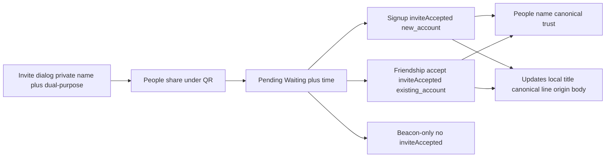

# Issue #97 — Invite identity and canonical name

> **For agentic workers:** REQUIRED SUB-SKILL: Use superpowers:subagent-driven-development (recommended) or superpowers:executing-plans. Execute units in order. One unit, tests, focused commit, then next. Do not push.

**Goal:** First-time users can say whose name the invite field asks for, who sees it, and that one People invite link works for a new or existing account; after a relationship-forming connect, a local nickname never hides the person’s public name/`@handle` on People, profile, or the invite-accepted Updates card.

**Architecture:** Keep one invite URL and one `inviteAccepted` event type. Add a pure `Profile` helper for the secondary canonical line. Thread `inviteOrigin` through existing attention `presentationPayload` **and** the GraphQL payload allowlist (no new event type, no migration). Client compose Updates title/subtitle from the already-fetched `Profile` plus origin; server stored title stays canonical for push/digest fallback. Emit origin-bearing `inviteAccepted` only on **relationship-forming** accepts (not beacon-only).

**Tech stack:** Flutter client l10n + design-system widgets; Dart server attention intents; existing `InviteAcceptedReceiptCard` profile fetch.

## Acceptance carve-out (closes #97 without full AC wording)

Ticket AC lists graph, invite confirmation, and recipient selectors. **This plan does not change those surfaces.** Closing #97 means:

- Inviter create/edit nickname is self-explanatory (label + helper + dual-purpose).
- Local rename never hides canonical on **People** and **other-person profile**.
- Dual-purpose is predictable before link generation (dialog, empty, People share).
- After relationship-forming accept: person on People (name → canonical → trust) + Updates origin body.
- Duplicate same-name contacts distinguishable on People/profile via secondary line.

Explicit non-goals (document when closing the issue): graph labels, graph context panel, recipient selectors, `InvitationAcceptDialog` identity layout, beacon-accept copy (`inviteAcceptBeaconBody`).

## Review amendments

### Round 1 (engineering)

1. **GraphQL allowlist** — add `inviteOrigin` to `attentionPresentationPayloadAllowedKeys` in [`query_attention.dart`](packages/server/lib/api/controllers/graphql/query/query_attention.dart) and the key set in [`attention_policy_test.dart`](packages/server/test/domain/attention/attention_policy_test.dart). Missing this throws `StateError` and breaks `attentionFeed`.
2. **Beacon-only** — skip `inviteAccepted` on `_acceptBeaconInviteOnly` paths (contract already says non-Beacon relationship-forming). Beacon access + contact upsert stay.
3. **Intent** — plain class, not Freezed. No `@Default`.
4. **Share caption** — only People invites (`beaconId == null`).
5. **Version** — bump **one minor above current** pubspec at commit time (likely `6.6.0` if `6.5.0` is other WIP) + `web/index.html` `?v=`. Do not raise `kDefaultMinClientVersion` (`6.0.0`).
6. **Freezed RoleFacts** — add `inviteOrigin`, run server `build_runner`.

### Round 2 (engineering + product)

1. **Field label** — “Your name / Ваше имя…” re-triggers UX-01. Frozen to private wording (below).
2. **`InvitationAcceptDialog`** — cut / non-goal for #97.
3. **`accepterHandle`** — producers must pass `accepterHandle: user.handle` / `accepter.handle`.
4. **Updates second line** — only when non-empty **and ≠ composed title**.
5. **Exact l10n strings** frozen below.
6. **Empty body** — reuse `invitationDualPurposeBody` (delete old `friendsInvitesEmptyBody` key after UI points at the one key).
7. **`ProfileAppBarTitle`** — keep `l10n.noName` when primary empty.
8. **Rename dialog** — keep `Their name: {displayName} [@handle]` row.
9. **`inviteAcceptBeaconBody`** — out of scope.
10. **“Relationship/account state”** — People appearance + Updates origin (no People badge).

### Round 3 (Claude Code CLI adversarial)

1. **`_rolePayload` mandatory** — [`attention_dispatch_repository.dart`](packages/server/lib/data/repository/attention_dispatch_repository.dart) hand-serializes every `AttentionRecipientRoleFacts` field. Adding `inviteOrigin` without updating `_rolePayload` silently drops it. UNIT 4 must touch this file (+ regenerate Freezed).
2. **Server stored title/body frozen literally** (below) — not “joined via your invitation” with a mangled join.
3. **Legacy / missing `inviteOrigin`** — body falls back to `receipt.body` (covers `{}` fixtures, actor-deletion rewrite of payload to `{eventType}`).
4. **`inviteOrigin` type = `String`** with wire literals `'new_account'` | `'existing_account'` only (no enum `.name` drift).
5. **Allowlist tests** — also update `fullPayload` in [`query_attention_payload_test.dart`](packages/server/test/api/controllers/graphql/query_attention_payload_test.dart).
6. **Beacon skip mechanism** — add `emitInviteAccepted` (default `true`) on `_acceptAndRecord`; beacon-only callers pass `false`. Do not invent a second helper.
7. **Docs** — copy plan into `docs/plans/issue-97-invite-identity-plan.md` before linking from `docs/README.md`.
8. **`invitePendingSubtitle`** — home file [`packages/client/lib/features/friends/ui/invite_pending_subtitle.dart`](packages/client/lib/features/friends/ui/invite_pending_subtitle.dart); named args matching `compactRelativeTimeAgo` style: `invitePendingSubtitle({required L10n l10n, required DateTime when, required DateTime now})`.
9. **`Waiting ·` on all pending tiles** — shared `_buildInviteTile` covers People **and** Request (beacon) invites; apply the same Waiting subtitle to both (only share **caption** stays People-only).
10. **Share `caption`** — rendered under the QR in the dialog chrome only; **never** put into `ShareParams` (`uri:` stays the shared payload).
11. **Updates loading/error** — until profile is ready (and on fetch error), keep **server** `receipt.title` / `receipt.body` (with origin l10n only when payload has origin **and** profile is ready for title composition). Keep `Profile` (not only display name string) on the card state.
12. **Blocked other-person profile** — `ProfileAppBarTitle` also renders `blockedProfile`; gaining canonical secondary there is **intended** (same widget). Update / keep green `profile_view_blocked_profile_test.dart`.
13. **People primary empty** — for peers, if `shownName` empty use `l10n.noName` (do not leave blank under `SelfUserHighlight.displayName`). Self still `labelYou`.
14. **ARB** — every new key needs `@key` metadata (`context:`). Delete obsolete `friendsInvitesEmptyBody` after switching empty UI to `invitationDualPurposeBody`.
15. **Lint baseline** — if tokenizing padding lowers client custom-lint count, update `scripts/custom-lint-baseline.txt` downward in UNIT 6.

## Global constraints

- User-facing: Request / discussion. Internal: Beacon / room. No `Request` domain entity.
- Feature UI: `context.tt`, `TenturaText`; no new raw `EdgeInsets`/`fontSize`/`Color` in `features/**`.
- Never edit generated files by hand; run `flutter gen-l10n` and server `dart run build_runner build -d` after sources that need it.
- Do not raise `kDefaultMinClientVersion` (`6.0.0`).
- Client: bump one minor above current + matching cache-buster.
- Conscious cuts: see Acceptance carve-out.
- Preserve unrelated dirty files. Stage explicit paths. No push.

## Frozen product rules

**Private nickname field (create + edit + Rename contact)**

| Key | EN | RU |
|---|---|---|
| `invitationAddresseeTitle` (keep) | For whom is this invite? | Для кого это приглашение? |
| `invitationAddresseeFieldLabel` / `renameContactFieldLabel` | Private name for this person | Приватное имя для этого человека |
| `invitationAddresseeHelper` / `renameContactHelper` | Only you can see this. You can change it later. | Видно только вам. Можно сменить позже. |
| `invitationDualPurposeBody` | This link works if they are new to Tentura or already have an account. | Ссылка сработает и для нового человека, и если у него уже есть аккаунт. |
| `invitationPendingWaiting` | Waiting | Ожидает |
| `confirmInvitationRemoval` | Are you sure you want to cancel this invite? The link will stop working. | Отменить приглашение? Ссылка перестанет работать. |
| `updatesInviteAcceptedBodyNewAccount` | Created an account via your invitation. You are now connected. | Создал(а) аккаунт по вашему приглашению. Теперь вы связаны. |
| `updatesInviteAcceptedBodyExistingAccount` | Already had a Tentura account. You are now connected. | Уже был аккаунт в Tentura. Теперь вы связаны. |

- Empty Invitations UI: use `invitationDualPurposeBody` directly; **delete** `friendsInvitesEmptyBody` from both arbs.
- Dual-purpose: dialog before Create, empty Invitations, People-invite share caption (under QR only). **Not** on pending tile. **Not** in `ShareParams`. **Not** on beacon share / forward-picker.
- Pending subtitle (People **and** Request invite tiles): `Waiting · {relative time}` / `Ожидает · {relative time}`.
- Rename: keep original-name reference row.

**Canonical secondary line**

Public parts: join non-empty `displayName` and `@handle` with ` · `. Client then drops any part equal to primary (`shownName`). Server stored title uses public parts only (no contactName).

Examples (client):

- alias `Mom`, public `Alice`, handle `alice` → secondary `Alice · @alice`
- alias equals public, handle set → `@alice`
- no alias, handle set → primary public name, secondary `@handle`
- no alias, no handle → no secondary
- empty shownName + handle → primary `noName` (People/profile), secondary `@handle`

Surfaces: People ([`network_person_card.dart`](packages/client/lib/features/capability/ui/widget/network_person_card.dart)) and other-person profile including blocked ([`profile_app_bar_title.dart`](packages/client/lib/ui/widget/profile_app_bar_title.dart)). Order on People: **name → canonical → trust** inside `BlocBuilder` column. Own-profile app bar unchanged.

**Server stored copy (push / digest / legacy in-app fallback)**

| Case | `title` | `body` |
|---|---|---|
| public name `Alice`, handle `alice` | `Alice · @alice` | origin body (below) |
| public name only | `Alice` | origin body |
| handle only | `@alice` | origin body |
| both empty | `Invitation accepted` | origin body |
| `new_account` body | — | `Created an account via your invitation. You are now connected.` |
| `existing_account` body | — | `Already had a Tentura account. You are now connected.` |

Do **not** append “joined via your invitation” to the title.

**In-app Updates composition (after profile load)**

- title = `shownName` if non-empty else public canonical (same join as server) else `receipt.title`
- second line = `canonicalSecondaryLabel` iff non-empty **and ≠ title**
- body = origin l10n if `inviteOrigin` present, else **`receipt.body`** (legacy / missing origin)
- loading / error: keep `receipt.title` + body rule above without local title override
- Seed prompt: shownName / `displayLabel`

**Origin payload**

`presentationKey: invite_accepted`. Wire string `inviteOrigin`:

- `'new_account'` — signup producers after `createInvited*`
- `'existing_account'` — friendship `accept()` path only

Beacon-only: `_acceptAndRecord(..., emitInviteAccepted: false)`. Regression test required.



## File map

- [`profile.dart`](packages/client/lib/domain/entity/profile.dart) — `canonicalSecondaryLabel`
- [`invitation_addressee_dialog.dart`](packages/client/lib/features/invitation/ui/dialog/invitation_addressee_dialog.dart)
- [`rename_contact_dialog.dart`](packages/client/lib/features/profile_view/ui/dialog/rename_contact_dialog.dart)
- [`friends_screen.dart`](packages/client/lib/features/friends/ui/screen/friends_screen.dart)
- **Create** [`invite_pending_subtitle.dart`](packages/client/lib/features/friends/ui/invite_pending_subtitle.dart)
- [`share_code_dialog.dart`](packages/client/lib/ui/dialog/share_code_dialog.dart) — optional `caption` under QR only
- [`network_person_card.dart`](packages/client/lib/features/capability/ui/widget/network_person_card.dart), [`profile_app_bar_title.dart`](packages/client/lib/ui/widget/profile_app_bar_title.dart)
- Server: intent plain class; [`attention_intent_case.dart`](packages/server/lib/domain/use_case/attention_intent_case.dart); RoleFacts + codegen; [`attention_policy.dart`](packages/server/lib/domain/attention/attention_policy.dart); [`query_attention.dart`](packages/server/lib/api/controllers/graphql/query/query_attention.dart); **[`attention_dispatch_repository.dart`](packages/server/lib/data/repository/attention_dispatch_repository.dart) `_rolePayload`**; [`invitation_case.dart`](packages/server/lib/domain/use_case/invitation_case.dart) `emitInviteAccepted`
- Updates: [`invite_accepted_receipt_card.dart`](packages/client/lib/features/updates/ui/widget/invite_accepted_receipt_card.dart), [`updates_receipt_display_copy.dart`](packages/client/lib/features/updates/updates_receipt_display_copy.dart)
- Copy plan → [`docs/plans/issue-97-invite-identity-plan.md`](docs/plans/issue-97-invite-identity-plan.md); link from [`docs/README.md`](docs/README.md); note in [`docs/relationship-states.md`](docs/relationship-states.md)

## Units

### UNIT 0 — Canonical label helper (TDD)

- [ ] Tests for examples above + empty profile.
- [ ] `canonicalSecondaryLabel` on `Profile` next to `shownName`.
- [ ] `flutter test test/domain/entity/profile_canonical_secondary_test.dart`

### UNIT 1 — Invite/rename/empty/share copy

- [ ] Arb keys/values + `@key` metadata exactly as frozen table; delete `friendsInvitesEmptyBody`.
- [ ] Dialog create: label, helper, dual-purpose; edit: no dual-purpose. Test via `.show()`.
- [ ] Empty Invitations uses `invitationDualPurposeBody`.
- [ ] `ShareCodeDialog` optional `caption` — render under QR; do not pass into `ShareParams`. Friends People create + People tile tap pass caption; beacon tiles / other call sites do not.
- [ ] Rename: new label/helper; keep `renameContactOriginalName` row.
- [ ] `flutter gen-l10n` + dialog widget test.

### UNIT 2 — Pending invite card

- [ ] Create `invite_pending_subtitle.dart` with named args; unit test via `lookupL10n`.
- [ ] All pending tiles (People + Request) use it; roomier padding via `context.tt`; edit/delete ≥44dp; no dual-purpose on tile.

### UNIT 3 — People + profile secondary

- [ ] People: primary = `SelfUserHighlight` for self, else `shownName` or `noName`; then canonical; then trust. Tokenize padding.
- [ ] `ProfileAppBarTitle`: primary `shownName` or `noName`; secondary `canonicalSecondaryLabel` (blocked profiles included).
- [ ] Widget tests with mocked `ProfileCubit` + `ScreenCubit.local()`; keep `profile_view_blocked_profile_test.dart` green.

### UNIT 4 — Server origin + allowlist + beacon skip

```dart
class InviteAcceptedNotificationIntent {
  const InviteAcceptedNotificationIntent({
    required this.inviterUserId,
    required this.accepterUserId,
    required this.accepterDisplayName,
    required this.actionUrl,
    required this.inviteOrigin, // String: 'new_account' | 'existing_account'
    this.accepterHandle = '',
  });

  final String inviterUserId;
  final String accepterUserId;
  final String accepterDisplayName;
  final String actionUrl;
  final String inviteOrigin;
  final String accepterHandle;
}
```

- [ ] Producers pass `inviteOrigin` **and** `accepterHandle: …handle`.
- [ ] Sites: `auth_case.dart`, `credential_auth_case.dart`, `invitation_case.dart`, `attention_intent_case_test.dart` ×2.
- [ ] `_acceptAndRecord({…, bool emitInviteAccepted = true})`; beacon-only callers pass `false`. Test no `inviteAccepted` on beacon-only.
- [ ] RoleFacts.`inviteOrigin` + `build_runner`; **`_rolePayload` includes `inviteOrigin`**.
- [ ] Allowlist + `attention_policy_test` key set + `query_attention_payload_test.fullPayload`.
- [ ] Stored title/body exactly as frozen server table (public-parts join; origin bodies match arb EN).

### UNIT 5 — Updates card

- [ ] Keep `Profile?` on card state; parse `inviteOrigin` from payload.
- [ ] Compose per in-app rules; legacy/`{}` → `receipt.body`; loading/error → server title.
- [ ] Fake profiles set `contactName` when asserting nickname title.
- [ ] Update `invite_accepted_receipt_card_test.dart`.

### UNIT 6 — Version, lints, docs

- [ ] Minor bump + `web/index.html` `?v=`.
- [ ] `./scripts/check-custom-lints.sh` client+server; if client count dropped, lower `scripts/custom-lint-baseline.txt`.
- [ ] `bash scripts/check-user-facing-terminology.sh`
- [ ] Copy this plan to `docs/plans/issue-97-invite-identity-plan.md`; link from `docs/README.md`; note in `relationship-states.md`; cite carve-out when closing #97.

## Out of scope

- Graph nodes, graph context panel, recipient pickers, forward picker.
- `InvitationAcceptDialog` / `inviteAcceptBeaconBody` wording.
- Origin badge on People cards.
- Re-emitting `inviteAccepted` after landing name-step.
- Splitting invite into two actions.
- `MIN_CLIENT_VERSION` bump.
- Blocked-user **list tiles** / mutual-friends sheet secondary line (blocked **profile app bar** via shared `ProfileAppBarTitle` is in scope).
- Changing beacon friendship semantics beyond stopping misleading `inviteAccepted` on beacon-only.
