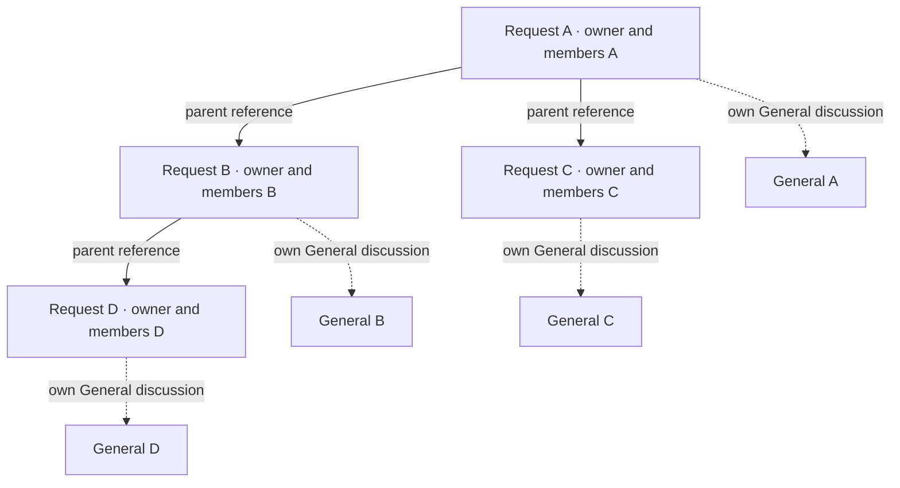

# Nested requests and General-only discussions — architectural proposal

Status: architectural proposal, not an implementation plan. No application, API, schema, or data changes are authorized by this document alone.

Date: 2026-09-06. Repository baseline inspected: `ecb9a918c`, including the current working tree. Existing unrelated plans and files are preserved.

User-facing **Request** remains internal **Beacon**. This proposal adds a relationship between Beacons; it does not introduce a parallel `Request` entity, repository, table, or route family.

## Product decisions supplied by the product owner

| Area | Decision |
|---|---|
| Replacement | Remove ask, promise, and blocker coordination items, which currently provide additional discussion threads. Replace their coordination surface with child requests. |
| Core product | Help offers, accepted helpers, acknowledged commitments, request-level participation, forwarding, and evaluation remain. A promise item and an acknowledged request participant are different concepts. |
| Remaining coordination | Plans, plan steps, facts, and other features that do not create additional discussion threads remain. |
| Hierarchy | A child has one parent. Multi-level nesting is allowed; cycles are forbidden. Nesting and fork lineage are separate relationships. |
| Creation | Any admitted discussion participant may create a child. Direct creation is the primary path; promotion of a message is another entry. The creator/promoter owns the child by default. |
| Membership | Each request has its own ownership, membership, admission, and permissions. There is no membership inheritance. Child members see the parent at the non-admitted request tier. |
| Promotion | An admitted participant may promote another participant's message. Preserve the current promotion interaction, with a system notice in the parent chat using the participant-admission notice style. The promoter owns the child. |
| Lifecycles | Children have the same complete lifecycle as any request. Parent closure, cancellation, or deletion does not close, cancel, or delete children. |
| Lifecycle notices | Parent lifecycle termination produces notices in every descendant request, at every depth, and notifications to those requests' users through normal notification behavior. Child closure produces a notice and notifications in its immediate parent. |
| Discovery | Every admitted participant of a parent can see its child cards. Hierarchy alone does not add a child to anyone's Inbox or My Work. Those surfaces retain their normal involvement/forwarding rules. |
| Relationship editing | No reparenting, detachment, or attachment of an existing standalone request in this version. |
| Legacy data | Existing ask/promise/blocker objects and non-General conversations are testing data and may be discarded. No conversion into child requests is required. |
| Future threads | Preserve the server's underlying ability to support multiple threads, but disable it through both the API and client, with guard comments explaining why it remains. |

### Follow-up defaults awaiting an answer

Two optional follow-up questions were sent while inspecting the code. This draft uses the following defaults; they are recommendations, not additional confirmed product decisions:

- **Linked request visibility:** opening a child from an admitted parent's child list shows ordinary request details, with no discussion access. Opening the parent as a child member uses the same tier. A limited-preview answer would narrow the read projection, not change membership or discovery semantics.
- **Lifecycle notice scope:** include entry into Wrapping up, final Closed, Cancelled, and Deleted, in both prescribed directions. “Close” is an intent that can enter Wrapping up before final Closed, so these must have distinct event identities and honest copy. An answer restricting notices to terminal states would remove Wrapping up from the propagation policy.

Additional architectural defaults are identified where relevant below: private drafts, immutable parentage, reuse of existing coordination lifecycle eligibility, and one promoted child link per source message. These can be revised without changing the central model.

## Architectural position

A child is an ordinary Beacon aggregate with an immutable parent reference. Each Beacon continues to own its own request lifecycle, discussion, participation, forwarding, and evaluation. The tree is a navigation and lifecycle-notification relationship, not a shared authorization group or a recursively loaded aggregate.

The parent owns neither the child's participants nor the child's lifecycle. Parent detail reads use a small, authorized child-summary projection. Commands against a child always run its ordinary request policies. The same person may therefore own one node, help on another, and only be able to read the request details of a third.

This preserves the product's central unit and avoids a second implementation of help offers, admission, review windows, trust attribution, media, and notifications for “subtasks.” It also prevents the retained coordination-item model from becoming a disguised alternative request model.

The arrows describe parent-to-child navigation; storage uses the child's parent ID. No arrow grants discussion admission.

## Current architecture and the boundaries affected

These are live-code anchors, rather than assumptions from older plans. Paths are relative to the repository root.

| Responsibility | Existing owner / evidence | Architectural consequence |
|---|---|---|
| Lifecycle vocabulary | `lib/domain/entity/beacon_status.dart` | Open-family, Wrapping up, Closed, Cancelled, and Deleted already have distinct meanings. Do not invent child-specific statuses. |
| Server creation, drafts, fork, cancellation, deletion | `packages/server/lib/domain/use_case/beacon_case.dart` (`BeaconCase`) | Reuse normal creation and lifecycle policy. Keep nesting distinct from `fork`. |
| Server state and lineage storage | `packages/server/lib/data/database/table/beacons.dart`; `docs/adr/0004-beacon-lineage-fork.md` | Add a separate nesting reference; do not reuse `lineage_parent_beacon_id` or `lineage_root_beacon_id`. |
| Discussion admission and thread access | `packages/server/lib/domain/use_case/beacon_room_case.dart` (`_canUseRoom`, `_canAccessThread`, `createMessage`, `listMessages`, `listThreads`, `markThreadSeen`) | Existing item-participant access to semantic threads must become unreachable through the product. General retains explicit admission. |
| Request read access | `packages/server/lib/domain/beacon_visibility.dart`; `packages/server/lib/domain/port/beacon_access_guard.dart`; migrations `m0123.dart`, `m0136.dart`; `hasura/metadata.json` | Read access is relationship-scoped today. Hierarchy visibility is an explicit new read reason, and must agree between V2 and Hasura. |
| Existing promotion | `packages/server/lib/data/repository/coordination_item_repository.dart` (`_emitCreatedRoomNotify`); client `features/beacon_view/ui/widget/coordination_item_composer_sheet.dart` | Promotion links the original message and emits a separate timeline notice. Preserve the interaction while replacing the target type. |
| Coordination item storage | `packages/server/lib/data/database/table/coordination_items.dart`; `packages/server/lib/consts/coordination_item_consts.dart` | Plans share infrastructure with retired kinds. Deleting the whole coordination subsystem would remove supported product behavior. |
| Thread scope storage | `packages/server/lib/data/database/table/beacon_room_messages.dart` | General is `thread_item_id IS NULL`; preserve the nullable scope column and reusable server machinery. |
| Retained participation | `packages/server/lib/domain/use_case/coordination_case.dart` (`setCoordinationResponse`, `setBeaconStatus`) | Its name does not make this obsolete. It implements core request participation. |
| Manual close / review | `packages/server/lib/domain/use_case/evaluation_case.dart` | Hierarchy events must cover both direct close and review-window entry, subject to the selected notice scope. |
| Automatic final close | `packages/server/lib/domain/use_case/attention_expiry_sweep_case.dart`; `packages/server/lib/domain/use_case/evaluation/review_finalization_case.dart` | Notifications must cover background completion, not just GraphQL button handlers. |
| Durable notification delivery | `packages/server/lib/domain/use_case/transactional_attention_case.dart`; `attention_intent_case.dart`; `packages/server/lib/data/repository/attention_dispatch_repository.dart` | Reuse transactionally recorded attention occurrences, receipts, and channel jobs. Do not introduce a separate push sender. |
| Recipient facts | `packages/server/lib/data/repository/beacon_room_notification_context_repository.dart` | `usersWithActiveCoordination` currently reads coordination items. Removing those items requires an explicit retained-role recipient model. |
| Request save and media workflow | `packages/client/lib/domain/use_case/beacon_create_case.dart`; `packages/client/lib/domain/port/beacon_write_port.dart` | Add creation context without copying the multi-stage save/media workflow into a separate child implementation. |
| Parent coordination surface | `packages/client/lib/features/beacon_threads/ui/widget/threads_list.dart`; `ui/bloc/threads_cubit.dart`; `ui/widget/thread_host.dart` | Replace semantic-thread rows with child-request summaries. Child navigation must open a Beacon, not an item thread. |
| General discussion | `packages/client/lib/features/beacon_threads/domain/use_case/beacon_threads_case.dart`; `ui/bloc/room_cubit.dart`; `ui/widget/room_message_tile.dart` | Reuse chat, replies, polls, facts, mentions, and admission-notice chrome with typed new system events. |
| Read state | `packages/client/lib/features/beacon_threads/domain/room_read_watermark_store.dart`; `DEV_GUIDELINES.md` | Each request keeps an independent General watermark. Viewing a parent cannot mark a child's chat seen. |
| Realtime convergence | `docs/contracts/realtime-entity-contract.json`; `DEV_GUIDELINES.md` | New hierarchy projections need explicit invalidation recipients and catch-up coverage. Invalidation hints confer no access. |

Some documentation still names pre-thread-migration client paths. The live discussion implementation inspected here is under `features/beacon_threads`; do not recreate a legacy `features/beacon_room` module from an old pointer.

## Domain and persistence model

### One Beacon model, two independent relationships

Add an optional `parentBeaconId` / `parent_beacon_id` to the normal Beacon representation. Null means a standalone root. Keep existing fork-lineage fields unchanged. A fork does not automatically inherit the source's nesting parent; the default fork remains a new standalone occurrence with its existing lineage relationship.

Store one immediate parent reference; do not persist recursive children inside the entity. Do not make the parent aggregate responsible for loading or saving descendants. A root ID, materialized path, or closure table is not necessary initially: indexed adjacency plus recursive SQL can serve ancestor/descendant operations. Such read optimizations can be introduced behind a port if measurements justify them.

Persistence invariants:

- Parentage is established only while creating a new Beacon. There is no public parent setter or existing-request attachment mutation.
- A non-null parent references a real Beacon; self-parenting is prohibited. Parentage is immutable, including after cancellation or deletion.
- New children can only point to an existing parent, so creation-only linking plus immutability prevents cycles in supported writes. Database constraints/triggers also defend the invariant against alternate writers; a plain self-FK alone is insufficient.
- Index the parent reference for immediate-child reads and descendant traversal. Child lists are paginated and deterministically ordered.
- Published request deletion preserves a structural tombstone. Do not use `ON DELETE CASCADE` or `ON DELETE SET NULL` on nesting: both violate independent lifecycle or immutable parentage. A hard purge must retain a minimal structural identity when descendants exist.
- Account erasure must anonymize/remove personal content according to the existing policy without silently detaching or deleting independently owned descendants. This affects the eventual hard-delete path as well as ordinary request deletion.

The public domain entity exposes IDs and values, not Drift rows or generated GraphQL objects. Optional parent navigation is an authorized read projection; a database relationship is not permission to serialize an unrestricted parent object.

### Promotion provenance is a separate relationship

Represent promotion with a small typed association between a child Beacon and its source General message. It records the child, source parent Beacon, nullable source message reference, and promoter attribution. The child author is still the normal Beacon author. The source message author is not made a child owner, helper, or member.

This association must not overload `linked_item_id`, which remains reserved for surviving coordination items such as plans. A dedicated association also avoids imposing message provenance fields on every ordinary request.

Default: one successfully promoted child per source message, matching the existing single-target source footer. A concurrent/retried promotion resolves to that same child; it must not overwrite the source link or silently create duplicates. Direct creation remains unrestricted by message provenance. The command additionally has its own durable idempotency identity, independent of whether its response reached the client.

Deleting the source message removes the quote/link to its contents, not the child or its parentage. Do not retain an otherwise deleted private message body inside generic event JSON. Editing a source message after promotion does not rewrite the independently authored child request.

## Authorization, visibility, and discovery

Treat these as separate policies with explicit facts:

| Capability | Required authority |
|---|---|
| Create child / begin promotion | Normal effective discussion admission on the parent, including author/steward authority, plus the parent's normal coordination lifecycle and block policy. Mere request-content visibility is insufficient. |
| Read immediate child cards | Effective discussion admission on the parent. No child admission is granted. |
| Open child request details via parent | Proposed linked-content read reason from direct parent admission. The child discussion, People details, private facts, and reviews keep their existing gates. |
| Open parent request details via child | Proposed linked-content read reason from effective membership/admission in the immediate child. No parent discussion admission is granted. |
| Read child General | Child's own author/steward/admission policy only. |
| Act on child | Child's ordinary action policy. Viewing a card does not authorize admission, edits, closure, moderation, or evaluation. |
| Populate Inbox / My Work | Existing involvement/forwarding predicates for that Beacon, never a hierarchy read grant alone. |

The two linked-content reasons are deliberately **one edge wide**. Do not implement them by recursively calling `canReadContent(parent)`: doing so would let visibility spread through the whole tree. Readable request details do not imply membership, and membership is not inferred from a previous successful read.

For A → B → C, a member of A can see B's request details and card. That alone does not expose B's child list or C. A member of C can open B's non-admitted details, but cannot thereby open A. Explicit existing involvement in those requests still works normally.

Apply draft, deleted/tombstone, block, and other established restrictions before hierarchy read reasons. Raw IDs, nested GraphQL relationships, subscriptions, previews, counts, and cached objects must not bypass them. “Visible to all admitted parent participants” uses the same existing block/deletion restrictions as other product surfaces; it is not a new block exception.

Hierarchy read reasons must be recognized by the canonical SQL predicate, V2 `BeaconAccessGuard`, and the pure visibility policy, while remaining absent from involvement predicates. In particular, expanding `canReadContent` must not accidentally expand profile involvement graphs, Inbox, or My Work.

Example: Bob creates B under A. Alice is admitted to A, so B appears on A. Alice has no new Inbox/My Work row or unread child-chat badge. A later forward of B to Alice follows the normal Inbox path; an accepted help offer follows the ordinary participation path. Bob sees B as its author regardless of forwarding.

Loss of parent admission revokes the hierarchy-derived child read path. It does not remove separately acquired child membership or forwarding access. Child membership can survive leaving the parent. The reverse applies when the immediate child is the only basis for reading the parent.

## Creation and message promotion

### Shared creation policy

Use the existing request composer and save/media orchestration with explicit creation context: standalone, child of a Beacon, or child promoted from a General message. A child has the same required fields, limits, publishing rules, ownership, and media handling as a root request. No arbitrary parent values enter a general update payload.

The default lifecycle guard reuses `BeaconStatus.allowsCoordination` on the parent: open-family and Wrapping up permit coordination; terminal states do not. This preserves the existing coordination eligibility rather than inventing a child-specific state machine. The UI obtains the capability from the server and the server rechecks it when writing.

Reuse private draft semantics. Saving an unfinished child creates an owner-only draft with its intended parent; it does not publish a card, link the source message visibly, or send a creation notice. Publication revalidates parent admission, lifecycle, blocks, and source-message access. If those have changed, the draft remains private and the failure is actionable; the server does not silently publish it as a standalone request. The owner may delete the draft. Draft parents cannot acquire children.

Immediate published creation atomically establishes the Beacon, parent reference, promotion association if any, and parent General system notice. Draft publication atomically makes the corresponding relationship visible and emits its notice once. Creation is not complete at the client until the server supplies the canonical child ID.

The unit of work includes permission checks under the relevant locks, database creation/publication, provenance, and durable notification/event recording. Media upload and delivery do not run inside that database transaction; reuse the existing staged-media and orphan-compensation design. Retry carries the command identity and saved Beacon/media state so a partial network failure does not create a second request.

Lock the parent and relevant admission/source state consistently against concurrent removal, deletion, publication, and source-message deletion. A parent closing concurrently must produce either a valid creation before the transition or a policy-rejected publication after it, according to the resulting lifecycle; not a check-then-write bypass. Wrapping up remains eligible under the stated default.

### Promotion interaction and privacy

Keep the current flow: message action → editable composer with source preview → successful publication → source lifecycle footer/link plus a separate system timeline notice. Replace the Ask/Promise/Blocker target picker and item fields with the normal request composer. The promoter becomes the child owner even when promoting somebody else's message.

Validate on the server that the source exists, belongs to the claimed parent, is in General, and is readable/promotable by this admitted user. Never rely on a foreign-key check or the client's claim about the parent. Preserve existing restrictions on non-promotable system/event messages rather than allowing arbitrary forged source IDs.

The user reviews the child request text before publication. Promotion may seed that text using the existing promotion convention, but does not copy the surrounding discussion, replies, attachments, mentions, pinned private facts, participants, targets, help offers, or read state. Explicitly added media uses normal ownership handling. Any private source quote displayed while composing stays source-authorized and is not embedded into the child's public/readable payload.

This is an intentional publication by an admitted promoter: the resulting child request text has the child's readership. Preserve that clear action through the existing publish interaction without inventing an extra consent workflow.

Direct child creation produces the same parent General notice, without a message source. Promotion additionally links the source message. Both use the admission-notice visual family, semantic accessibility text, and a child-request link, not a fake message written on behalf of the source author.

## Lifecycle propagation and attention

### Event semantics

A lifecycle event records the **source Beacon**, stable source transition identity, previous/next status, actor (possibly system), and committed event time. Delivery records separately identify the **receiving Beacon** and its relationship to the source. A system notice is a consequence of a lifecycle change; inserting the notice is never another lifecycle change.

Under the proposed notice scope:

| Actual source transition | Descendants at every depth | Immediate parent | Lifecycle mutation on other requests |
|---|---|---|---|
| Enter Wrapping up | Ancestor-is-wrapping-up notice | Child-is-wrapping-up notice | None |
| Enter Closed | Ancestor-closed notice | Child-closed notice | None |
| Enter Cancelled | Ancestor-cancelled notice | Child-cancelled notice | None |
| Enter Deleted | Ancestor-deleted notice | Child-deleted notice/tombstone | None |

This applies to direct closure, early close, automatic review expiry, cancellation, and deletion. A scheduled finalization must produce the same source event as the equivalent manual transition. A repeated no-op command does not generate a second event.

Example: if B in A → B → D closes, A and D receive notices. A's other child C does not. If A closes, B, C, and D receive notices. The notice placed in B does not generate an additional notice to A or D. This rules out loops and duplicate notices through multiple propagation paths.

Descendant traversal continues through closed, cancelled, or deleted intermediate nodes. Their lifecycle cannot sever the relationship or prevent still-active grandchildren from being informed. Deleted destinations do not send users into unavailable chats; retain delivery/audit state and respect normal tombstone/access rules while continuing the traversal. Ordinary closed discussions may receive system notices even where human posting is disabled.

Do not propagate NOW edits, general messages, membership changes, help offers, or trust results across the tree. The comparison to NOW/status notifications specifies the existing delivery experience; it does not make every request edit a hierarchy-wide broadcast. Existing reopening behavior remains local under this proposal; hierarchy-wide reopen notices would be a separate product choice. Notices describe dated events rather than asserting an ancestor is permanently closed.

### Durable delivery with bounded work

Extend the existing attention architecture instead of sending push/email directly from lifecycle commands or GraphQL resolvers. A pure hierarchy notification policy determines source transition eligibility and direction. A narrow domain port supplies/records topology and delivery facts; SQL traversal and task execution stay in data/infrastructure.

The source transaction records a durable hierarchy event and its target-request work set, atomically with the source state transition and the existing source-request notification. Capture the target set with a set-based indexed recursive query. The source transaction's database snapshot defines the set of published descendants affected; unpublished drafts are not destinations, and deleting an unpublished draft does not notify the parent. A future child is not retroactively notified of an event before its publication. There must be no interval where the status has committed but the propagation work can be lost.

The target set is linear in affected requests, but the source transaction performs no per-user external delivery or recursive chain of application calls. A bounded worker materializes each target's General system notice and attention intent within that target's transaction, then marks the delivery complete in the same transaction. Existing attention jobs perform channel delivery. Prefer the existing durable task infrastructure if it supports these transactional and retry guarantees; otherwise use a narrow hierarchy-delivery outbox behind a port, not a new general workflow framework.

Uniqueness at `(sourceEventId, targetBeaconId)` prevents duplicate chat notices and delivery work. Attention occurrence keys derive from that stable pair. Receipt/job identities include the recipient and normal channel identity. Retries reuse the original immutable event payload; the existing dispatcher rejects a reused key with different source facts.

Bound worker batches, claim work safely across workers, retry transient failures, and expose exhausted retries/queue age. A failure for one descendant does not prevent processing the others, and a push outage does not roll back a committed lifecycle transition. Preserve per-target source-event ordering so delayed Wrapping up notices cannot appear after that same source's final Closed notice without their original event ordering.

Recipient policy is evaluated when a target notice is first materialized, then snapshotted for its retries. This chooses the target's then-current audience; it does not attempt to reconstruct historical membership. Channel delivery and later navigation still apply current authorization and existing privacy/preferences. This timing is explicit so queue delays and membership changes have defined semantics.

### Receiving-request audience and privacy

All notices are scoped to the **receiving request**. Resolve its author, stewards, admitted participants, retained active participation/help roles, and normal Inbox/watch audiences according to the established status-notification policy. A viewer who only sees a child card is not a child notification subscriber.

Preserve normal preference, block, actor-suppression, and watcher-channel behavior. “All users” means the request's normal eligible status audience, not every account that can infer its ID. The General notice remains visible to admitted viewers, including the actor, even where the actor receives no separate attention receipt. Users of a destination need not be members of the source to receive the lifecycle fact required by this redesign.

The present `usersWithActiveCoordination` query reads items slated for removal. Replace that dependency with named facts for retained request roles; do not let the removal silently suppress status notifications to helpers. Surviving plan participation can remain a separate fact where the ordinary policy needs it. Keep core help-offer/acknowledgement semantics intact.

For a distant ancestor, recipients may have no right to read its details. A shared chat row and immutable push payload must therefore be safe for all intended recipients: generic relationship wording plus the lifecycle fact, without private text, member names, reviews, or an unrestricted source title. Authorized UI may enrich the source link on read. Deleted sources use tombstone copy. An inaccessible source still produces the required notice but cannot be opened through an authorization bypass.

Link the notification to the receiving request's notice or normal accessible destination. Do not send a descendant-only user to an inaccessible ancestor page. Deduplicate within each destination; if a person belongs to several affected requests, retain the destination-specific in-app notices and use the existing batching/preferences model for external delivery rather than erasing context with global deduplication.

### Evaluation and trust remain local

Every Beacon's review participants, review window, evidence, and trust effects are computed from that Beacon's own participation and forwarding history. Do not inherit evaluators, multiply evaluation edges through nesting, or aggregate a parent's outcome from children. The same people may have separate eligible contributions in several requests; existing per-request evaluation limits still apply. A hierarchy notification must never execute review finalization on its destination.

## General-only product boundary with retained thread machinery

The enabled product offers exactly one discussion thread per request: General. A child's General is a discussion on a different Beacon, not an item thread of the parent.

Preserve the server's reusable thread scope model, nullable `thread_item_id`, storage/indexing, repository logic, and relevant lower-level tests. Retain plan/item storage required by supported features. Keep stable retired kind values reserved; do not renumber surviving persisted enums or reinterpret an old promise ID as a child request ID.

Use one explicit server product-capability policy, defaulting to General-only, with guard comments that name this architecture document and explain the future multi-thread intent. Preserve runnable dormant machinery behind that policy rather than copying large functions into comments. A guard comment without executable rejection is insufficient.

The API contract removes or disables ask/promise/blocker creation, drafts, publication, acceptance, resolution, redirection, cancellation, reminders, and responsibility-item projections. Generic coordination APIs allow only supported surviving kinds and operations. Removing named mutations is not enough if a generic kind argument can still recreate an ask.

No public request may select or create a non-General conversation. Audit scope-bearing operations together: list/fetch/target messages, create/edit/delete, replies, reactions, attachments/downloads, polls, mentions, thread lists, mark-seen, previews, notifications, and subscription/paint payloads. Methods that only accept a message ID must resolve its scope before applying the capability gate. Never normalize a supplied non-General ID to General; reject it explicitly.

Where the compatible operation name is useful, it may stay with a General-only contract. New schema inputs should not advertise arbitrary thread selection. Any temporarily retained argument for old clients rejects non-General values on the server. V2 routing, Hasura permissions, and database-facing alternate writers all need the same effective restriction; a disabled client menu is not enforcement.

Remove product-facing item-thread routes and destinations. Old links must resolve to an explicit unavailable state or a safe request overview where authorized; they must not be interpreted as child-request links. General deep links, source-message links, and surviving plan/fact links retain their own meaning.

Dormant server thread tests demonstrate that the retained mechanisms still function in a controlled fixture/capability context; public-contract tests demonstrate that production APIs cannot invoke them. A future re-enable requires a new API/authorization/product review, not merely uncommenting registrations.

## Client structure and experience

### Parent surface

Keep the existing request shell and its People/Log responsibilities. In the surface currently listing General and semantic-thread items, show General and a clearly named **Child requests** section with **Create child request** as the primary creation entry. The enclosing navigation should use discussion/request vocabulary instead of suggesting child requests are additional threads; final tab copy is a presentation detail, not a domain rename.

Each child card is a summary projection of an ordinary Beacon: identity/title, owner identity permitted at the request-detail tier, lifecycle/status, and only the compact existing request metadata useful for choosing it. It is not an item model with fake kind/status fields. No child-message preview, participant list, private fact, evaluation result, or unread count is exposed through parent admission alone.

Show immediate children, with active and finished grouping and a restrained deleted tombstone where appropriate. Drafts remain private to their owner. Use pagination and stable ordering rather than recursively rendering all descendants. Opening a child uses the normal request route. Its parent link provides the upward navigation allowed by policy; do not prefetch an unrestricted ancestor breadcrumb chain.

General keeps its chat preview, admitted-member treatment, and independent unread state. Where a user separately has child admission, a child-specific badge may use that child's authorized read-state projection; it must never be calculated from parent read-through. This is optional presentation and not a requirement to expose child chat activity in the first design.

### Dependency ownership

Add small shared domain contracts such as `BeaconHierarchySummary`, `BeaconParentReference`, `BeaconPromotionSource`, and the hierarchy lifecycle event. These are conceptual names; their precise file granularity belongs in the later implementation plan. A summary is a projection, not a second aggregate.

On the client, a narrow `BeaconHierarchyPort` belongs to domain. A data adapter maps V2/Hasura DTOs to those domain values. A `BeaconHierarchyCase` coordinates child summaries, capabilities, and relevant realtime refresh; creation remains under the existing `BeaconCreateCase` with explicit command context. The request-view composition consumes those cases. Cubits present state and invoke commands rather than join repositories or call transport services directly.

On the server, a focused child creation/promotion case owns authorization and transaction scope through ports. Reuse normal Beacon creation policy through a shared domain collaborator where necessary; do not duplicate `BeaconCase.create` or call a GraphQL mutation from another mutation. A focused lifecycle-effects collaborator is called by all applicable lifecycle paths, including automatic finalization. It records hierarchy work without making the parent responsible for mutating children.

Persistence adapters implement domain-owned ports. SQL, recursive traversal, Drift types, task storage, and GraphQL annotations stay in outer layers. The transaction abstraction remains domain-owned and the actual transaction is provided by the current mutating unit of work. DI wiring belongs at the composition edge and generated bindings are regenerated.

Do not perform a blanket rename or deletion of `coordination_*`: request help-offer coordination and plans still use those areas. Remove feature-facing Ask/Promise/Blocker coupling from `ThreadsCubit`, the item composer/actions, message promotion, responsibility displays, blocker-specific NOW hints, and notification copy without removing the retained core workflows.

### Design system and navigation

Reuse Tentura Material 3 components, `context.tt`, `TenturaText.*`, existing request identity/status presentation, and compact/regular/expanded density rules. No new raw styling constants or child-specific theme. Lists remain lazy, accessible under text scaling, and operable on compact and wider layouts.

Compact and expanded layouts use the same domain state. Selecting a child opens the normal Beacon view rather than feeding a Beacon ID into `ThreadHost`'s semantic-item selection. Root-owned typed navigation preserves deep links and back navigation without creating a separate hierarchy router or rebuilding a route for every ancestor.

System events use typed payloads with a versioned discriminator, mapped into the existing admission-style chat notice and preview presenters. Source-link rendering and server-safe fallback text belong to their existing presentation boundaries, not raw widget interpretation of arbitrary JSON. Localize all user-visible text in the supported `.arb` resources; preserve the Request/discussion/General terminology contract.

## API and projection shape

Keep V2 operations focused on explicit intent. Conceptually the contract needs a child-summary query, an authorized parent-reference projection, and a create-child command with an optional promotion source and idempotency identity. Existing draft publication recognizes the saved child context and applies the same gates. Exact GraphQL field names and DTO definitions belong in the later implementation plan.

Do not add a generic mutation that can assign `parentBeaconId` on any existing Beacon. Do not expose recursively nested `children { children { ... } }` responses. Child queries are bounded and request-scoped, with capabilities/status and stable pagination. Parent/child summary rendering must not incur one membership, profile, or last-message request per card; data adapters batch the permitted facts.

Membership, forwarding, admission, reviews, editing, and media operations on the child use the existing Beacon APIs. Creation responses give enough canonical identity for navigation and safe retries; client cache state is reconciled from authoritative reads.

New direct V2 operations must be registered in `packages/client/lib/data/service/remote_api_client/build_client.dart`. Schema/operation inputs live in source GraphQL and adapter files, including `packages/client/lib/data/gql/schema.graphql`; regenerate Ferry, Freezed, Injectable, routes, and localization as applicable. Do not hand-edit generated output or introduce special coercion cases in the GraphQL controller.

## Realtime, unread, and cache consistency

Changes to child publication, visible summary fields, lifecycle, or tombstone state invalidate the immediate parent's child-summary projection as well as the child's existing projections. Admission/block changes invalidate any hierarchy read paths they grant or remove in both directions. Private child drafts must not leak through IDs, counts, paint payloads, or invalidation fan-out.

Define hierarchy effects in `docs/contracts/realtime-entity-contract.json`, using an existing entity kind where it truthfully represents the change or one explicit new kind where required. Reuse authenticated V2 WebSocket distribution, bounded recipient fan-out, actor attribution, coalescing, and guarded use-case refresh. Do not create subscriptions that accept arbitrary parent/child IDs as authorization.

Lifecycle notice insertion converges through the receiving Beacon's existing room-message/attention projections. It may increment that request's General unread and Updates attention according to existing rules, but never marks another request seen. Actor sessions converge even when separate attention notifications suppress the actor.

Reconnect, restored browser visibility, and access revocation must refetch the parent list and active child view. Invalidation is a hint; snapshots remain authoritative. Retain usable state during transient refresh failures, reject stale account/generation responses, and evict newly unauthorized cached child/parent content when the authoritative read denies it.

## Legacy testing data and compatibility boundary

Discarding legacy objects is an explicit product-owner decision for this environment. Scope the migration to retired ask/promise/blocker kinds and all non-General conversations, rather than wiping unrelated requests, accounts, help offers, acknowledgements, evaluations, plans, or facts.

Treat retirement as a referential cleanup, not just three `DELETE` statements. Relevant dependents include semantic-thread messages, attachments/blob cleanup, replies, reactions, polls, item events and anchors, source-message promotion metadata, per-thread seen state, responsibility/deadline/reminder rows, attention receipts/jobs, historical notification destinations, and denormalized previews. Use actual FK and producer inventories to decide deletion order and cleanup behavior.

Preserve General messages while removing their references/footers to discarded items. Remove obsolete system anchors or leave a deliberate safe historical representation without a dead actionable target. Do not move non-General messages into General: that would expose formerly scoped conversations and contradict the decision to discard them. Reconcile unread counts, stored previews, and attention badges from the remaining General history; retain valid General read watermarks rather than creating artificial unread activity from the cleanup.

Plans and facts remain supported. When a surviving fact/plan record references a message in a discarded conversation, preserve the supported record where its model permits and clear/reconcile provenance safely; do not turn private text into a new public copy. Identify any non-null provenance constraint explicitly before deleting its source. Shared blobs are collected only when unreferenced according to existing ownership/GC rules.

Keep the underlying multi-thread schema machinery and reserved kind codes. Disable obsolete workers and public producers so they cannot recreate discarded data. Do not rewrite historical migrations; add a forward migration using the server's existing handwritten `migrant` registration in `packages/server/lib/data/database/migration/_migrations.dart`.

This is a breaking product/API boundary, even with zero real users. The later release requires matching server/client schemas and generated clients, the semver change prescribed by the repository's versioning rule, a corresponding `flutter_bootstrap.js?v=` update, and a minimum-client gate when stale clients would exercise removed APIs. Existing installed test PWAs and queued operations still count as old clients. Version checks complement server rejection; they do not enforce authorization.

Discarded conversations cannot be reconstructed by rolling back application code. Any desired backup/export belongs to the future data-change execution, not to this documentation task. No reset, migration, code generation, version bump, or runtime change has been performed while writing this proposal.

## Acceptance properties for the later implementation

These are architectural outcomes, not an ordered work breakdown.

| Area | Required evidence |
|---|---|
| Aggregate independence | A child can be forwarded, admitted to, helped on, closed, and evaluated with exactly the ordinary Beacon rules; no parent role grants child mutation rights. |
| Tree integrity | Multiple levels work; cycles, self-parenting, reparenting, and attachment of an existing request fail at supported boundaries and database invariants. Source/parent deletion preserves independent descendants. |
| Visibility | A → B → C tests distinguish direct linked-detail access from transitive access; drafts, blocks, tombstones, revoked membership, nested GraphQL selections, and cached data obey the same rules across Hasura and V2. |
| Discovery | Alice sees B on A without an Inbox/My Work insertion. A real forward/help action changes B's normal surfaces. Child cards never manufacture participation or notifications. |
| Creation | Direct creation and promotion use the same composer/domain policy; another author's message can be promoted by an admitted user; forged parent/source pairs fail. Retries and concurrent submissions produce one child/link/notice. |
| Transaction races | Admission removal, parent transition, source deletion, child publication, cancellation, and idempotency conflicts cannot cause unauthorized or half-linked children. |
| Lifecycle events | Manual and automatic transitions produce the selected down-all-levels/up-one-level notices once, without sibling broadcasts, loops, lifecycle cascades, or trust cascades. Deleted intermediate nodes do not truncate traversal. |
| Delivery durability | Worker crashes before/after notice insertion, repeated jobs, concurrent workers, delayed delivery, actor suppression, watcher preferences, source privacy, and lost target access have defined tested outcomes. |
| General-only boundary | Every reachable scope-bearing API rejects non-General scope, including message-ID operations and generic coordination mutations. Internal dormant-thread tests still demonstrate retained machinery. |
| Retained product | Help offers, acknowledgements, participation exits, plans/steps, facts, replies, mentions, polls, review eligibility, and trust finalization continue to work. No retired item kind is required for core notifications. |
| Client consistency | Parent and child views converge across two sessions and reconnects; read watermarks remain separate; inaccessible source links are safe; compact/wide layouts and text scaling retain usable controls. |
| Legacy cleanup | Realistic fixtures with mixed General/semantic messages and supported plan/fact provenance leave no broken FKs, active obsolete jobs, leaked copied conversations, or dangling actionable links. |

Existing evidence anchors include `packages/server/test/domain/beacon_visibility_test.dart`, `test/domain/beacon_lineage_visibility_test.dart`, `test/domain/use_case/beacon_threads_case_test.dart`, `test/data/repository/beacon_threads_repository_pg_test.dart`, `test/domain/use_case/beacon_room_case_plan_thread_test.dart`, `test/domain/evaluation/evaluation_case_test.dart`, `test/domain/use_case/evaluation/review_finalization_case_test.dart`, and `test/architecture/transactional_attention_producer_inventory_test.dart` under the server package. Client anchors include `packages/client/test/features/beacon_threads/`, `test/features/coordination_item/`, `test/features/beacon_view/`, and the realtime architecture contract suites. Some item-thread tests will become internal-capability or retired-API-rejection tests; they are not automatically valid acceptance for the redesigned product.

Verification for implementation includes custom lint tests and package-root lint gates for both packages, focused domain/API/transaction tests, Flutter tests and intentional visual checks, the terminology contract, generated-schema/DI consistency, and realtime contract checks. PostgreSQL proof uses a unique disposable database, verifies `current_database()`, applies migrations, and runs the appropriate serial PG suite (`dart test -t pg -j 1`). Browser/realtime proof uses the repository's owned-runner environment and terminal completion evidence; a shared-database pass or API walkthrough is not a substitute.

## Documentation and decision boundaries

This proposal supersedes semantic-item threads only as a proposed future direction. It does not claim the redesign is shipped. When implementation is accepted, the current-state vocabulary and feature documents will need coherent updates: `CONTEXT.md`, `docs/features/beacon_room.md`, `docs/Tentura_current_status_quo.md`, visibility documentation/ADR 0008, the realtime contract, API documentation, and surviving coordination terminology. ADR 0004 remains the authority for fork lineage, with nesting explicitly separate.

The two follow-up defaults near the top remain visibly provisional. The later step-based implementation plan should resolve exact interfaces, operation names, schema migrations, lock order, producer inventory, and executable test names from this architecture and the then-current code. This document intentionally contains no execution sequence and grants no permission to implement the redesign.
