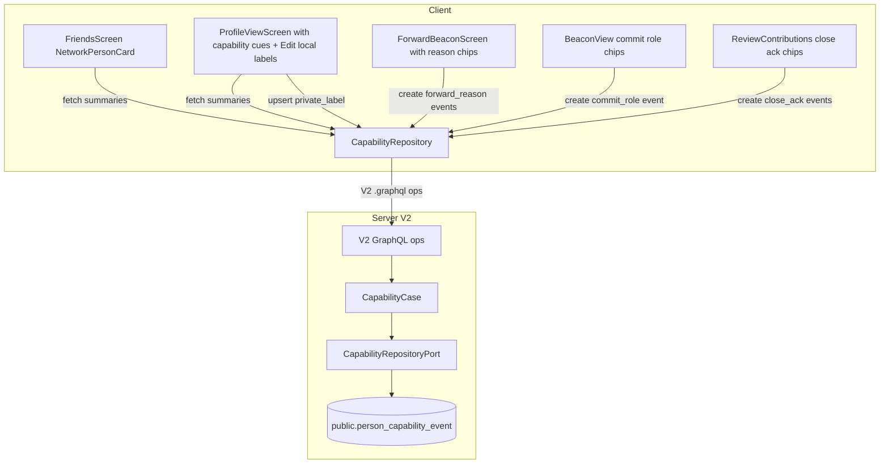

# Tentura v1 — Non-ML Capabilities Overhaul (Phases 0–4)

> **Self-declared chips are explicitly OUT of scope.** Capabilities about a person are derived only from observers (private labels), forwarders (forward reasons), participants (commit roles), and authors/evaluators (close acknowledgements). Users do **not** declare what they can help with on their own profile. The user-facing wording “I can sometimes help with…” must not appear anywhere.

## Source of truth & journaling rule

Every phase of this work must read `docs/capability-non-ml-overhaul-journal.md` **before starting** and **append** a dated section after each meaningful change. The journal records:

- decisions made + alternatives rejected,
- unexpected findings (schema surprises, lint blockers, codegen pitfalls),
- follow-up TODOs created during the phase,
- a one-line status footer at the end of each session.

This matches the existing pattern set by `docs/beacon-room-implementation-journal.md`, `docs/beacon-need-overhaul-journal.md`, and `docs/typography-overhaul-journal.md`. Do **not** invent a new journal pattern.

One ADR is created in a new folder `docs/adr/`:

- `docs/adr/0001-capability-event-storage.md` — captures the “unified `person_capability_event` table + client-hardcoded slug taxonomy + extended `CommitHelpType` + no self-declared source” decision (hard to reverse: yes; surprising without context: yes; real trade-off: yes).

The messenger-disable decision does **not** need an ADR — it is a UI-level removal that is trivially reversible. Record it as a single section in the journal.

---

## Decisions already locked in (from grilling)

These are non-negotiable inputs into the plan. Subagents working on individual phases must not relitigate them:

- **Plan depth:** all four phases written at implementation-step level. Sub-phases will still be re-grilled before each phase begins.
- **Messenger scope:** disable Network/Friends row tap entry only. `ChatRoute`, `ChatScreen`, `ChatCubit`, `ChatRemoteRepository`, P2P WS subscription/send all stay live; deep links to `/chat/:id` still work.
- **Taxonomy storage:** client-hardcoded `enum CapabilityTag` with stable `slug` strings + l10n labels. Server stores the slug as a plain `text` column (mirrors the existing `beacon.tags` / `beacon_evaluation.reason_tags` pattern).
- **`CommitHelpType` strategy:** extend the existing enum (and server `kAllowedHelpTypeKeys`). The full taxonomy of ~30 slugs is the global set; commit-role chips expose a small subset (~10) marked with an `isCommitRoleEligible` flag.
- **Event storage:** **unified** `person_capability_event` server table. Private labels are stored on the server, filtered to the observer via per-source visibility logic in `CapabilityCase` (Hasura is bypassed for these reads).
- **No self-declared source:** `CapabilityEventSource` does **not** include a `selfDeclared` value. Profile editor remains untouched. Section 1 of the original feature spec (“Self-declared chips”) is removed wholesale.
- **Person card widget:** new `NetworkPersonCard` widget. `ChatPeerListTile` is left intact for the chat list (used by `chat` feature only).
- **Versioning:** each phase bumps **minor** versions in `packages/client/pubspec.yaml` and `packages/server/pubspec.yaml`. `MIN_CLIENT_VERSION` is **not** bumped (all schema additions are nullable / additive).

---

## Architectural shape



**All capability operations route through V2 GraphQL** (`/api/v2/graphql`), not Hasura. Every new operation name in `.graphql` files must be added to `_tenturaDirectOperationNames` in [packages/client/lib/data/service/remote_api_client/build_client.dart](packages/client/lib/data/service/remote_api_client/build_client.dart) — this is enforced by `quick-reference.mdc` § V2 Routing.

Real-time updates piggy-back on the existing entity invalidation channel (see `quick-reference.mdc` § Real-Time Invalidation): when `person_capability_event` changes, server emits an `entity_changes` notification that the client `InvalidationService` debounces and feeds back to the relevant cubits.

---

## Capability taxonomy (slug + group + commit-role flag)

Define once in `packages/client/lib/domain/capability/capability_tag.dart`. The enum is shared across all four phases — even though no UI in this workstream lets a user declare these about themselves, the same canonical slug is used by observers (private labels), forwarders (forward reasons), commit dialogs (commit roles), and review screens (close acknowledgements).

```dart
enum CapabilityTag {
  // Logistics
  transport(group: CapabilityGroup.logistics, isCommitRoleEligible: true),
  storage(group: CapabilityGroup.logistics),
  pickupDelivery(group: CapabilityGroup.logistics),
  tools(group: CapabilityGroup.logistics, isCommitRoleEligible: true),
  physicalHelp(group: CapabilityGroup.logistics, isCommitRoleEligible: true),

  // Communication
  calls(group: CapabilityGroup.communication),
  translation(group: CapabilityGroup.communication),
  writing(group: CapabilityGroup.communication),
  negotiation(group: CapabilityGroup.communication),
  introductions(group: CapabilityGroup.communication, isCommitRoleEligible: true),

  // Knowledge
  localKnowledge(group: CapabilityGroup.knowledge),
  legalNavigation(group: CapabilityGroup.knowledge),
  medicalNavigation(group: CapabilityGroup.knowledge),
  documents(group: CapabilityGroup.knowledge, isCommitRoleEligible: true),
  verification(group: CapabilityGroup.knowledge, isCommitRoleEligible: true),

  // Care / support
  pets(group: CapabilityGroup.care),
  childcare(group: CapabilityGroup.care),
  eldercare(group: CapabilityGroup.care),
  emotionalSupport(group: CapabilityGroup.care),
  hosting(group: CapabilityGroup.care),

  // Resources
  money(group: CapabilityGroup.resources, isCommitRoleEligible: true),
  food(group: CapabilityGroup.resources),
  housing(group: CapabilityGroup.resources, isCommitRoleEligible: true),
  equipment(group: CapabilityGroup.resources),
  workspace(group: CapabilityGroup.resources, isCommitRoleEligible: true),

  // Technical
  techHelp(group: CapabilityGroup.technical),
  repair(group: CapabilityGroup.technical),
  software(group: CapabilityGroup.technical),
  design(group: CapabilityGroup.technical),
  adminPaperwork(group: CapabilityGroup.technical),

  // Special
  time(group: CapabilityGroup.resources, isCommitRoleEligible: true), // legacy CommitHelpType
  contact(group: CapabilityGroup.communication, isCommitRoleEligible: true), // legacy
  other(group: CapabilityGroup.special, isCommitRoleEligible: true);

  String get slug; // canonical wire string (e.g. `transport`, `physical_help`)
}
```

Slug strings are added to a single, shared constant in
`packages/server/lib/domain/capability/capability_tag.dart` (`kAllowedCapabilitySlugs`) so server-side validation stays in lock-step. l10n labels go into `app_en.arb` / `app_ru.arb` under keys `capabilityTag_<slug>` and `capabilityGroup_<group>`.

The legacy `CommitHelpType` slugs (`money/time/skill/verification/contact/transport/other`) all become aliases:
- `money/time/verification/contact/transport/other` map to identical slugs in the new enum.
- `skill` is **deprecated** — server-side migration `m00YY_help_type_taxonomy_align.dart` rewrites all `beacon_commitment.help_type = 'skill'` to `'other'`. Client `CommitHelpType.skill` is removed.

---

## Server data model

`packages/server/lib/data/database/migration/m00XX_person_capability_event.dart` (one new migration, created in **Phase 1**), registered in `_migrations.dart`:

```sql
CREATE TABLE public.person_capability_event (
  id                 text PRIMARY KEY,                  -- generateId('CE')
  subject_user_id    text NOT NULL REFERENCES public."user"(id) ON DELETE CASCADE,
  observer_user_id   text NOT NULL REFERENCES public."user"(id) ON DELETE CASCADE,
  tag_slug           text NOT NULL,
  source_type        smallint NOT NULL,                 -- 0..3 (see CapabilityEventSource)
  beacon_id          text REFERENCES public.beacon(id) ON DELETE CASCADE,
  visibility         smallint NOT NULL DEFAULT 0,       -- 0=private, 1=beacon_scoped
  note               text NOT NULL DEFAULT '',
  created_at         timestamptz NOT NULL DEFAULT now(),
  deleted_at         timestamptz
);

CREATE INDEX pce_subject_source_idx     ON person_capability_event(subject_user_id, source_type)        WHERE deleted_at IS NULL;
CREATE INDEX pce_observer_subject_idx   ON person_capability_event(observer_user_id, subject_user_id)   WHERE deleted_at IS NULL;
CREATE INDEX pce_beacon_idx             ON person_capability_event(beacon_id)                            WHERE beacon_id IS NOT NULL AND deleted_at IS NULL;

-- Soft uniqueness for private label (one row per observer+subject+slug)
CREATE UNIQUE INDEX pce_private_label_uq ON person_capability_event(observer_user_id, subject_user_id, tag_slug)
  WHERE source_type = 0 AND deleted_at IS NULL;

-- PG NOTIFY trigger so InvalidationService picks up changes (see PgNotificationService).
CREATE TRIGGER pce_notify
AFTER INSERT OR UPDATE OR DELETE ON person_capability_event
FOR EACH ROW EXECUTE FUNCTION notify_entity_change('person_capability_event');
```

The `source_type` enum lives in `packages/server/lib/domain/capability/capability_event_source.dart`:

```dart
enum CapabilityEventSource {
  privateLabel(0),
  forwardReason(1),
  commitRole(2),
  closeAcknowledgement(3);
  final int dbValue;
}
```

`Visibility` enum (`packages/server/lib/domain/capability/capability_event_visibility.dart`):

```dart
enum CapabilityEventVisibility {
  private(0),       // default — only observer can read
  beaconScoped(1);  // beacon participants + author can read (used for commit_role)
  final int dbValue;
}
```

> Note: there is **no** `self_public` visibility. Self-declared was removed; the only globally-readable cue category is `commit_role`, which uses `beacon_scoped` because beacon participation is already public information at the beacon level.

### Hasura permissions

The table is **not** exposed via Hasura V1 to client roles. All reads go through V2 use cases (`CapabilityCase`) which apply per-source filtering server-side. We add Hasura tracking only for admin role + computed-field reads from server-side service calls. This avoids leaking row-level visibility logic into Hasura permission DSL, which gets fragile fast.

### Domain port + use case

- `packages/server/lib/domain/port/person_capability_event_repository_port.dart`
- `packages/server/lib/data/repository/person_capability_event_repository.dart` (Drift impl)
- `packages/server/lib/domain/use_case/capability_case.dart` (`@Singleton(order: 2)`):
  - `upsertPrivateLabel(observerId, subjectId, slugs[])` — replaces full set; soft-deletes removed.
  - `recordForwardReasons(forwardEdgeId, slugs[], note)` — called from `ForwardCase.forward`.
  - `recordCommitRole(commitmentId, slug)` — called from `CommitmentCase.commit` (mirrors the existing `beacon_commitment.help_type` write; server is the single writer).
  - `recordCloseAcknowledgement(beaconId, observerId, subjectId, slugs[])` — called from `EvaluationCase.evaluationSubmit` (additive; does **not** replace `reason_tags`).
  - `getCapabilityCues(viewerId, subjectId)` → returns the per-slug aggregated cues filtered by the viewer’s permission scope.

The use case enforces:

- only `observer_user_id == userId` can upsert `privateLabel`; `observerId == subjectId` is rejected (private label on self is meaningless and would re-introduce a self-declared backdoor);
- forward/commit/close events are written by their owning use cases (callers, not the client) — clients pass slugs, server attaches `observer_user_id`/`beacon_id` from the calling context.

---

## Server V2 GraphQL surface

Add fields to `packages/server/lib/api/controllers/graphql/`:

### Queries
- `personCapabilityCues(subjectUserId: ID!): PersonCapabilityCuesPayload!`
  - returns the aggregated cues grouped by `source_type` for the calling user.
- `myPrivateLabelsForUser(subjectUserId: ID!): [String!]!`

### Mutations
- `capabilityPrivateLabelSet(subjectUserId: ID!, slugs: [String!]!): Boolean!`
- `beaconCommit(...)` — extend the existing mutation in [packages/server/lib/api/controllers/graphql/mutation/mutation_commitment.dart](packages/server/lib/api/controllers/graphql/mutation/mutation_commitment.dart) so that the existing `helpType` arg accepts the new extended slug set. **No new args.** `CommitmentCase.commit` continues to write to `beacon_commitment.help_type` and additionally writes a `commit_role` event via `CapabilityCase`.
- `beaconForward(...)` — extend the existing mutation in [packages/server/lib/api/controllers/graphql/mutation/mutation_forward.dart](packages/server/lib/api/controllers/graphql/mutation/mutation_forward.dart) with optional `reasons: [String!]` (per-recipient identical reasons) and optional `recipientReasons: [ForwardRecipientReasonInput!]`. `ForwardCase.forward` writes one `forward_reason` event per recipient×slug.
- `evaluationSubmit(...)` — extend the existing mutation in [packages/server/lib/api/controllers/graphql/mutation/mutation_evaluation.dart](packages/server/lib/api/controllers/graphql/mutation/mutation_evaluation.dart) with optional `acknowledgedHelpTags: [String!]`. `EvaluationCase.evaluationSubmit` calls `CapabilityCase.recordCloseAcknowledgement` after the existing `reason_tags` write succeeds. The two are conceptually distinct: `reason_tags` = “why this rating”, `acknowledgedHelpTags` = “what they actually helped with”.

All new operation names on the client side must be added to `_tenturaDirectOperationNames` in `build_client.dart`.

`PersonCapabilityCuesPayload` shape (no `selfDeclared` field):

```graphql
type PersonCapabilityCuesPayload {
  privateLabels: [String!]!         # filled only when viewer == observer
  forwardReasonsByMe: [TagCount!]!  # forwardReasons created by viewer for subject
  commitRoles: [TagBeaconRef!]!     # subject's commit roles, beacon-scoped
  closeAckByMe: [TagBeaconRef!]!    # close-acks viewer wrote for subject
  closeAckAboutMe: [TagBeaconRef!]! # close-acks others wrote about viewer when subject==self
}
type TagCount { slug: String! count: Int! lastSeenAt: DateTime! }
type TagBeaconRef { slug: String! beaconId: ID! beaconTitle: String! createdAt: DateTime! }
```

Per `quick-reference.mdc`: never call `.nonNullable()` on `GraphQLListType`; wrap inner type instead. List arguments use `InputField*` pattern (see `WORKAROUNDS.md` section 2).

---

## Client domain & repository layer

```
packages/client/lib/
├── domain/
│   ├── capability/
│   │   ├── capability_tag.dart            # CapabilityTag enum + helpers
│   │   ├── capability_group.dart          # CapabilityGroup enum
│   │   ├── capability_event_source.dart   # mirrors server enum (NO selfDeclared)
│   │   └── person_capability_cues.dart    # Freezed entity for aggregated cues
│   └── port/
│       └── capability_repository_port.dart
└── features/
    └── capability/
        ├── data/
        │   ├── gql/
        │   │   ├── capability_private_label_set.graphql
        │   │   ├── person_capability_cues_fetch.graphql
        │   │   └── my_private_labels_for_user.graphql
        │   └── repository/
        │       └── capability_repository.dart   # @lazySingleton, RemoteRepository
        ├── domain/
        │   └── use_case/
        │       └── capability_case.dart         # client-side orchestration if multi-repo needed
        └── ui/
            └── widget/
                ├── capability_chip_set.dart     # selectable FilterChip wrap, grouped
                ├── capability_cue_strip.dart    # compact "transport · pets · ..." line
                └── network_person_card.dart     # NEW shared widget; see Phase 0
```

`CapabilityRepository` follows the existing `RemoteRepository` base class pattern (see [packages/client/lib/features/forward/data/repository/forward_repository.dart](packages/client/lib/features/forward/data/repository/forward_repository.dart) as a template). Returns `PersonCapabilityCues` (Freezed) — never raw GraphQL types (lint: `no_domain_to_data_or_ui_import`).

Real-time invalidation: the new repository exposes a `Stream<void> changes` that the `InvalidationService` triggers on `entity_changes` payloads of type `person_capability_event`. Cubits using cues subscribe and refetch with `bufferTime` debounce, per the existing `quick-reference.mdc` § Real-Time Invalidation pattern.

---

## Phase 0 — Disable messenger entry from Network row + bootstrap journal/ADR

**Goal:** Network/Friends row tap goes only to profile; messenger code preserved with `// DISABLED: capability-rework` markers; journal + ADR scaffolding in place; `NetworkPersonCard` widget shell created (no capability cues yet — those land in Phase 1+).

### Files to create

1. `docs/capability-non-ml-overhaul-journal.md` — initial template:

```md
# Capability Non-ML Overhaul Journal

## How to use

- Read this file in full **before** starting any phase.
- Append a dated section after each meaningful step.
- Record decisions, rejected alternatives, unexpected findings, and follow-up TODOs.

## Decisions locked in (Phase 0)

- Plan depth: full 4 phases (0–4), sub-phases re-grilled before start.
- Messenger scope: row tap only; chat code preserved with `// DISABLED:` markers.
- Taxonomy: client-hardcoded enum + slug text on server.
- Self-declared chips: REMOVED from scope. CapabilityEventSource has no `selfDeclared` value.
- Profile editor (ProfileEditScreen) is NOT modified by this workstream.
- ...

## Phase 0 — YYYY-MM-DD

...
```

2. `docs/adr/0001-capability-event-storage.md` — ADR (template borrowed from `grill-with-docs/ADR-FORMAT.md`):

```md
# ADR 0001: Unified person_capability_event table + extended CommitHelpType (no self-declared source)

Status: Accepted (2026-04-30)

## Context
Tentura needs deterministic, observer-derived capability cues...

## Decision
1. Single `person_capability_event` table with `source_type` discriminator covering 4 sources: private_label, forward_reason, commit_role, close_acknowledgement. Self-declared is explicitly excluded.
2. Extend `CommitHelpType` enum and `kAllowedHelpTypeKeys` to align with the wider CapabilityTag taxonomy; deprecate `skill` slug.
3. Hasura is bypassed for capability reads; visibility is enforced in `CapabilityCase`.

## Consequences
- Profile editor untouched; users cannot self-declare what they can help with.
- Capability cues only become populated as people actually act (label, forward, commit, close-ack).
- Hasura permission DSL too fragile for per-source visibility → all reads via V2 use case.

## Alternatives considered
- Separate tables per source (rejected: B vs C in grilling)
- Including a self_declared source (rejected per second user instruction; users were unwilling to maintain such data)
```

3. `packages/client/lib/features/capability/ui/widget/network_person_card.dart` — initial widget shell that just renders avatar, title, mutual badge, and (when present) a `[Forward]` action slot. Capability cue rendering is added incrementally in Phases 1–4.

### Files to edit

1. [packages/client/lib/features/friends/ui/screen/friends_screen.dart](packages/client/lib/features/friends/ui/screen/friends_screen.dart):
   - Replace `ChatPeerListTile` with `NetworkPersonCard` in the friends-tab `_FriendsTabBody`. The invites tab keeps its existing widget (no behaviour change).
   - `NetworkPersonCard.onTap` calls `screenCubit.showProfile(profile.id)` only — no chat navigation, no `isSeeingMe` branching.

2. [packages/client/lib/features/chat/ui/widget/chat_peer_list_tile.dart](packages/client/lib/features/chat/ui/widget/chat_peer_list_tile.dart):
   - Add a leading comment block: `// DISABLED: capability-rework — this widget is no longer used by the Network/Friends surface. Retained for the chat list; do not delete or repurpose without lifting the // DISABLED marker first.`
   - Leave the widget body untouched.

3. [packages/client/lib/ui/bloc/screen_cubit.dart](packages/client/lib/ui/bloc/screen_cubit.dart):
   - **Do not** delete `showChatWith`. Add a one-line comment above it: `// Used by deep-link /chat/:id and the chat list; not reachable from Network tab.`

4. `packages/client/pubspec.yaml`: bump minor.

### Verification

- Manual: tap row in Network → profile opens, no messenger reachable from Network anywhere.
- Manual: open `tentura://chat/<friend_id>` deep link → still works.
- Run `flutter analyze --fatal-infos` and `dart run custom_lint` — must pass.
- Run any existing widget tests under `packages/client/test/features/friends/`. Update if they depended on `ChatPeerListTile` reaching `showChatWith`.

### Journal entry skeleton

```md
## Phase 0 — Disable messenger entry — YYYY-MM-DD

What changed:
- Created NetworkPersonCard widget shell.
- Replaced ChatPeerListTile usage in friends_screen.dart with NetworkPersonCard.
- Added // DISABLED: capability-rework marker to chat_peer_list_tile.dart.
- Bumped client to vX.Y.Z.

Why:
- Per grill decision row_only: row tap → profile only; chat code preserved.

Unexpected findings:
- ...

Follow-ups:
- ...
```

---

## Phase 1 — Private labels (also: bootstrap server table + CapabilityCase)

**Goal:** every user can attach private slugs to any other user; visible only to the labeler. This phase **creates the unified `person_capability_event` table** and the `CapabilityCase` skeleton, since this is the first source of events.

### Server changes

1. New migration `packages/server/lib/data/database/migration/m00XX_person_capability_event.dart` (registers in `_migrations.dart`). Creates the table + indexes + NOTIFY trigger described above.
2. New domain port `packages/server/lib/domain/port/person_capability_event_repository_port.dart`.
3. New repository `packages/server/lib/data/repository/person_capability_event_repository.dart` (Drift impl).
4. New use case `packages/server/lib/domain/use_case/capability_case.dart` with `upsertPrivateLabel`, `getPrivateLabelsForUser`, `getCapabilityCues` (only `privateLabels` field populated in this phase; other fields default to empty arrays).
5. New GraphQL ops in `packages/server/lib/api/controllers/graphql/mutation/mutation_capability.dart` and `query/query_capability.dart`. Schema snippets:

   ```graphql
   extend type Mutation {
     capabilityPrivateLabelSet(subjectUserId: ID!, slugs: [String!]!): Boolean!
   }
   extend type Query {
     myPrivateLabelsForUser(subjectUserId: ID!): [String!]!
     personCapabilityCues(subjectUserId: ID!): PersonCapabilityCuesPayload!
   }
   ```

   Validate every slug against `kAllowedCapabilitySlugs`; reject `subjectUserId == observerUserId`; raise `ExceptionBase` with code `1300/1301` (claim a new code-space — see `quick-reference.mdc` § Exceptions).

6. Wire `PgNotificationService` channel `entity_changes` to recognise `person_capability_event` payloads; verify by reading [packages/server/lib/data/service/pg_notification_service.dart](packages/server/lib/data/service/pg_notification_service.dart).

### Client changes

1. Create `packages/client/lib/domain/capability/*` (`capability_tag.dart`, `capability_group.dart`, `capability_event_source.dart` (no `selfDeclared`), `person_capability_cues.dart` Freezed).
2. Create `packages/client/lib/domain/port/capability_repository_port.dart`.
3. Create `packages/client/lib/features/capability/` skeleton (data/domain/ui).
4. Add `.graphql` operations:
   - `capability_private_label_set.graphql`
   - `person_capability_cues_fetch.graphql`
   - `my_private_labels_for_user.graphql`
5. Register all new op names in `_tenturaDirectOperationNames` in [packages/client/lib/data/service/remote_api_client/build_client.dart](packages/client/lib/data/service/remote_api_client/build_client.dart).
6. Add `app_en.arb` / `app_ru.arb` keys:
   - `capabilityTag_<slug>` × ~30
   - `capabilityGroup_<group>` × 6
   - `capabilityEditPrivateLabels` ("Edit local labels")
   - `capabilityCueMyLabels` ("My labels: %{tags}")
   - **Do NOT** add any `capabilitySectionTitle` / `capabilityCueSelfListed` keys; profile-edit is not touched.
7. Create `CapabilityChipSet` widget (FilterChip wrap, grouped by `CapabilityGroup`, with deselect-all support). Tested in widgetbook (add `packages/widgetbook/lib/src/use_cases/capability_chip_set_use_cases.dart`).
8. New modal `packages/client/lib/features/profile_view/ui/dialog/edit_private_labels_dialog.dart` — bottom sheet with `CapabilityChipSet`, fed by `myPrivateLabelsForUser`. **Not** a separate AutoRoute; opened imperatively from the profile-view actions menu.
9. Edit [packages/client/lib/features/profile_view/ui/screen/profile_view_screen.dart](packages/client/lib/features/profile_view/ui/screen/profile_view_screen.dart) and `ProfileViewBody`:
   - Add `[Edit local labels]` action in the actions list (only when `viewer != subject` AND `viewer.isFriend`; otherwise hide).
   - Render a compact `CapabilityCueStrip` showing `My labels: pets, calls` (only when `privateLabels` non-empty).
10. Edit `ProfileViewCubit` to fetch `personCapabilityCues` alongside the profile, expose `PersonCapabilityCues` in state via Freezed `copyWith`. Inject `CapabilityRepositoryPort` (constructor injection; remember the `cubit_requires_use_case_for_multi_repos` lint — if total repos ≥2, switch to a `ProfileViewCase` use case).
11. Extend `NetworkPersonCard` to render the private-label cue strip below the title row when present.
12. **Confirm `ProfileEditScreen` is not modified.** Its diff for this phase must be empty.

### Verification

- Add unit test `packages/server/test/domain/use_case/capability_case_test.dart` — covers slug validation, upsert idempotency on slug removal, `observerId == subjectId` rejection, only-observer-can-read filter.
- Add widget test `packages/client/test/features/profile_view/edit_private_labels_test.dart` — modal saves and immediately reflects in parent screen (via `repository.changes` stream).
- Manual: open friend’s profile → tap Edit local labels → select chips → save → cue strip updates → log in as a different user and check labels are NOT visible.
- Run `flutter gen-l10n`, `dart run build_runner build -d`, `flutter analyze --fatal-infos`, `dart run custom_lint` — all green.
- Bump `packages/client/pubspec.yaml` and `packages/server/pubspec.yaml` minor versions.
- Append journal entry. Re-state in the journal that `ProfileEditScreen` was deliberately untouched.

---

## Phase 2 — Forward reasons

**Goal:** when forwarding a beacon, the forwarder picks reason chips per recipient; reasons are private to the forwarder; aggregated as “Often forwarded for ...” in their own UI.

### Server changes

1. Extend `mutation_forward.dart` so `beaconForward` accepts `reasons: [String!]` (applied uniformly to all recipients) **and** `recipientReasons: [ForwardRecipientReasonInput!]` (per-recipient override). Define `ForwardRecipientReasonInput { recipientId, slugs, note }` as an `InputType*` (per `WORKAROUNDS.md` section 2 pattern).
2. `ForwardCase.forward` (in [packages/server/lib/domain/use_case/forward_case.dart](packages/server/lib/domain/use_case/forward_case.dart)) calls `CapabilityCase.recordForwardReasons` per recipient×slug after the existing forward-edge insertion. Pass `forwardEdge.id` so the events can be joined back if needed.
3. Extend `PersonCapabilityCuesPayload.forwardReasonsByMe` aggregation — group by `tag_slug`, count.

### Client changes

1. Extend `forward_beacon.graphql` to send `reasons` / `recipientReasons` (this op is already in `_tenturaDirectOperationNames`).
2. Edit `ForwardBeaconScreen` and the recipient-row widget under `packages/client/lib/features/forward/ui/`:
   - Add a per-recipient `[Why?]` button that opens a chip selector (modal) backed by `CapabilityChipSet`.
   - Optional “apply same reasons to all” toggle at the screen level.
3. Extend `NetworkPersonCard` to render `Often forwarded for: transport, pets` (only when viewer is the one who forwarded — populated from `forwardReasonsByMe`).
4. New l10n keys: `forwardReasonPrompt`, `forwardReasonApplyToAll`, `capabilityCueForwardedFor`.

### Verification

- Server unit test: forward with mixed per-recipient reasons writes correct events; uniform reasons fan out.
- Client widget test: chip selection persists across recipient list scroll.
- Bump minor versions; append journal entry.

---

## Phase 3 — Commit role chips (extend `beaconCommit`)

**Goal:** when committing, user picks one slug from the commit-role-eligible subset (~10 chips). Stored in **both** `beacon_commitment.help_type` (legacy) and `person_capability_event` (new, source=commitRole).

### Server changes

1. Extend `kAllowedHelpTypeKeys` in [packages/server/lib/domain/coordination/help_type.dart](packages/server/lib/domain/coordination/help_type.dart) with new slugs (`place`, `documents`, `physical_help`, `tools`, `housing`, `workspace`, `introductions`).
2. Migration `m00YY_help_type_taxonomy_align.dart`: rewrite all `beacon_commitment.help_type = 'skill'` to `'other'`. Single `UPDATE` statement.
3. `CommitmentCase.commit` now also calls `CapabilityCase.recordCommitRole(commitmentId, slug)` after the existing upsert. Wrap the additional write in `db.withMutatingUser(userId, ...)` per `quick-reference.mdc` § Echo suppression.

### Client changes

1. Update [packages/client/lib/domain/entity/help_type.dart](packages/client/lib/domain/entity/help_type.dart):
   - Remove `skill`.
   - Add new entries that 1:1 mirror the new server slugs.
   - Mark each as alias of `CapabilityTag` slug for unified label rendering (e.g. `CommitHelpType.transport.capabilityTag => CapabilityTag.transport`).
2. Update commit dialog ([packages/client/lib/features/beacon_view/ui/dialog/commitment_message_dialog.dart](packages/client/lib/features/beacon_view/ui/dialog/commitment_message_dialog.dart)):
   - Show ChoiceChip row of commit-role-eligible slugs (label via `capabilityTag_<slug>`).
   - The existing free-form message field stays.
3. Extend `NetworkPersonCard` and `ProfileViewBody` to render `Helped with transport on 2 beacons / Verified documents once` (from `commitRoles`).
4. Update `app_en.arb` / `app_ru.arb`: `commitRolePrompt` ("How are you helping?"), `capabilityCueCommitted` ("Helped with %{tag} on %{count} beacons").

### Verification

- Server test: legacy `help_type=skill` rows migrate to `other`.
- Server test: commit writes both `beacon_commitment.help_type` and `person_capability_event`.
- Client widget test: chip selection round-trips through the commit dialog.
- Run `flutter analyze --fatal-infos` and `dart run custom_lint`.
- Bump minor versions; append journal entry.

---

## Phase 4 — Close acknowledgements

**Goal:** during the existing review window, the evaluator picks contribution chips (“what did this person actually help with”) per evaluated participant. Stored as the strongest signal in `person_capability_event`.

### Server changes

1. Extend `evaluationSubmit` mutation in [packages/server/lib/api/controllers/graphql/mutation/mutation_evaluation.dart](packages/server/lib/api/controllers/graphql/mutation/mutation_evaluation.dart) with optional `acknowledgedHelpTags: [String!]`. Define as nullable list (`InputFieldList` pattern) — preserves backward compatibility for old clients.
2. `EvaluationCase.evaluationSubmit` (already in [packages/server/lib/domain/use_case/evaluation_case.dart](packages/server/lib/domain/use_case/evaluation_case.dart)) calls `CapabilityCase.recordCloseAcknowledgement(beaconId, evaluatorId, evaluatedUserId, slugs)` after the existing `upsertEvaluation`. Validate slugs against `kAllowedCapabilitySlugs`. **Do not** modify `reason_tags` semantics — they remain orthogonal.
3. Extend `PersonCapabilityCuesPayload`:
   - `closeAckByMe` — list of (slug, beacon ref) where viewer ack’d subject;
   - `closeAckAboutMe` — list of (slug, beacon ref) where someone else ack’d viewer (only when `subjectUserId == viewerId`).

### Client changes

1. Edit `evaluation_submit.graphql` to add `acknowledgedHelpTags` arg.
2. Edit `ReviewContributionsScreen` ([packages/client/lib/features/evaluation/ui/screen/review_contributions_screen.dart](packages/client/lib/features/evaluation/ui/screen/review_contributions_screen.dart)):
   - Add a `CapabilityChipSet` per participant (multi-select, no group filtering needed).
   - The existing rating + reason-tag UI stays untouched.
3. Edit `EvaluationCubit` to thread `acknowledgedHelpTags` through draft save / submit.
4. Update `NetworkPersonCard` and `ProfileViewBody` to render the strongest cue first. Order: `closeAck` > `commitRole` > `forwardReason` > `privateLabel`. There is no `selfDeclared` rung.
5. Update `app_en.arb` / `app_ru.arb`: `closeAckPrompt` ("What did %{name} actually help with?"), `capabilityCueAcknowledged`.

### Verification

- Server test: `evaluationSubmit` with `acknowledgedHelpTags` writes both evaluation row and capability events; without the arg, behaviour unchanged.
- Client widget test: review screen chip round-trip across draft save/submit.
- Manual: close beacon → review window opens → select chips → submit → cues visible to involved users on profile.
- Bump minor versions; append journal entry. Re-read journal’s “Decisions” section to confirm nothing has drifted (especially: confirm self-declared still does not exist anywhere in codebase or schema).

---

## Cross-cutting checklist (every phase)

- [ ] Read journal + ADR before starting; append journal entry on completion.
- [ ] **No self-declared chips.** `ProfileEditScreen` diff stays empty across all four phases. `CapabilityEventSource` has only 4 values (privateLabel, forwardReason, commitRole, closeAcknowledgement). `PersonCapabilityCuesPayload` has no `selfDeclared` field. No l10n key starting with `capabilitySection*` or `capabilityCueSelfListed`.
- [ ] All new GraphQL operation names registered in `_tenturaDirectOperationNames`.
- [ ] No `Map<String, dynamic>` in domain/use_case public APIs (lint: `no_map_dynamic_in_use_case_api`). Use Freezed entities + computed-payload helper functions.
- [ ] No imports from `data/` or `ui/` inside `domain/` (lint: `no_domain_to_data_or_ui_import`).
- [ ] No `data/service/` imports inside `ui/bloc/*_cubit.dart` (lint: `no_cubit_to_data_service_import`).
- [ ] No raw `gql('...')` in Dart (lint: `no_raw_graphql_in_dart`).
- [ ] No inline `TextStyle(fontSize: ...)` in `features/**` or `ui/**` (lint: `no_inline_font_size`).
- [ ] No `.nonNullable()` on `GraphQLListType` server-side (`packages/server/WORKAROUNDS.md` § 2).
- [ ] Run `dart run build_runner build -d` after schema changes.
- [ ] `flutter analyze --fatal-infos`, `dart analyze --fatal-infos`, `dart run custom_lint` all green before commit.
- [ ] Patch / minor version bumps in both `packages/client/pubspec.yaml` and `packages/server/pubspec.yaml` per `versioning.mdc`. `MIN_CLIENT_VERSION` untouched (everything is additive).
- [ ] When in doubt during a phase: re-read `docs/capability-non-ml-overhaul-journal.md` and `docs/adr/0001-capability-event-storage.md`. If a finding contradicts a documented decision, **stop and surface it** before proceeding.

## Anti-patterns banned for the duration of this work

Per the user’s explicit list — never introduce these even if they look easy:

- public skill scores / leaderboards / endorsement counts;
- AI / LLM inferred capability profiles (this whole effort is non-ML by mandate);
- generic per-user DM action attached to capability surfaces;
- public dossiers exposing raw capability event logs;
- contradictions between the four signal layers (capability vs. availability vs. reliability vs. trust must stay separate in UI copy and data model);
- **self-declared capability chips of any kind** — the user explicitly removed this pattern; do not reintroduce it under another name (e.g. “interests”, “skills”, “bio tags”, “profile chips”).

